# Planteo y análisis unificado — servicio de administración del SAI (`sai-service`)

> **Qué es este documento.** El **planteo unificado** de un servicio propio para administrar el SAI
> (UPS) de un servidor Linux: objetivos, alcance, arquitectura candidata, modelo de datos, flujos de
> usuario y riesgos. Integra en una sola línea de decisión el planteo original y el replanteo
> posterior del modelo de datos. **No es un diseño cerrado ni una especificación**, pero sí es lo
> bastante concreto —campos, tipos, invariantes, ejemplos JSON completos— como para escribir pruebas
> unitarias y *end-to-end* antes de codificar.
>
> **Qué no es.** No hay código, ni esquema SQL definitivo, ni contratos de API cerrados. Las
> decisiones marcadas como **abiertas** lo están de verdad.
>
> **Autocontenido a propósito.** Toda la evidencia que sostiene el texto está **transcrita acá**:
> valores medidos, parámetros del equipo, observaciones y citas. No hace falta abrir ningún otro
> documento para leerlo o para implementarlo.
>
> **Procedencia de los datos.** Los valores del equipo provienen del relevamiento del SAI real
> conectado al host `i7infra` y de la verificación de firmware del host, ambos ejecutados el
> **2026-07-19**. Donde un valor es **inventado o reconstruido** —números de serie, precios,
> proveedores, series de relleno de las *fixtures*— está **marcado como tal**. Nada más es
> invención.
>
> **Estado:** `draft` · **2026-07-19**

---

## Contenido

- [Evaluación de la idea](#evaluación-de-la-idea)
- [1. Antecedente: qué sabemos del equipo](#1-antecedente-qué-sabemos-del-equipo)
  - [1.1 Hechos verificados](#11-hechos-verificados)
  - [1.2 Observaciones que condicionan el diseño](#12-observaciones-que-condicionan-el-diseño)
- [2. Objetivos del servicio](#2-objetivos-del-servicio)
- [3. Alcance](#3-alcance)
  - [3.1 Dentro del alcance](#31-dentro-del-alcance)
  - [3.2 Fuera del alcance](#32-fuera-del-alcance)
  - [3.3 Primera entrega](#33-primera-entrega)
- [4. El problema crítico: garantizar el reencendido](#4-el-problema-crítico-garantizar-el-reencendido)
  - [4.1 La secuencia buscada](#41-la-secuencia-buscada)
  - [4.2 El bloqueo que hay que evitar](#42-el-bloqueo-que-hay-que-evitar)
  - [4.3 El presupuesto de tiempo](#43-el-presupuesto-de-tiempo)
  - [4.4 La trampa de firmware](#44-la-trampa-de-firmware)
  - [4.5 Qué hay que verificar antes de confiar en esto](#45-qué-hay-que-verificar-antes-de-confiar-en-esto)
  - [4.6 ¿Se puede verificar por software el «Restore on AC Power Loss»?](#46-se-puede-verificar-por-software-el-restore-on-ac-power-loss)
  - [4.7 La vía que aporta el servicio: verificación continua por evidencia](#47-la-vía-que-aporta-el-servicio-verificación-continua-por-evidencia)
  - [4.8 Consecuencia: la entidad `Verificacion` y la regla de bloqueo](#48-consecuencia-la-entidad-verificacion-y-la-regla-de-bloqueo)
- [5. Arquitectura candidata](#5-arquitectura-candidata)
  - [5.1 Capas](#51-capas)
  - [5.2 El adaptador de conexión](#52-el-adaptador-de-conexión)
  - [5.3 El planificador](#53-el-planificador)
  - [5.4 El contenedor y el USB](#54-el-contenedor-y-el-usb)
- [6. Salud de batería: qué se puede calcular de verdad](#6-salud-de-batería-qué-se-puede-calcular-de-verdad)
  - [6.1 Este equipo no avisa, y el ecosistema entero depende de que avise](#61-este-equipo-no-avisa-y-el-ecosistema-entero-depende-de-que-avise)
  - [6.2 Lo que dicen las normas — y las tres cifras falsas que circulan](#62-lo-que-dicen-las-normas--y-las-tres-cifras-falsas-que-circulan)
  - [6.3 Qué tan bien predice la capacidad la medición óhmica](#63-qué-tan-bien-predice-la-capacidad-la-medición-óhmica)
  - [6.4 Los otros métodos, y por qué se descartan](#64-los-otros-métodos-y-por-qué-se-descartan)
  - [6.5 Peukert: el histórico sirve, pero no con el exponente que todos citan](#65-peukert-el-histórico-sirve-pero-no-con-el-exponente-que-todos-citan)
  - [6.6 ¿Se puede calcular la resistencia interna acá?](#66-se-puede-calcular-la-resistencia-interna-acá)
  - [6.7 Método que se adopta, y sus límites declarados](#67-método-que-se-adopta-y-sus-límites-declarados)
  - [6.8 El caso que conviene tener presente](#68-el-caso-que-conviene-tener-presente)
  - [6.9 Lo que realmente va a predecir el recambio: la edad](#69-lo-que-realmente-va-a-predecir-el-recambio-la-edad)
- [7. Modelo de datos](#7-modelo-de-datos)
  - [7.1 Qué conserva del planteo original](#71-qué-conserva-del-planteo-original)
  - [7.2 Siete carencias del modelo inicial](#72-siete-carencias-del-modelo-inicial)
  - [7.3 Principios](#73-principios)
  - [7.4 Las tres capas](#74-las-tres-capas)
  - [7.5 Diagrama de entidades](#75-diagrama-de-entidades)
  - [7.6 Objetos de valor](#76-objetos-de-valor)
  - [7.7 Catálogo](#77-catálogo)
  - [7.8 Inventario, con ciclo de vida explícito](#78-inventario-con-ciclo-de-vida-explícito)
  - [7.9 Vínculos temporales](#79-vínculos-temporales)
  - [7.10 Historia: la muestra y su procedencia](#710-historia-la-muestra-y-su-procedencia)
  - [7.11 Historia: eventos, pruebas, acciones](#711-historia-eventos-pruebas-acciones)
  - [7.12 Modalidades de la acción de apagado](#712-modalidades-de-la-acción-de-apagado)
  - [7.13 Mantenimiento y costos](#713-mantenimiento-y-costos)
  - [7.14 Transversales](#714-transversales)
  - [7.15 Cómo se responden las consultas objetivo](#715-cómo-se-responden-las-consultas-objetivo)
- [8. Add-ons de protocolo](#8-add-ons-de-protocolo)
- [9. Flujos de usuario](#9-flujos-de-usuario)
  - [9.1 Mapa de flujos](#91-mapa-de-flujos)
  - [9.2 UF-1 · Alta del parque y puesta en marcha](#92-uf-1--alta-del-parque-y-puesta-en-marcha)
  - [9.3 UF-2 · Configuración de políticas de apagado](#93-uf-2--configuración-de-políticas-de-apagado)
  - [9.4 UF-3 · Monitoreo en vivo](#94-uf-3--monitoreo-en-vivo)
  - [9.5 UF-4 · Consulta de históricos y gráficas](#95-uf-4--consulta-de-históricos-y-gráficas)
  - [9.6 UF-5 · Prueba de batería y seguimiento de salud](#96-uf-5--prueba-de-batería-y-seguimiento-de-salud)
  - [9.7 UF-6 · Alta de servicio técnico: recambio de batería](#97-uf-6--alta-de-servicio-técnico-recambio-de-batería)
  - [9.8 UF-7 · Reparación y sustitución del SAI](#98-uf-7--reparación-y-sustitución-del-sai)
  - [9.9 UF-8 · Ventana de mantenimiento: verificar los supuestos](#99-uf-8--ventana-de-mantenimiento-verificar-los-supuestos)
  - [9.10 UF-9 · Informe de período y comparación de marcas](#910-uf-9--informe-de-período-y-comparación-de-marcas)
  - [9.11 UF-10 · Ingesta automatizada desde un servicio externo](#911-uf-10--ingesta-automatizada-desde-un-servicio-externo)
  - [9.12 Trazabilidad: flujo → escenario → invariante](#912-trazabilidad-flujo--escenario--invariante)
- [10. Riesgos y decisiones abiertas](#10-riesgos-y-decisiones-abiertas)
- [11. Observaciones](#11-observaciones)
- [12. Qué queda sin verificar](#12-qué-queda-sin-verificar)
- [13. Referencias](#13-referencias)
- [Anexo A — Escenarios con ejemplos completos](#anexo-a--escenarios-con-ejemplos-completos)
- [Anexo B — Cobertura, invariantes y flujos end-to-end](#anexo-b--cobertura-invariantes-y-flujos-end-to-end)
- [Anexo C — Borrador de prompt de caracterización](#anexo-c--borrador-de-prompt-de-caracterización)

---

## Evaluación de la idea

**El servicio se justifica, pero no por las razones más obvias.** Monitorear el SAI y apagar el
host ordenadamente ya lo resuelve NUT con `upsmon` + `upssched`. Lo que **no** existe en ninguna
herramienta —libre ni comercial— para este equipo es:

| Aporte real | Por qué no lo cubre lo existente |
|-------------|----------------------------------|
| **Histórico de salud de batería** | El equipo no expone ningún indicador y **el test no devuelve veredicto**. La salud solo se obtiene midiendo la caída de tensión y guardando serie temporal — nadie lo hace por vos |
| **Ciclo de vida del equipo** | Altas, recambios de batería, reparaciones, asociación de métricas al período de cada batería. NUT no tiene modelo de inventario |
| **Panel remoto y API para terceros** | NUT expone variables, no una interfaz de administración |
| **Correlación de eventos en el tiempo** | Microcortes, degradación, gráficas superpuestas. `upslog` produce texto plano |
| **Verificación viva de los supuestos** | Que el host reencienda solo tras un corte es un supuesto que puede volverse falso en silencio. Ninguna herramienta lo vigila; el servicio puede hacerlo con su propio histórico ([§4.7](#47-la-vía-que-aporta-el-servicio-verificación-continua-por-evidencia)) |

**Lo que se descarta de la propuesta inicial:** escribir el traductor de protocolo. No por la
dificultad de decodificar —que hoy es abordable— sino porque **la exploración misma del protocolo
es destructiva** y la validación no tiene verdad de referencia ([§8](#8-add-ons-de-protocolo)).
Para el equipo actual el problema ya está resuelto y verificado.

**El riesgo principal del proyecto no es técnico sino de expectativa:** el servicio va a tomar la
decisión de apagar un servidor sin backups. Si falla, falla de noche y sin testigos. La
sección [§4](#4-el-problema-crítico-garantizar-el-reencendido) es la que más atención merece;
todo lo demás es software convencional.

**Y hay un segundo modo de falla, más silencioso que el primero:** que el servicio produzca
conclusiones falsas sobre datos que parecían medidos. El equipo expone valores de tres naturalezas
distintas —medidos, derivados por el driver y estimados por él— y mezclarlos garantiza que alguien
construya, dentro de dos años, una tendencia de salud sobre un número que nunca fue una medición.
La [§7](#7-modelo-de-datos) existe en buena parte para impedirlo.

---

## 1. Antecedente: qué sabemos del equipo

### 1.1 Hechos verificados

Hechos establecidos por el relevamiento del equipo real (2026-07-19). Son la base de todo lo que
sigue:

| Hecho | Valor |
|-------|-------|
| Dispositivo | `0665:5161`, puente serie-sobre-HID «INNO TECH», **sin número de serie** (`iSerial` vacío) |
| Protocolo | `Voltronic-QS-Hex 0.10`, familia Megatec/Qx |
| **Sin eventos** | Solo encuesta: el equipo **nunca avisa** un corte; todo estado se descubre preguntando |
| Sin `battery.runtime` | La autonomía **no se mide** en este equipo; se podría **estimar** con `runtimecal` calibrado |
| `battery.charge` | **Derivado** por el driver, interpolando el voltaje contra umbrales que el propio driver estimó |
| `battery.voltage.high` / `.low` | **Estimados por el driver** (*guesstimation*): 13,00 V y 10,40 V. No leídos del equipo |
| Comandos disponibles | `shutdown.return`, `shutdown.stayoff`, `shutdown.stop`, `load.on/off`, `test.battery.start.quick`, `beeper.toggle` |
| **`ups.delay.shutdown`** | Actual **30 s** · rango **12–540 s** ← **techo duro** |
| **`ups.delay.start`** | Actual **180 s** · rango 60–599940 s |
| Valores nominales | `battery.voltage.nominal` 12,0 V · `output.voltage.nominal` 220,0 V · `output.frequency.nominal` 50,0 Hz |
| Tipo declarado | `ups.type` = *offline / line interactive* · `ups.firmware.aux` = `PM-T` |
| Flotación medida | **13,41 V** (= 2,235 V/celda en un bloque de 12 V) |
| Línea base de salud | Caída de **−0,47 V**, mínimo 12,94 V, recuperación a 13,24 V en **~35 s**, con carga **13 %** |
| Test de batería | Se ejecuta, pero **no devuelve veredicto**: 51 muestras consecutivas sin `TEST`, `RB` ni `ups.alarm` |
| El SO no lo ve | `upower` no lista el SAI: **no es un *HID Power Device*** |

### 1.2 Observaciones que condicionan el diseño

Observaciones del relevamiento del equipo (`O-U*`) y del entorno que lo aloja:

| # | Observación | Consecuencia de diseño |
|---|-------------|------------------------|
| **O-U1** | Las unidades systemd de NUT quedaron `enabled` en el host | Competirían por el equipo con el contenedor. Hay que decidir dónde vive NUT ([§5.4](#54-el-contenedor-y-el-usb)) |
| **O-U2** | Un contenedor vecino monta `/dev/bus/usb` con `rwm` | Hay competencia por el nodo USB |
| **O-U8** | `ups.load` pasó de 13 % a 30 % al sumar dos contenedores de IA | La carga concurrente cambia, y con ella la comparabilidad de las mediciones |
| **O-U9** | Sin la carga concurrente, las mediciones de batería **no son comparables entre sí** | Toda muestra y toda prueba deben registrar su contexto de carga |
| **O-U10** | El equipo **no señala el test** por software: sin `TEST`/`RB`/`ups.alarm` | El veredicto de salud lo calcula el servicio, nunca el equipo |
| **O-U11 / O-U12** | Desapariciones documentadas del bus USB en dispositivos `0665:5161` | El servicio **debe vigilar su propia conectividad** |
| **O-U13** | El software del fabricante (ViewPower) tiene RCE sin parche | No es una alternativa |
| **O-01** | El host **no tiene backups** | Es lo que da urgencia al apagado ordenado, y lo que hace grave equivocarse |

---

## 2. Objetivos del servicio

1. **Administrar un apagado planificado del sistema operativo**, garantizando que al volver el
   suministro el host **vuelva a encenderse solo**.
2. **Administrar la mantenibilidad del equipo**: altas, recambios, historial de baterías y
   reparaciones, con sus costos.
3. **Monitorizar y registrar** estados de red eléctrica y sucesos a lo largo del tiempo.
4. **Alertar** de desconexión, fallos y degradación de batería — por ahora como avisos visuales
   en el panel.
5. **Acceso remoto** por web desde otros equipos de la LAN.
6. **Trazar el origen de cada valor**: poder responder *«¿este número lo midió el aparato o lo
   calculó el software?»* sin leer el código.
7. **Comparar marcas y productos** por desempeño real observado y costo por año de servicio.
8. **Admitir captura automatizada** de hechos por servicios externos, sin corromper el histórico.

El objetivo 1 es el único con consecuencias irreversibles; los demás son observabilidad, registro y
gestión.

---

## 3. Alcance

### 3.1 Dentro del alcance

- Servicio **web dockerizado**, exclusivamente Linux, dentro de un host Linux.
- **Un solo SAI activo**, el conectado al host.
- **Un único usuario administrador.**
- Identificación del dispositivo USB desde el panel, con **prueba de conexión**.
- Políticas de apagado configurables (umbrales, retardos, modalidad), **versionadas**.
- Lectura de estado en tiempo real con **frecuencia de refresco configurable**.
- Persistencia de métricas, eventos e historial, **con procedencia por valor**.
- Gráficas de evolución (voltajes, carga, microcortes), individuales o superpuestas.
- Inventario con **ciclo de vida y baja lógica** de equipos y baterías.
- Registro de intervenciones de servicio técnico **con costos**.
- API de ingesta **idempotente** para fuentes externas.

### 3.2 Fuera del alcance

Explícitamente excluido de esta etapa:

| Excluido | Motivo |
|----------|--------|
| **Apagado de otros equipos de la red** | Decisión del usuario: excede el alcance. Implica un protocolo de coordinación cuyo modo de falla es corrupción simultánea en varias máquinas |
| Múltiples SAI simultáneos | El modelo los contempla, la implementación no |
| Notificaciones externas (mail, SMS) como mecanismo primario | Alertas visuales en el panel por ahora. Y hay una razón de fondo: en un corte de energía la red también cae ([E-4](#e-4--corte-prolongado-la-política-dispara-y-el-sistema-se-niega)) |
| Escribir el traductor de protocolo del equipo actual | Ya resuelto y verificado; ver [§8](#8-add-ons-de-protocolo) |
| Gestión de usuarios y roles | Un solo administrador |
| Lectura del ajuste de BIOS por software | Posible pero inútil; se descarta con fundamento en [§4.6](#46-se-puede-verificar-por-software-el-restore-on-ac-power-loss) |

### 3.3 Primera entrega

**Alcance mínimo defendible**, extensible después hacia los add-ons:

- Servicio **.NET con Blazor (interactive server) + SQLite**, dockerizado.
- **USB del SAI compartido directo al contenedor.**
- El diálogo con el equipo **a través de NUT**, que ya está instalado y verificado.
- Planificador interno con rondas de verificación de políticas.
- Panel: estado en vivo, historial, alertas, configuración de políticas, inventario e
  intervenciones.
- Una única política de apagado operativa, la de [§7.12](#712-modalidades-de-la-acción-de-apagado),
  que **arranca forzada en `SoloAlerta`** mientras los supuestos no estén verificados
  ([§4.8](#48-consecuencia-la-entidad-verificacion-y-la-regla-de-bloqueo)).

La capa de add-ons de protocolo queda **diseñada pero no implementada**: la primera entrega usa
el adaptador NUT.

---

## 4. El problema crítico: garantizar el reencendido

Esta es la parte del servicio que puede dejar el servidor apagado indefinidamente, y merece
tratarse antes que ninguna otra.

### 4.1 La secuencia buscada

El razonamiento es el siguiente: **el host no puede encenderse solo si nunca perdió la
alimentación**. La BIOS solo dispara el autoencendido cuando detecta una **transición** de
ausencia a presencia de energía. Por lo tanto el SAI **debe cortar la salida**, aunque el host ya
esté apagado.

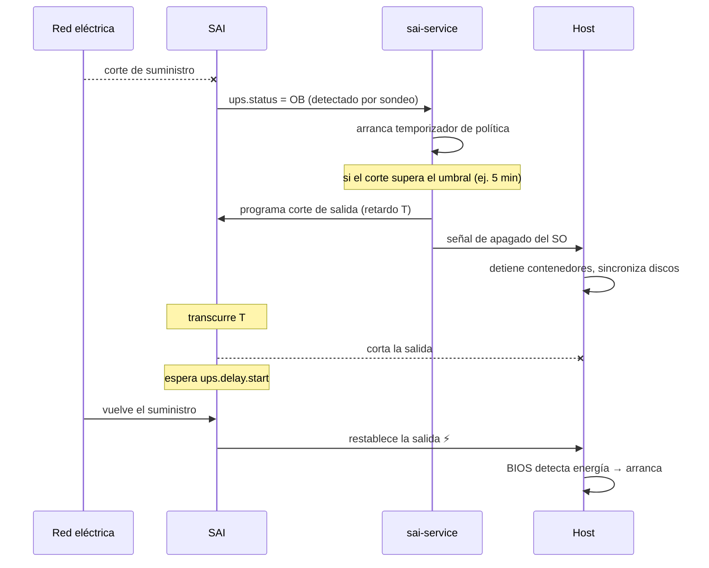
```mermaid
sequenceDiagram
    participant R as Red eléctrica
    participant U as SAI
    participant S as sai-service
    participant H as Host

    R--xU: corte de suministro
    U->>S: ups.status = OB (detectado por sondeo)
    S->>S: arranca temporizador de política
    Note over S: si el corte supera el umbral (ej. 5 min)
    S->>U: programa corte de salida (retardo T)
    S->>H: señal de apagado del SO
    H->>H: detiene contenedores, sincroniza discos
    Note over U: transcurre T
    U--xH: corta la salida
    Note over U: espera ups.delay.start
    R->>U: vuelve el suministro
    U->>H: restablece la salida ⚡
    H->>H: BIOS detecta energía → arranca
```

Dos parámetros del equipo hacen esto posible, ambos verificados:

- **`shutdown.return`** — *«Turn off the load and return when power is back»*. Es exactamente la
  semántica buscada.
- **`ups.delay.start`** = 180 s — cuánto espera antes de restablecer la salida.

### 4.2 El bloqueo que hay que evitar

**El escenario que rompe todo es que la energía vuelva durante la cuenta regresiva.**

Secuencia del fallo:

1. Corte → se supera el umbral → el servicio ordena apagar el host y programa el corte del SAI.
2. El host empieza a bajar.
3. **Vuelve la energía** antes de que venza el retardo.
4. Si el SAI cancela su apagado (existe `shutdown.stop`), **nunca corta la salida**.
5. El host termina de apagarse. Hay energía en la red, el SAI la está entregando.
6. **No hubo transición de energía. La BIOS no tiene nada que detectar. El host queda apagado
   hasta que alguien apriete el botón.**

Es el peor resultado posible: el sistema se protegió correctamente de un corte que resultó ser
breve, y a cambio quedó fuera de servicio indefinidamente.

> **Decisión de diseño derivada — ciclo forzado.** Una vez iniciada la secuencia de apagado,
> **el corte del SAI no debe cancelarse aunque vuelva la red**. Es preferible un apagón
> controlado de tres minutos a un servidor apagado hasta la mañana siguiente.

Esto no es una invención: es la solución que la industria ya adoptó. CyberPower PowerPanel la
implementa como **«Mandatory Power Cycle»**, descrita como *«el UPS también se apagará tras un
retardo, pero volverá a encenderse unos 10 segundos después»* — precisamente para resolver este
bloqueo.

### 4.3 El presupuesto de tiempo

Acá aparece la restricción más dura, y **hay que dimensionarla con datos reales, no estimar**.

El techo es verificado y no negociable: **`ups.delay.shutdown` admite como máximo 540 s (9
minutos)**. Todo el apagado del host tiene que caber ahí dentro.

Del estudio de apagado del host sale el otro término de la ecuación:

| Componente | Tiempo | Origen |
|------------|--------|--------|
| Grace actual del demonio Docker | **15 s** (por defecto, sin flag) | Estudio de apagado, riesgo **R-1** |
| Lo que **necesita** el contenedor que aloja una VM huésped | **~120 s** | Ídem |
| Corrección recomendada de `shutdown-timeout` | **150 s** | Ídem |
| Resto del apagado del SO (servicios, sync, desmontaje) | **sin medir** | — |

> **Consecuencia cruzada, y no es menor.** Corregir el riesgo **R-1** del estudio de apagado
> —subir `shutdown-timeout` a 150 s para que la VM huésped no reciba `SIGKILL`— **consume 150 de
> los 540 segundos disponibles**. Las dos decisiones están acopladas: no se pueden tomar por
> separado.

**Queda abierto** medir el apagado completo real del host bajo carga. Hasta tenerlo, cualquier
valor de retardo es una conjetura. Y como la carga del host cambia con el tiempo —pasó de 3 a 8
contenedores en menos de una semana— esta medición **caduca**: por eso su verificación lleva
vigencia corta ([§4.8](#48-consecuencia-la-entidad-verificacion-y-la-regla-de-bloqueo)).

### 4.4 La trampa de firmware

El protocolo Megatec implementa el apagado con retorno como **`S<n>R<m>`** (*apagar en n minutos,
volver a los m*). Las notas de implementación del protocolo advierten textualmente:

> *«S01R0001 and S01R0002 may not work on early firmware versions. **The failure mode is that the
> UPS turns off and never returns.**»*

Es decir: **un comando bien formado, según especificación, que en ciertos firmwares apaga el SAI y
no lo vuelve a encender nunca.** Aplica exactamente al mecanismo del que depende todo el objetivo
1 de este servicio.

Dos consecuencias:

1. **Usar NUT en lugar de construir la trama a mano.** El driver ya conoce esta clase de trampas y
   modela el comando; escribirlo directamente es reintroducir el riesgo.
2. **Probar el ciclo completo antes de confiar en él**, con los contenedores detenidos y alguien
   presente físicamente.

### 4.5 Qué hay que verificar antes de confiar en esto

Nada de esta sección está verificado en el equipo. Antes de habilitar la política de apagado:

| Verificación | Cómo | Riesgo si se omite |
|--------------|------|--------------------|
| **BIOS: reencendido tras restaurar la energía** | Entrar al setup de la placa y fijar *Restore on AC Power Loss* = **Power On** (no *Last State*) | El host nunca arranca solo |
| **`shutdown.return` funciona en este firmware** | Prueba controlada con contenedores detenidos y presencia física | Servidor apagado indefinidamente ([§4.4](#44-la-trampa-de-firmware)) |
| **Tiempo real de apagado completo** | Cronometrar `poweroff` bajo carga habitual | El SAI corta con el host a medio bajar |
| **Comportamiento de `ups.status` en corte real** | Provocar un corte controlado; observar `OB` y si aparece `LB` | La política dispara sobre un flag que quizá no llega |
| **Que el SAI reencienda al volver la red** | Parte de la misma prueba | Ídem |

> Estas pruebas son **destructivas por naturaleza**: implican cortar la energía al host. Deben
> planificarse como una ventana de mantenimiento, no improvisarse.

Esta tabla **no es una lista de pendientes en un documento**: es el estado inicial de una entidad
de dominio ([§4.8](#48-consecuencia-la-entidad-verificacion-y-la-regla-de-bloqueo)).

### 4.6 ¿Se puede verificar por software el «Restore on AC Power Loss»?

Es el supuesto del que depende **todo el objetivo 1**. Si está mal, el SAI apaga el host y el host
no vuelve. La pregunta obvia es si se puede leer sin abrir el setup.

**Respuesta corta: no existe un comando que lea ese ajuste de forma soportada.** No lo expone
SMBIOS/DMI, ni ACPI, ni `sysfs`, ni ninguna interfaz estándar de Linux. Sí está **físicamente
almacenado** en una variable UEFI del equipo, pero como un *blob* binario sin estructura
documentada, cuya lectura exige ingeniería inversa del firmware y cuya escritura puede dejar la
placa inutilizable.

**Lo que se descartó, y por qué.** Verificado sobre el host el 2026-07-19:

| Vía | Resultado | Por qué no sirve |
|-----|-----------|------------------|
| `dmidecode` / SMBIOS | Expone fabricante, versión y fecha de BIOS | **SMBIOS no modela ajustes de setup.** Describe el *hardware*, no la configuración del firmware. No hay ningún tipo de estructura DMI para «Restore on AC Power Loss» |
| `/sys/class/dmi/id/` | `bios_vendor: American Megatrends Inc.`, `bios_version: F15`, `bios_date: 10/23/2013`, `board_name: B75M-D3H` | Confirma la identidad de la placa (útil), pero ningún ajuste |
| ACPI / `/proc/acpi/wakeup` | Lista dispositivos habilitados para despertar el sistema (`PS2K`, `USB1`, …, todos `*disabled`) | Modela **wake-on-device desde suspensión**, que es un mecanismo distinto: requiere que la placa siga alimentada. Ante un corte total de energía no interviene |
| `fwupdmgr`, `flashrom` | No instalados | `fwupd` gestiona *actualizaciones* de firmware, no ajustes de setup. Esta placa (2012, sin soporte LVFS) no publica *capsules* |
| Utilidad del fabricante | No existe para Linux | El fabricante no publica herramientas de configuración de BIOS para Linux en esta generación |

**La vía que técnicamente existe — y por qué no conviene tomarla.** El host arranca en modo UEFI y
expone las variables del firmware AMI:

```
$ ls -l /sys/firmware/efi/efivars/ | grep -i setup
-rw-r--r-- 1 root root   86  AMITSESetup-c811fa38-42c8-4579-a9bb-60e94eddfb34
-rw-r--r-- 1 root root 1222  Setup-ec87d643-eba4-4bb5-a1e5-3f3e36b20da9
```

Esos **1222 bytes** de `Setup-…` son el volcado de los ajustes del setup de AMI Aptio — «Restore on
AC Power Loss» está ahí adentro, como uno o dos bits en algún desplazamiento. Leerlo requeriría:

1. Obtener la imagen de BIOS del fabricante.
2. Extraer los formularios IFR (*Internal Forms Representation*) con `UEFITool` + `IFRExtractor`.
3. Localizar el `varstore` y el desplazamiento exacto de la opción.
4. Leer ese byte del *blob*.

Es un procedimiento conocido, pero **desaconsejado acá** por cuatro razones concretas:

- **Frágil por versión.** El desplazamiento vale para *esta* build de firmware. Cualquier
  actualización lo invalida en silencio: seguirías leyendo un byte, ahora el equivocado.
- **Peligroso al escribir.** Escribir sobre `Setup` con un desplazamiento mal calculado corrompe la
  NVRAM. En placas de esta época eso significa **recuperación por programador SPI**, o placa muerta.
- **Verifica lo que no importa.** Confirmaría que *el byte dice Power On*. No confirma que el
  firmware **se comporte** así — que es justamente lo que la [§4.4](#44-la-trampa-de-firmware)
  advierte que no se puede dar por sentado en este terreno.
- **Coste desproporcionado.** Toda esa cadena, contra una prueba física de diez minutos que ya está
  planificada por otros motivos.

> **Conclusión.** La lectura del ajuste es *posible pero inútil*: cara, frágil y sin capacidad de
> responder la pregunta real. Se descarta explícitamente.

**La vía robusta es verificar por comportamiento**, y ya está prevista en la ventana de
mantenimiento de [§4.5](#45-qué-hay-que-verificar-antes-de-confiar-en-esto):

1. Con el host encendido y los contenedores detenidos, **cortar la alimentación de red** al SAI y
   dejar que se agote o forzar el corte de salida.
2. Restaurar la energía.
3. Observar si el host arranca **sin tocar el botón**.

Esa prueba responde a la vez el ajuste de BIOS, el comportamiento del firmware del SAI
(`shutdown.return`) y el reencendido del equipo. **Es la misma ventana**: no agrega costo.

### 4.7 La vía que aporta el servicio: verificación continua por evidencia

Una prueba puntual verifica el estado **de ese día**. Pero el ajuste puede volverse falso en
silencio:

- La **pila CMOS** de una placa de 2012 se agota y el setup vuelve a valores de fábrica.
- Una actualización o un *clear CMOS* por otro motivo lo resetea.
- Alguien lo cambia y no lo documenta.

El sistema seguiría creyendo que puede apagar el host con seguridad. **El servicio puede detectar
eso solo, a partir del historial**, sin ninguna interfaz especial. La evidencia ya existe en el
host: `wtmp` registra arranques y apagados, y distingue los sucios.

```
$ last -x reboot shutdown
reboot   system boot  6.12.95+deb13-am Wed Jul 15 13:33 - still running
reboot   system boot  6.12.95+deb13-am Wed Jul 15 13:30 - 13:31  (00:01)
shutdown system down  6.12.95+deb13-am Wed Jul 15 13:31 - 13:33  (00:02)
reboot   system boot  6.12.95+deb13-am Wed Jul 15 09:56 - crash
reboot   system boot  6.12.95+deb13-am Fri Jul 10 10:40 - crash
```

Las entradas marcadas **`crash`** son arranques que **no fueron precedidos por un apagado limpio**:
el sistema se cortó de golpe y después volvió. Cruzando eso con los eventos del SAI —que el servicio
va a registrar de todos modos— se obtiene la verificación:

> **Si hubo un evento de corte de energía, y a continuación un arranque del host sin intervención
> humana, entonces el reencendido automático funcionó.** Con fecha, y repetible cada vez que ocurre.

Y la inversa, que es la que salva:

> **Si hubo un corte y el host no volvió solo, el supuesto es falso hoy** — aunque haya sido
> verdadero en la prueba de puesta en marcha.

> **Precisión sobre la evidencia de arriba.** Esos dos `crash` del 10 y el 15 de julio **no prueban
> nada todavía**: `wtmp` no distingue un corte de energía de un *reset* manual o un *kernel panic*,
> y no hay registro de si alguien apretó el botón. Sirven para mostrar que **el mecanismo de
> detección existe y ya tiene datos**, no como verificación. La correlación con eventos del SAI es
> lo que la convierte en prueba, y eso requiere el servicio andando.

### 4.8 Consecuencia: la entidad `Verificacion` y la regla de bloqueo

Esto no es un detalle de implementación: **es una entidad de dominio**.

El servicio depende de varios supuestos que (a) no se pueden consultar, (b) solo se establecen
empíricamente, y (c) **pueden dejar de ser ciertos sin aviso**:

| Supuesto | Cómo se establece | Cómo puede volverse falso |
|----------|-------------------|---------------------------|
| BIOS reenciende tras corte | Prueba física / evidencia acumulada | Pila CMOS agotada, *clear CMOS*, cambio manual |
| `shutdown.return` funciona en este firmware | Prueba física controlada | Cambio de equipo, firmware distinto |
| El SAI reenciende su salida al volver la red | Misma prueba | Ídem |
| El apagado completo del host cabe en 540 s | Cronometrado bajo carga | Crece la carga: hoy son 8 contenedores, eran 3 |
| `ups.status` señala `OB` en un corte real | Corte controlado | Cambio de driver o de dialecto |

Modelarlos como `Verificacion` —con **evidencia**, **fecha**, **método**, **resultado** y
**caducidad**— convierte una lista de pendientes en un objeto vivo que el sistema puede vigilar. Un
panel que diga *«la política de apagado se apoya en 5 supuestos; 3 verificados, 1 vencido, 1 nunca
probado»* es información operativa real.

> **Regla de diseño derivada, y es la regla de seguridad central del servicio:** la política de
> apagado **no debe habilitarse** si algún supuesto del que depende está en estado
> `NuncaVerificado`, `Vencido` o `Refutado`. El modo `SoloAlerta`
> ([§7.12](#712-modalidades-de-la-acción-de-apagado)) deja de ser una recomendación de puesta en
> marcha y pasa a ser **el estado forzado por el sistema** mientras los supuestos no estén
> verificados.

Su materialización está en [E-4](#e-4--corte-prolongado-la-política-dispara-y-el-sistema-se-niega):
el resultado `BloqueadaPorVerificacion` es **el sistema negándose a apagar el host porque no puede
probar que va a volver a encenderse**.

---

## 5. Arquitectura candidata

### 5.1 Capas

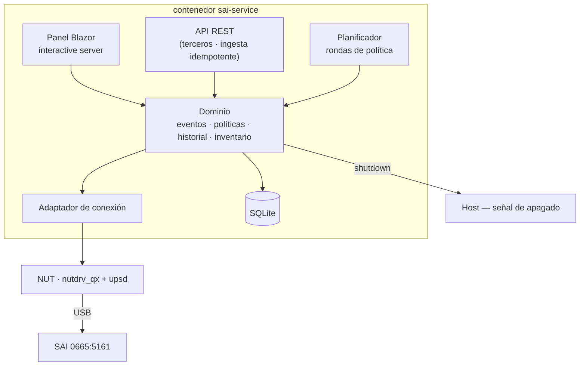
```mermaid
flowchart TB
    subgraph C["contenedor sai-service"]
        direction TB
        UI["Panel Blazor<br/>interactive server"]
        API["API REST<br/>(terceros · ingesta idempotente)"]
        SCH["Planificador<br/>rondas de política"]
        DOM["Dominio<br/>eventos · políticas · historial · inventario"]
        AD["Adaptador de conexión"]
        DB[("SQLite")]
    end
    NUT["NUT · nutdrv_qx + upsd"]
    UPS["SAI 0665:5161"]
    HOST["Host — señal de apagado"]

    UI --> DOM
    API --> DOM
    SCH --> DOM
    DOM --> DB
    DOM --> AD
    AD --> NUT
    NUT -->|USB| UPS
    DOM -->|shutdown| HOST
```

### 5.2 El adaptador de conexión

La pieza que aísla al dominio de **cómo** se habla con el equipo. Tres implementaciones previstas,
solo la primera en la entrega inicial:

| Adaptador | Estado | Cuándo conviene |
|-----------|--------|-----------------|
| **NUT** (cliente de `upsd`, o invocando `upsc`) | **Primera entrega** | Equipo soportado por NUT — el caso actual |
| **Directo + add-on de dialecto** | Diseñado, no implementado | Equipo que NUT no cubra ([§8](#8-add-ons-de-protocolo)) |
| Simulado | Útil para desarrollo | Probar políticas sin hardware ni riesgo. Es también lo que permite cubrir el flujo F-3 en pruebas automatizadas |

El contrato del adaptador debería exponer, como mínimo: **leer estado**, **probar conectividad**,
**ordenar apagado con retorno** y **lanzar test de batería**. La forma exacta queda abierta.

> **Por qué NUT y no directo, en una línea:** el dialecto de este equipo (`voltronic-qs-hex` sobre
> puente `cypress`) no era evidente —el driver descartó `voltronic-qs` antes de acertar— y el
> espacio de comandos incluye letras sueltas que **cortan la energía**
> ([§8](#8-add-ons-de-protocolo)).

### 5.3 El planificador

Módulo interno que ejecuta **rondas de verificación** de las políticas activas. Es el corazón
operativo del servicio, porque **el equipo no emite eventos**: todo estado se descubre
preguntando.

Responsabilidades:

- Sondear el estado en el intervalo configurado y **persistir la métrica** con su procedencia.
- Evaluar las condiciones de cada política activa.
- Mantener **temporizadores con cancelación**: una condición debe sostenerse N segundos antes de
  disparar. Es lo que evita actuar ante un microcorte.
- Detectar **pérdida de comunicación** con el equipo y alertar (**O-U11**).
- Lanzar las **pruebas de batería programadas**, subiendo la cadencia de sondeo mientras duran.
- **Evaluar el estado de las verificaciones** y degradar la modalidad efectiva cuando corresponda
  ([§4.8](#48-consecuencia-la-entidad-verificacion-y-la-regla-de-bloqueo)).
- Ejecutar acciones y registrar el resultado.

> **Regla derivada de la experiencia del relevamiento:** toda acción debe **validarse por efecto
> observado**, no por ausencia de error. Durante el relevamiento, un comando que nunca llegó al
> equipo no produjo ningún mensaje de error — se detectó comparando datos. Un servicio que asuma
> que «no hubo excepción» equivale a «se ejecutó» va a mentir.

Esquema de estados de la política de corte:

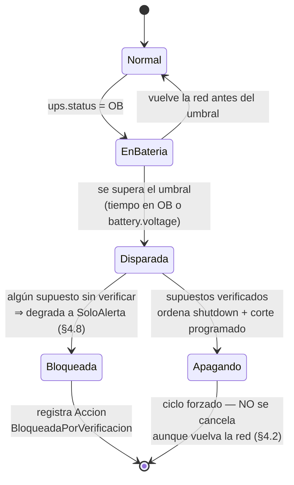
```mermaid
stateDiagram-v2
    [*] --> Normal
    Normal --> EnBateria: ups.status = OB
    EnBateria --> Normal: vuelve la red antes del umbral
    EnBateria --> Disparada: se supera el umbral<br/>(tiempo en OB o battery.voltage)
    Disparada --> Bloqueada: algún supuesto sin verificar<br/>⇒ degrada a SoloAlerta (§4.8)
    Disparada --> Apagando: supuestos verificados<br/>ordena shutdown + corte programado
    Bloqueada --> [*]: registra Accion<br/>BloqueadaPorVerificacion
    Apagando --> [*]: ciclo forzado — NO se cancela<br/>aunque vuelva la red (§4.2)
```

### 5.4 El contenedor y el USB

Compartir el USB directo al contenedor es viable, con dos salvedades relevadas:

**El equipo no tiene número de serie**, así que no hay `/dev/serial/by-id`. El anclaje estable
disponible es la **ruta física del puerto** (`ID_PATH=pci-0000:00:14.0-usb-0:3`). Una regla `udev`
sobre ese path da un symlink propio y evita mapear `/dev/bus/usb` entero — que expondría al
contenedor otros periféricos del host.

Efecto lateral favorable: anclar por puerto significa *«el SAI que esté enchufado ahí»*, de modo
que **un reemplazo de equipo no rompe el binding** (a diferencia del anclaje por serial).

**El nodo `hidraw` es volátil.** Cuando una herramienta libusb reclama la interfaz, el kernel
desengancha `usbhid` y `/dev/hidrawN` desaparece. No sirve como punto de montaje estable.

> **Decisión abierta.** Si NUT corre **dentro** del contenedor (un solo artefacto desplegable) o
> **en el host** con el servicio como cliente TCP. La primera opción es más limpia de desplegar; la
> segunda evita que el contenedor necesite el dispositivo. En ambos casos hay que resolver
> **O-U1**: las unidades systemd de NUT quedaron `enabled` en el host y competirían por el equipo.

---

## 6. Salud de batería: qué se puede calcular de verdad

Se preguntó si detectar la degradación es viable, si existen algoritmos para determinar el estado
de vida de una batería de plomo, si el histórico de valores y horas de uso alcanza, y si el SAI
advierte su fin de vida.

La respuesta honesta tiene tres partes: **el equipo no advierte nada**, **hay algoritmos pero casi
ninguno es aplicable con las señales disponibles**, y **lo que sí queda es más modesto y más útil
de lo que parece**. Esta sección separa las tres con las fuentes en la mano, porque el terreno está
lleno de cifras que circulan sin respaldo.

### 6.1 Este equipo no avisa, y el ecosistema entero depende de que avise

Dos hechos que hay que poner juntos:

- **El SAI no reporta veredicto.** Verificado: acepta `test.battery.start.quick`, lo ejecuta, y
  nunca expone `TEST`, `RB` ni `ups.alarm` — 51 muestras consecutivas sin cambio de estado
  (**O-U10**).
- **Todo el software libre de monitoreo se limita a retransmitir ese veredicto.** Se buscaron
  específicamente proyectos que *calculen* salud a partir de datos de NUT: no existe ninguno. Los
  paneles de Grafana, la integración de Home Assistant y los exportadores de Prometheus grafican o
  reenvían las variables crudas. La integración de Home Assistant **no hace ningún cálculo**; el
  *blueprint* más avanzado de la comunidad notifica cuando *«el resultado del autotest no es
  aprobado»* — es decir, alerta sobre el veredicto del firmware.

> **Consecuencia.** El estándar de facto es *«confiar en la bandera `RB` del equipo»*, y **en este
> equipo esa bandera nunca va a llegar**. Un monitoreo convencional acá no alerta nunca. Calcular
> salud propia no es sobre-ingeniería: es la única opción. Pero también significa que se está
> haciendo algo que nadie más hace, lo que obliga a ser conservador con las conclusiones.

Tampoco hay dónde poner un resultado: **el espacio de nombres de NUT no tiene ninguna variable de
estado de salud.** Lo más cercano es `battery.status` (opaco, típicamente `ok`/`replace`) y
`battery.packs.bad`. Existe `battery.capacity` en Ah, pero en la práctica es un valor de placa
configurado, no medido.

Lo que **no** se puede hacer, verificado:

- Leer un indicador de salud: el equipo no lo expone.
- Confiar en el test: se ejecuta pero **no devuelve veredicto**.
- Usar el voltaje en flotación: **una batería al 20 % de su capacidad flota igual que una nueva**.

### 6.2 Lo que dicen las normas — y las tres cifras falsas que circulan

La familia de métodos más citada es la **medición óhmica** (resistencia interna, impedancia o
conductancia) con seguimiento contra una línea base. Es lo que usan los sistemas profesionales de
baterías estacionarias. Sobre los umbrales hay que ser muy preciso, porque acá se acumulan errores:

| Cifra que circula | Estado real |
|-------------------|-------------|
| «IEEE 1188 dice reemplazar con +25 % de resistencia» | **Mal atribuida.** El 25 % es experiencia de campo de **un fabricante de instrumentos** (Glenn Albér, Albércorp), declarada como tal en su propio documento: *«Albércorp experiences show…»*, y referida **solo a resistencia DC**. No es lenguaje de IEEE |
| «IEEE 1188-2025 fija un 20 % como disparador de reemplazo» | **Sin respaldo.** Rastreado a **una sola entrada de blog comercial**, que cita la norma sin número de cláusula ni texto reproducido. Contradice la única cifra que sí aparece citada del texto normativo |
| «40–50 % es el umbral de reemplazo» | **Es un margen de garantía**, no un umbral físico. El mismo Albér: *«los fabricantes quieren márgenes extra para garantía»*, y *«cuando una celda que falla llega al 50 % ya está prácticamente muerta»* |

**Lo que sí está citado del texto de IEEE Std 1188-2005** (Anexo C, C.4), vía reproducción
secundaria:

> *«Los valores óhmicos internos son útiles como **herramienta de tendencia**. Para usarlos con
> eficacia deben tomarse lecturas de línea base precisas tras unos seis meses de operación.»*
> *«Típicamente, **un cambio del 30 % al 50 %** respecto de la línea base se considera
> significativo.»*

Con dos matices que la propia norma agrega y que casi nunca se citan: *«significativo»* quiere decir
**investigar**, no reemplazar; y **una lectura óhmica buena no absuelve a la celda**. El criterio de
reemplazo de la norma es **de capacidad**: por debajo del **80 % de la nominal**.

> **Advertencia de trazabilidad.** IEEE 1188 es de pago y **no se pudo leer el texto normativo**;
> todo lo anterior son citas reproducidas por terceros identificados. Además, **hay una
> contradicción sin resolver** entre fuentes sobre si existe una revisión 1188-2025 que sustituya a
> la de 2005. Si alguna de estas cifras va a fundamentar una decisión de compra, **hay que comprar
> la norma**. Para lo que sigue no hace falta, porque —como se ve abajo— ninguno de estos umbrales
> es aplicable acá.

### 6.3 Qué tan bien predice la capacidad la medición óhmica

Peor de lo que se cree. Este es el punto que suele omitirse. La evidencia independiente es
consistente:

| Fuente | Hallazgo |
|--------|----------|
| **EPRI**, >16 000 celdas, Battcon 2002 | La resistencia interna correlaciona con pérdida de capacidad, pero *«hay dispersión sustancial»*, y **la mayor dispersión está entre 70 % y 100 % de capacidad**. Conclusión: *«identificar celdas buenas o malas, más que afirmar que cierta resistencia indica cierta capacidad»* |
| **C&D Technologies**, Battcon 2004 | Los tres instrumentos óhmicos coinciden **entre sí** en >98 %, pero su correlación **con la capacidad** fue de solo **60,3 a 64,9** |
| **Albér**, tabla de C&D | Correlación con capacidad por método: resistencia **DC 92 %**, conductancia (20 Hz) **59 %**, impedancia (60 Hz) **45 %**, impedancia (1000 Hz) **28 %** |
| **Alpha Technologies** (fabricante de instrumentos de conductancia) | En su propio documento técnico: *«**No hay correlación directa** entre conductancia y capacidad disponible»*, y *«la menor correlación existe cuando la batería está al 80 % de capacidad o más»* |

Léase de nuevo lo último: **la correlación es más débil justo en la franja donde se toma la decisión
de reemplazar.** Y lo admite quien vende el instrumento.

> Conclusión de esta subsección: la medición óhmica **encuentra celdas malas**; no mide capacidad.
> Ni siquiera con instrumental dedicado, conexión Kelvin de 4 hilos y acceso por celda —nada de lo
> cual existe acá.

### 6.4 Los otros métodos, y por qué se descartan

**Coup de fouet** (la caída y meseta característica al inicio de la descarga). Es un fenómeno real y
bien documentado, 10–80 mV por celda, de segundos a minutos, cuya amplitud crece con la edad. **Se
descarta**, por tres razones verificadas:

- **Puede directamente no ocurrir.** Cita textual de un trabajo de acceso abierto (Li et al.,
  *Electronics* 10:2425, 2021): el efecto *«es relativamente difícil de forzar, requiere que la
  batería esté completamente cargada; y el experimento muestra que **no ocurrirá con algunos
  voltajes medios de carga**»*. Los propios autores lo abandonaron por esto. Un SAI en flotación
  permanente es exactamente ese escenario.
- **No es transferible entre condiciones.** Delaille et al. (*J. Power Sources* 2006) encontraron
  **distintos valores de mínimo para el mismo estado de salud a distintos estados de carga**, y
  concluyen que el método es poco fiable con ciclado irregular.
- **Sin evidencia en baterías chicas.** Toda la literatura localizada usa celdas de 100–200 Ah o
  cadenas de central telefónica. **Cero estudios sobre bloques de 7–9 Ah**, que es lo que hay acá.

> **Trampa terminológica que conviene registrar.** Buena parte del folclore de la industria del SAI
> llama «coup de fouet» a caídas de tensión de **milisegundos** en la transferencia de carga. Es
> otro fenómeno —transitorio óhmico/inductivo— tres o cuatro órdenes de magnitud más rápido que el
> efecto electroquímico. **La caída medida de −0,47 V es de este segundo tipo: caída bajo carga,
> no coup de fouet.**

**Constante de tiempo de recuperación.** Electroquímica genuina, pero la evidencia apunta a que lo
que se degrada es la **resistencia de transferencia de carga**, no la constante de tiempo: la
capacitancia de doble capa **cae** mientras la resistencia **sube**, y τ = R·C no se mueve de forma
monótona. Un análisis DRT de 2025 sobre envejecimiento en flotación encuentra que **las posiciones
de los picos son invariantes** y lo que cambia es su magnitud. No se encontró ningún producto
comercial ni norma que estime salud de plomo-ácido a partir de una constante de tiempo.

**Tensión de flotación.** Confirmado inútil como indicador de salud, y por una razón estructural: es
**el punto de regulación del cargador**, así que informa sobre el cargador, no sobre la batería.

### 6.5 Peukert: el histórico sirve, pero no con el exponente que todos citan

Si alguna vez se mide autonomía real en cortes, normalizar por carga es necesario para comparar.

**El exponente de Peukert no es una constante del producto: depende del régimen de descarga.**
Regresiones sobre las tablas de descarga publicadas por tres fabricantes de baterías de 7 Ah AGM:

| Batería | k (10–20 h) | k (1–20 h) | k (15 min–5 h) | k (5 min–1 h) |
|---------|-------------|------------|----------------|---------------|
| CSB GP1272 | 1,115 | 1,194 | 1,268 | **1,383** |
| Power-Sonic PS-1270 | 1,111 | 1,228 | 1,373 | **1,517** |
| GS Yuasa NP7-12 | 1,179 | 1,169 | 1,228 | **1,378** |

El rango «AGM = 1,05–1,15» que circula en todos lados **no tiene cita** —aparece sin fuente incluso
en Wikipedia— y corresponde a los regímenes lentos de 10–20 h. **Un SAI descarga en minutos**, donde
las mismas celdas exhiben k ≈ 1,33–1,52. Usar 1,15 para normalizar una autonomía de 10 minutos
subcorrige groseramente.

Dos consecuencias prácticas:

1. **Mejor que Peukert: la tabla de potencia constante del fabricante.** Los tres fabricantes
   publican tablas de W vs. duración vs. tensión de corte. La carga de un SAI es de **potencia
   constante**, no de corriente constante, así que la tabla es medida, del tipo de carga correcto y
   no necesita exponente alguno.
2. **El error de carga se amplifica por k.** Como Ĉ = I^k·t, resulta (δĈ/Ĉ) = k·(δI/I). Con k ≈ 1,35,
   **un 10 % de error en la carga produce 13,5 % de error en capacidad aparente** — y toda la
   ventana de decisión (100 % → 80 %) son 20 puntos. Un error del 10 % se come dos tercios del
   margen.

> Y el propio Peukert es, según la revisión crítica de Doerffel & Abu-Sharkh (2006), un ajuste
> empírico válido solo a **corriente constante, temperatura constante y rango de régimen estrecho**.
> Sirve como verificación de orden de magnitud, no como estimador.

### 6.6 ¿Se puede calcular la resistencia interna acá?

**No en términos absolutos.** Y conviene dejarlo escrito para que nadie lo intente después.

Para obtener R = ΔV/ΔI hace falta la **corriente de descarga**. Lo único disponible es `ups.load`,
que es:

- un **entero en porcentaje** (cuantización de 1 punto),
- de una **potencia nominal que no conocemos** — el equipo no la expone y el descriptor USB no
  identifica el modelo,
- **estimado por el propio SAI**,
- sin factor de potencia real ni rendimiento del inversor en ese punto de operación.

Se compone un desconocido constante con una curva de eficiencia no lineal desconocida, sobre una
lectura cuantizada a 1 de 100. **Los miliohmios no son recuperables.**

Vale la aritmética para dimensionar la incertidumbre, **explícitamente ilustrativa**: suponiendo
—sin fundamento— una nominal de 650 VA, el 13 % de carga daría ~85 VA; con un factor de potencia y
un rendimiento de inversor asumidos, la corriente de batería rondaría los 6 A, y con los ~25 mΩ que
declaran las hojas de datos de estas baterías de 7 Ah la caída esperada sería ~0,15 V. **Se midieron
0,47 V.** La discrepancia de más del triple no dice que la batería esté mal: dice que **la cadena de
supuestos no sirve para concluir nada**. Es exactamente el resultado que había que documentar.

**Lo que sí queda, y es lo que hacen los fabricantes serios.** Dos referencias que valen más que
cualquier fórmula:

- **APC**, sobre su autotest: *«cuando el SAI prueba las baterías, busca **la velocidad a la que cae
  la tensión en el tiempo para una carga dada**»*. Es una pendiente dV/dt bajo carga conocida, no
  una resistencia.
- **Eaton ABM**, prueba de fin de vida útil: descarga durante **el 25 % del tiempo de descarga
  esperado** y compara la tensión contra **un umbral dependiente de la carga**.

Los dos fabricantes, con acceso a instrumentación infinitamente mejor, **eligieron
pendiente-bajo-carga-conocida antes que calcular una resistencia absoluta**. Es el mejor argumento
disponible sobre qué es alcanzable desde afuera.

### 6.7 Método que se adopta, y sus límites declarados

**Se adopta el seguimiento de la tendencia de la caída de tensión durante el autotest**, con
condiciones estrictas y expectativas bajas.

| Aspecto | Definición |
|---------|------------|
| **Señal** | Caída de tensión durante `test.battery.start.quick`, y tiempo de recuperación |
| **Naturaleza** | **Tendencia relativa en unidades arbitrarias.** No es una medición de resistencia ni un porcentaje de salud |
| **Condición de comparabilidad** | Solo se comparan pruebas con **la misma carga concurrente** (`ups.load` en el mismo tramo). Las demás se registran pero **se excluyen de la tendencia** |
| **Línea base** | −0,47 V, recuperación a 13,24 V en ~35 s, carga 13 % (2026-07-19) |
| **Qué puede afirmar** | *«Esta batería se comporta peor que antes; conviene revisarla»* |
| **Qué NO puede afirmar** | Resistencia interna absoluta · SoH en porcentaje · capacidad remanente en Ah · autonomía · nada conforme a IEEE 1188 |

Procedimiento operativo:

1. Lanzar `test.battery.start.quick` **periódicamente** desde el planificador.
2. **Muestrear densamente durante el test** — a 1 muestra/segundo se perdieron dos muestras; con
   sondeo cada 30 s el evento pasa desapercibido.
3. Registrar la **caída de tensión y el tiempo de recuperación**, junto con la **carga concurrente
   del host** (sin ese dato las mediciones no son comparables, **O-U9**).
4. Comparar contra la línea base.
5. Alertar cuando la caída crezca o la recuperación se alargue de forma sostenida.

**Confusores que quedan sin resolver, y hay que anotarlos:**

- **Sin temperatura.** No hay sensor. La resistencia interna depende fuertemente de la temperatura, y
  **la oscilación estacional dentro del gabinete puede rivalizar con la señal de degradación** en un
  año. Es el confusor más serio y no tiene solución con este equipo.
- **Estado de carga.** Una prueba poco después de un corte mide otra cosa. Debe exigirse un tiempo
  mínimo en flotación antes de testear.
- **Filtrar por carga tira la mayoría de los datos**, porque la carga del host varía — y este host
  varía mucho (`ups.load` pasó de 13 % a 30 % por dos contenedores de IA, **O-U8**).
- **La línea base llega tarde.** IEEE 1188 pide tomarla a los ~6 meses de vida. La disponible se tomó
  con la batería ya en servicio desde 2024: **es una referencia de conveniencia, no una línea base
  de batería nueva.**

### 6.8 El caso que conviene tener presente

Battcon 2017, W. Cantor, sobre una cadena VRLA dimensionada para 4 horas de autonomía:

> *«Los datos muestran que **las tensiones de celda estaban en especificación y eran muy
> consistentes**. Las lecturas óhmicas estaban **muy por encima** del valor de línea base provisto
> por el fabricante.»*

Se cortó la energía. La batería falló enseguida: **la capacidad resultó ser del 6 %.** Más de la
mitad de las celdas por debajo de 1,75 V a los 13 minutos de una prueba programada de tres horas.

> Tensiones normales. Valores óhmicos buenos. Seis por ciento de capacidad.

Es el mejor recordatorio de que **ninguna de estas señales indirectas certifica que una batería
sirva.** Lo único que lo prueba es una descarga real cronometrada, que este equipo no puede hacer de
forma controlada. Todo lo que el servicio calcule debe presentarse con esa reserva.

### 6.9 Lo que realmente va a predecir el recambio: la edad

Con este instrumental, el mejor predictor disponible es el calendario. Orden de utilidad de las
señales disponibles:

1. **Edad desde la fabricación**, contra la vida esperada del modelo.
2. **Tendencia de la caída de tensión a carga igualada** — detecta degradación, no la cuantifica.
3. **Autonomía observada en cortes reales**, a carga comparable. Única señal de capacidad verdadera;
   llega de forma oportunista y rara.
4. **Conteo de descargas profundas.** Ver abajo: puede importar más que la edad.
5. **Alarma dura** por tensión anormalmente baja en flotación, que delata una celda en corto.

**Sobre la vida esperada, con la precisión necesaria.** El «3–5 años» habitual **necesita decir a
qué temperatura**, porque hay dos convenciones legítimas y distintas:

| Convención | Referencia | Clasificación |
|------------|------------|---------------|
| **Eurobat** (Europa) | **20 °C** | 3–5 años = *Standard Commercial*; 6–9 = *General Purpose*; 10–12 = *Long Life*; >12 = *Very Long Life* |
| **Norteamericana** (CSB, East Penn) | **25 °C** | «Hasta 5 años en servicio de reserva» |

La hoja de datos de la CSB GP1272 —una 12 V 7,2 Ah de esta clase— imprime **las dos en la misma
línea**: *«Up to 5 Years in Standby Service at 25 °C / Eurobat (20 °C): 3-5 Years Standard
Commercial»*. Registrar la vida esperada sin la temperatura de referencia hace incomparables dos
modelos. **`ModeloBateria.vidaFlotacionEsperada` necesita un campo de temperatura de referencia**
(invariante **I-21**).

**La regla del 50 % por cada 10 °C.** Aparece en Eurobat (sobre 20 °C), CSB y Power-Sonic (sobre
25 °C), y East Penn la da como 50 % por cada **7 °C**. Dos advertencias:

- **Varias de estas «reglas» viven en cláusulas de garantía, no en secciones de ingeniería.** Son
  fórmulas de asignación de riesgo comercial que se citan después como física.
- La evidencia sobre su dirección **está en conflicto y conviene no resolverlo**: la aritmética de
  Arrhenius indica que la regla plana *sobrestima* la degradación a temperatura alta, mientras que
  los ensayos de Kramm (INTELEC 2006) sobre baterías de SAI concluyen que el modelo tradicional es
  *«en realidad optimista aplicado a baterías de UPS»*, porque el calor mata la **potencia** más
  rápido que la **energía** — y un SAI es una aplicación de alta tasa.

**Vida por ciclos, que puede dominar sobre la edad.** A 25 °C, las cifras canónicas:

| Profundidad de descarga | Ciclos |
|-------------------------|--------|
| 100 % | **150–200** |
| 50 % | 400–500 |
| 30 % | 1000+ |

Una batería de 7 Ah tiene del orden de **150–200 descargas completas en toda su vida**. Si este host
sufriera cortes profundos con frecuencia semanal, **se consumiría por ciclado y el número de vida
calendario sería irrelevante**. Es una razón concreta para que el modelo cuente eventos de descarga
y su profundidad, no solo el tiempo — y lo hace, en `fichaVidaUtil.eventosSoportados`
([E-6](#e-6--recambio-de-batería-intervención-baja-lógica-y-cierre-de-vigencia)).

**Umbral de alarma dura — versión corregida.** Una propuesta inicial razonable es alarmar por
`battery.voltage < 11 V`. **Hay que ajustarla**, porque las cifras de tensión en reposo que circulan
son de baterías **inundadas, no AGM**. Según Power-Sonic, para sus AGM la tensión de circuito
abierto es **2,16 V/celda a plena carga y 1,94 V/celda descargada** — o sea **12,96 V y 11,64 V** en
un bloque de 12 V, no los 12,6 / 11,8 V habituales. Usar una tabla de inundada sobre una AGM
**subestima sistemáticamente el estado de carga**.

Más útil que un umbral en reposo —que además **nunca es obtenible**, porque una batería de SAI está
siempre en flotación y jamás en reposo— son los umbrales por bloque que publican los fabricantes:

| Condición (bloque de 12 V) | Interpretación |
|----------------------------|----------------|
| **< 2,2 V/celda (13,3 V)** en flotación | Potencialmente **una celda en corto** |
| **> 2,42 V/celda (14,5 V)** | Potencialmente **una celda abierta** |

> **Dato a vigilar en este equipo.** La flotación medida es **13,41 V = 2,235 V/celda**, apenas por
> encima del umbral de celda en corto. No es una alarma —la flotación la fija el cargador, no la
> batería— pero **es un valor que conviene tener registrado y seguido**, y refuerza que la línea
> base actual se tomó sobre una batería que ya llevaba tiempo en servicio.

**Dos límites estructurales de este equipo, para dejar constancia:**

- **Un solo bloque.** La señal de flotación que sí es diagnóstica es la **dispersión entre bloques**
  de una cadena en serie (East Penn publica ±0,30 V, y «por debajo de 12,90 V indica un problema»).
  Con **una sola batería de 12 V no hay dispersión que medir**: esa vía no existe acá.
- **Sin corriente de flotación.** Es el mejor indicador en modo flotación —se duplica cada 10 °C y
  cada 0,05 V/celda, y su aumento gradual señala envejecimiento— y **no está disponible por NUT**.
  Los sistemas profesionales usan una sonda de corriente dedicada precisamente porque la medición es
  difícil. No es una limitación que se pueda sortear con software.

**Y esto vuelve al modelo de datos.** Que el mejor predictor sea la edad es exactamente lo que
justifica las decisiones de [§7](#7-modelo-de-datos): `fechaFabricacion` separada de `fechaCompra`,
la ficha de vida útil que registra cuánto duró de verdad cada unidad, y la agrupación por
`ModeloBateria` para comparar marcas. **La respuesta a «¿cómo sé el estado de vida de la batería?»
es, en buena medida, "llevando bien el registro" — que es justamente lo que este servicio hace.**

---

## 7. Modelo de datos

> **Esta sección es el modelo vigente y único.** Un modelo de dominio anterior, más simple
> —`Dispositivo`, `Bateria` con vigencia como atributo, `Metrica`, `Evento`, `Accion`, `Politica`,
> `Parametro`, `Historial`, `ServicioTecnico`, `Usuario`— fue replanteado por completo al aparecer
> los requisitos de ciclo de vida, trazabilidad del origen de los valores, costos y comparación
> entre marcas. Lo que sigue es el resultado de ese replanteo; el modelo anterior no se conserva
> como alternativa. [§7.1](#71-qué-conserva-del-planteo-original) dice qué se rescató de él y
> [§7.2](#72-siete-carencias-del-modelo-inicial), por qué el resto no alcanzaba.

**Alcance de esta sección.** Modelo de datos y su semántica. **No** cubre la implementación, el
esquema SQL definitivo ni la API REST, aunque los ejemplos son deliberadamente serializables tal
cual.

### 7.1 Qué conserva del planteo original

Cuatro decisiones del modelo inicial que **no hay que tocar**:

1. **Separar la métrica del evento.** Serie densa y regular vs. suceso escaso y significativo.
   Guardarlos en la misma tabla complica las consultas de gráficas y el purgado. Y la nota original
   —«el evento debería poder referenciar la métrica que lo originó»— es correcta; acá se profundiza
   a `muestrasEvidencia[]`.
2. **Vigencia temporal de la batería** en lugar de duplicar métricas por batería. La intuición es la
   correcta; lo que cambia es *dónde* vive esa vigencia ([C-1](#72-siete-carencias-del-modelo-inicial)).
3. **Parámetros versionables**, «conviene saber con qué configuración se tomó una decisión». Es
   exactamente el criterio de trazabilidad que el modelo nuevo generaliza a todo.
4. **Plantear la retención desde el principio.** Una métrica cada 5 segundos son **~6,3 millones de
   filas al año**. El problema estaba bien identificado; faltaba modelar la solución.

Y conserva íntegra la **modalidad explícita de la acción de apagado**, que sigue vigente sin cambios
y está en [§7.12](#712-modalidades-de-la-acción-de-apagado).

### 7.2 Siete carencias del modelo inicial

#### C-1 · La vigencia estaba en el atributo equivocado

`Bateria.instalada_desde/hasta` funciona mientras cada batería viva y muera dentro de un solo SAI.
Se rompe en cuanto ocurre lo que el requisito pide poder responder:

- Una batería se retira, se prueba en el banco y **se reinstala** (dos períodos, no uno).
- Una batería se mueve **a otro SAI**.
- Un SAI se retira a reparación y **otro cubre el host** mientras tanto.

Con dos fechas en la batería, el tercer caso ni siquiera es representable. La pregunta *«en ese
período, ¿qué dispositivo estuvo activo y con qué batería?»* no tiene respuesta.

> **Corrección.** La vigencia deja de ser un atributo y pasa a ser **una entidad**: un vínculo
> `(A, B, desde, hasta)`. Es el patrón clásico de *tenencia* o *asignación*. Hacen falta dos:
> `MontajeBateria` (batería ↔ SAI) y `CoberturaHost` (SAI ↔ host).

#### C-2 · No distinguía el modelo del producto de la unidad física

El requisito dice: *«decidir en pos a marcas o productos con mejores desempeños»*. Eso es
**imposible de calcular** con una sola entidad `Bateria`, porque no hay dónde agrupar. Para comparar
hace falta separar:

- **`ModeloBateria`** — el producto: fabricante, capacidad nominal, tecnología, vida esperada.
- **`Bateria`** — la unidad: número de serie, lote, fecha de compra, precio pagado.

Recién entonces *«¿qué marca me dura más?»* es una consulta de agregación sobre unidades agrupadas
por modelo. Lo mismo aplica a `ModeloDispositivo`.

#### C-3 · Ninguna procedencia en los valores — la carencia más grave

El requisito lo dice literalmente: *«la trazabilidad de los valores, cuál fue su origen»*. El modelo
inicial guardaba la métrica como una lectura y nada más.

Esto no es purismo. El relevamiento del propio equipo demostró que **los valores que expone no son
todos de la misma naturaleza**:

| Variable | Naturaleza real |
|----------|-----------------|
| `battery.voltage` | **Medida** por el equipo |
| `input.voltage`, `output.voltage`, `ups.load` | **Medidas** |
| `battery.charge` | **Derivada por NUT**, interpolando el voltaje contra umbrales |
| `battery.voltage.high` / `.low` | **Estimados por el driver** (*guesstimation*), no leídos del equipo |
| `battery.runtime` | **Inexistente** en este equipo |

Guardar `battery.charge = 100` junto a `battery.voltage = 13.41` **sin marcar que el primero es una
interpolación del segundo** garantiza que, dentro de dos años, alguien construya una tendencia de
salud sobre un número que nunca fue una medición. Es el modo de falla más probable de todo el
sistema: no un error de código, sino una conclusión falsa apoyada en datos que parecían medidos.

> **Corrección.** Cada valor almacenado lleva su **procedencia**: qué lo produjo, con qué driver y
> versión, si es medido / derivado / estimado / imputado, y de qué otros valores deriva.

#### C-4 · El historial mezclaba tres cosas distintas

Una única entidad `Historial` («recambio de batería, reparación, reemplazo del equipo») junta:

- el **hecho** de que hubo una intervención (con costo, proveedor, duración),
- el **cambio de estado** que produjo en las entidades,
- el **cierre y apertura de vigencias** que implica.

Al no separarlos, el costo de mantenimiento —requisito explícito— no tiene dónde vivir, y el cierre
de un montaje queda implícito.

#### C-5 · No había ciclo de vida ni baja lógica

El requisito es explícito: *«el UPS solo puede tener baja lógica, la batería también baja lógica al
hacer el servicio técnico de recambio»*. Sin estados ni motivo de baja no se puede distinguir una
batería *en stock* de una *en servicio* de una *desechada*, ni calcular cuánto duró realmente cada
una.

#### C-6 · Los eventos derivados no registraban qué regla los derivó

Los eventos se derivan del sondeo, no los emite el equipo. Pero si un evento `CorteSuministro` se
generó con un umbral de 5 minutos y seis meses después ese umbral es de 2, **el histórico deja de
ser comparable** y nada lo indica. El evento debe llevar la regla y su versión.

#### C-7 · La agregación no estaba modelada, solo mencionada

Si los datos viejos se colapsan a promedios horarios y el registro resultante no se distingue de una
muestra cruda, se pierde la capacidad de saber qué se está mirando. Un promedio horario de
`input.voltage` **oculta exactamente los microcortes** que el sistema quiere estudiar.

### 7.3 Principios

Cinco decisiones de las que se deriva todo lo demás:

| # | Principio | Consecuencia |
|---|-----------|--------------|
| P-1 | **Los hechos son inmutables; el estado es una proyección** | Nada se borra ni se actualiza en la historia. El «estado actual» se deriva. Permite reconstruir qué se sabía en cualquier instante |
| P-2 | **Toda relación que cambia en el tiempo es una entidad con intervalo** | Ni la batería sabe en qué SAI está, ni el SAI qué host cubre: lo sabe el vínculo, con `desde`/`hasta` |
| P-3 | **Todo valor lleva su procedencia** | Origen, método, driver+versión, y de qué deriva. Sin excepción |
| P-4 | **Baja lógica siempre** | `estado` + `fechaBaja` + `motivoBaja`. El borrado físico no existe en este dominio |
| P-5 | **Separar catálogo (qué es) de inventario (cuál es) de historia (qué pasó)** | Habilita comparar marcas, y evita duplicar atributos de producto en cada unidad |

> **Sobre P-1.** No hace falta un *event store* completo ni CQRS. Alcanza con que las tablas de
> historia sean **append-only** y que las correcciones se registren como hechos nuevos que anulan a
> los previos, en vez de como `UPDATE`. Es una disciplina, no una tecnología.

### 7.4 Las tres capas

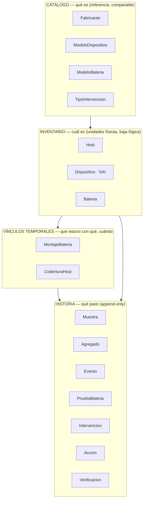
```mermaid
flowchart TB
    subgraph CAT["CATÁLOGO — qué es (referencia, comparable)"]
        FAB[Fabricante]
        MD[ModeloDispositivo]
        MB[ModeloBateria]
        TI[TipoIntervencion]
    end
    subgraph INV["INVENTARIO — cuál es (unidades físicas, baja lógica)"]
        HOST[Host]
        DEV[Dispositivo · SAI]
        BAT[Bateria]
    end
    subgraph VIN["VÍNCULOS TEMPORALES — qué estuvo con qué, cuándo"]
        MON[MontajeBateria]
        COB[CoberturaHost]
    end
    subgraph HIS["HISTORIA — qué pasó (append-only)"]
        MUE[Muestra]
        AGG[Agregado]
        EVE[Evento]
        PRU[PruebaBateria]
        INT[Intervencion]
        ACC[Accion]
        VER[Verificacion]
    end
    CAT --> INV
    INV --> VIN
    VIN --> HIS
    INV --> HIS
```

**La lectura de este diagrama es el modelo entero:** el catálogo describe productos; el inventario,
unidades; los vínculos dicen qué unidad estuvo con cuál y cuándo; la historia registra hechos que
siempre se anclan a un instante y, por ese instante, se resuelven contra los vínculos.

Esa última frase es la clave: **la historia no guarda a qué batería pertenece una métrica.** Guarda
el dispositivo y el instante. La batería se resuelve consultando `MontajeBateria`. Así, corregir un
error en la fecha de un recambio **reatribuye automáticamente** todo el histórico afectado, sin
migrar datos.

### 7.5 Diagrama de entidades

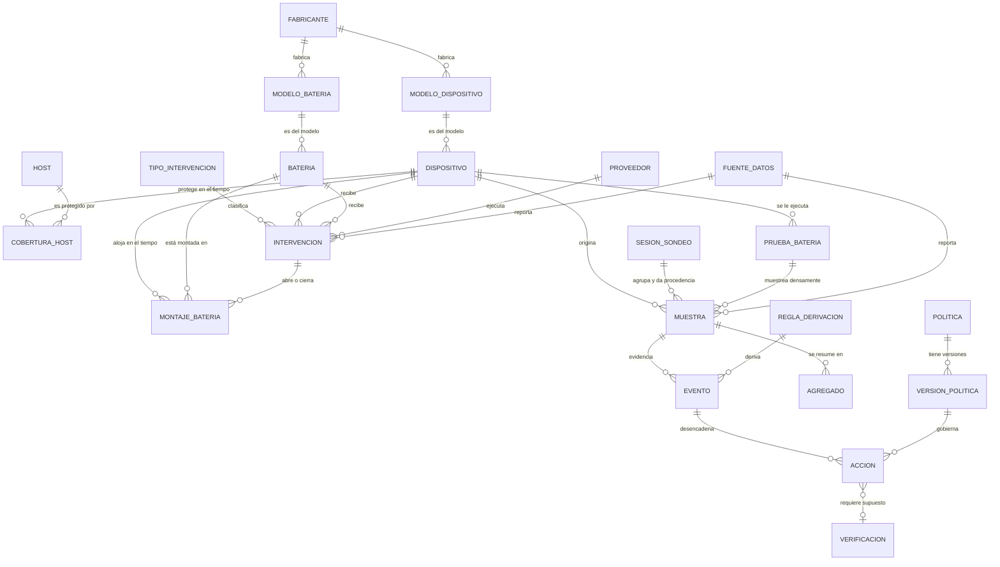
```mermaid
erDiagram
    FABRICANTE ||--o{ MODELO_DISPOSITIVO : fabrica
    FABRICANTE ||--o{ MODELO_BATERIA : fabrica
    MODELO_DISPOSITIVO ||--o{ DISPOSITIVO : "es del modelo"
    MODELO_BATERIA ||--o{ BATERIA : "es del modelo"

    DISPOSITIVO ||--o{ MONTAJE_BATERIA : "aloja en el tiempo"
    BATERIA ||--o{ MONTAJE_BATERIA : "está montada en"
    DISPOSITIVO ||--o{ COBERTURA_HOST : "protege en el tiempo"
    HOST ||--o{ COBERTURA_HOST : "es protegido por"

    DISPOSITIVO ||--o{ MUESTRA : "origina"
    SESION_SONDEO ||--o{ MUESTRA : "agrupa y da procedencia"
    MUESTRA ||--o{ EVENTO : "evidencia"
    REGLA_DERIVACION ||--o{ EVENTO : "deriva"
    MUESTRA ||--o{ AGREGADO : "se resume en"

    DISPOSITIVO ||--o{ PRUEBA_BATERIA : "se le ejecuta"
    PRUEBA_BATERIA ||--o{ MUESTRA : "muestrea densamente"

    EVENTO ||--o{ ACCION : desencadena
    POLITICA ||--o{ VERSION_POLITICA : "tiene versiones"
    VERSION_POLITICA ||--o{ ACCION : "gobierna"
    ACCION }o--o| VERIFICACION : "requiere supuesto"

    TIPO_INTERVENCION ||--o{ INTERVENCION : clasifica
    INTERVENCION ||--o{ MONTAJE_BATERIA : "abre o cierra"
    DISPOSITIVO ||--o{ INTERVENCION : recibe
    BATERIA ||--o{ INTERVENCION : recibe
    PROVEEDOR ||--o{ INTERVENCION : ejecuta

    FUENTE_DATOS ||--o{ MUESTRA : reporta
    FUENTE_DATOS ||--o{ INTERVENCION : reporta
```

> **Cómo se complementan los diagramas.** El ER de arriba muestra *qué se relaciona con qué*. Los
> diagramas de clases que siguen agregan lo que el ER no puede expresar y las pruebas sí necesitan:
> **tipos**, **enumeraciones cerradas**, **anulabilidad** y las **operaciones** que encapsulan los
> invariantes del [Anexo B](#anexo-b--cobertura-invariantes-y-flujos-end-to-end).

### 7.6 Objetos de valor

Estos tipos aparecen dentro de casi todas las entidades. Definirlos primero evita repetirlos.

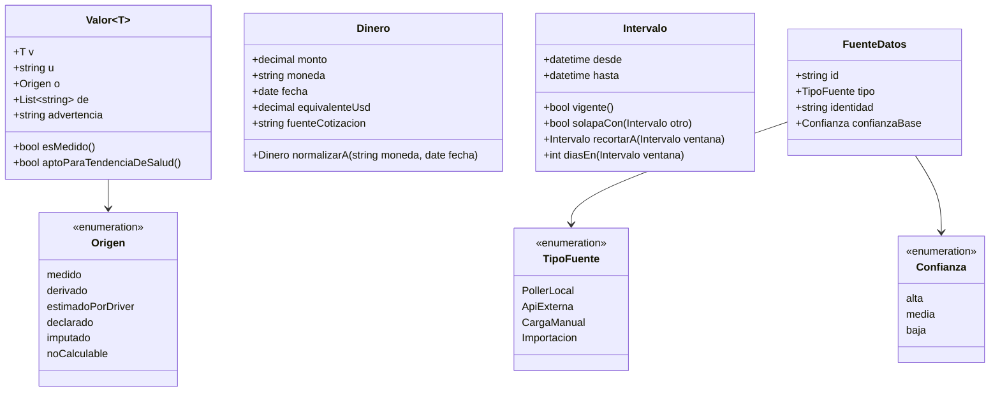
```mermaid
classDiagram
    class Valor~T~ {
        +T v
        +string u
        +Origen o
        +List~string~ de
        +string advertencia
        +bool esMedido()
        +bool aptoParaTendenciaDeSalud()
    }
    class Origen {
        <<enumeration>>
        medido
        derivado
        estimadoPorDriver
        declarado
        imputado
        noCalculable
    }
    class Dinero {
        +decimal monto
        +string moneda
        +date fecha
        +decimal equivalenteUsd
        +string fuenteCotizacion
        +Dinero normalizarA(string moneda, date fecha)
    }
    class Intervalo {
        +datetime desde
        +datetime hasta
        +bool vigente()
        +bool solapaCon(Intervalo otro)
        +Intervalo recortarA(Intervalo ventana)
        +int diasEn(Intervalo ventana)
    }
    class FuenteDatos {
        +string id
        +TipoFuente tipo
        +string identidad
        +Confianza confianzaBase
    }
    class TipoFuente {
        <<enumeration>>
        PollerLocal
        ApiExterna
        CargaManual
        Importacion
    }
    class Confianza {
        <<enumeration>>
        alta
        media
        baja
    }
    Valor --> Origen
    FuenteDatos --> TipoFuente
    FuenteDatos --> Confianza
```

**Dos operaciones que son invariantes ejecutables, no comodidades:**

- `Valor.aptoParaTendenciaDeSalud()` devuelve `false` para `derivado`, `estimadoPorDriver` e
  `imputado`. Es **I-9** hecho código, y es la defensa contra C-3: quien intente construir una
  tendencia con `battery.charge` choca con el tipo, no con una convención.
- `Intervalo.solapaCon()` centraliza **I-1** e **I-4**. Si la comprobación de solapamiento vive en
  un solo lugar, hay un solo lugar donde equivocarse.

> **`Dinero.normalizarA()`** merece una advertencia: convertir entre monedas y fechas **produce un
> valor derivado**, y debe devolver un `Valor` con `o = derivado`, no un `Dinero` que parezca
> original. En un país con la inflación de Argentina, un costo «normalizado» sin marcar es el mismo
> error que `battery.charge`.

### 7.7 Catálogo

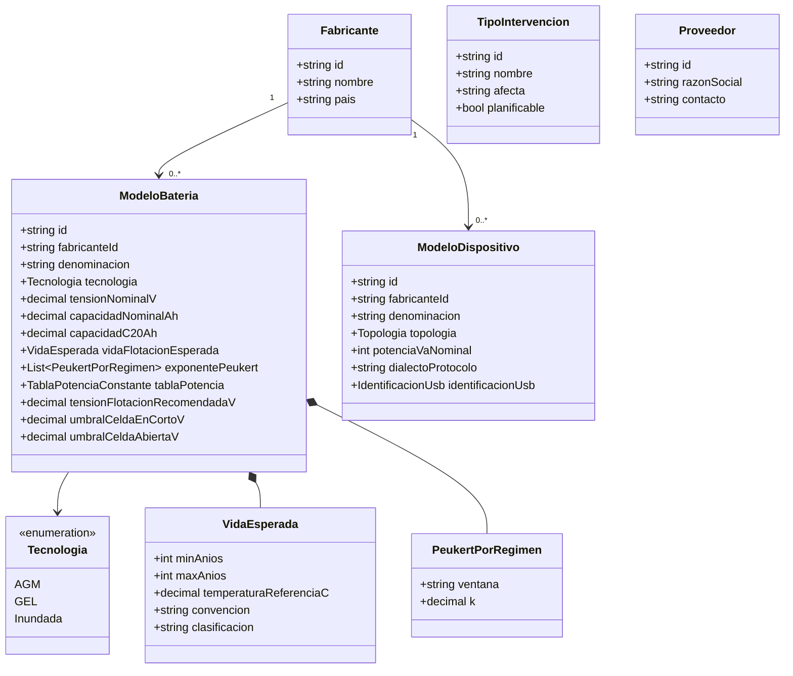
```mermaid
classDiagram
    class Fabricante {
        +string id
        +string nombre
        +string pais
    }
    class ModeloBateria {
        +string id
        +string fabricanteId
        +string denominacion
        +Tecnologia tecnologia
        +decimal tensionNominalV
        +decimal capacidadNominalAh
        +decimal capacidadC20Ah
        +VidaEsperada vidaFlotacionEsperada
        +List~PeukertPorRegimen~ exponentePeukert
        +TablaPotenciaConstante tablaPotencia
        +decimal tensionFlotacionRecomendadaV
        +decimal umbralCeldaEnCortoV
        +decimal umbralCeldaAbiertaV
    }
    class VidaEsperada {
        +int minAnios
        +int maxAnios
        +decimal temperaturaReferenciaC
        +string convencion
        +string clasificacion
    }
    class PeukertPorRegimen {
        +string ventana
        +decimal k
    }
    class ModeloDispositivo {
        +string id
        +string fabricanteId
        +string denominacion
        +Topologia topologia
        +int potenciaVaNominal
        +string dialectoProtocolo
        +IdentificacionUsb identificacionUsb
    }
    class TipoIntervencion {
        +string id
        +string nombre
        +string afecta
        +bool planificable
    }
    class Proveedor {
        +string id
        +string razonSocial
        +string contacto
    }
    class Tecnologia {
        <<enumeration>>
        AGM
        GEL
        Inundada
    }
    Fabricante "1" --> "0..*" ModeloBateria
    Fabricante "1" --> "0..*" ModeloDispositivo
    ModeloBateria --> Tecnologia
    ModeloBateria *-- VidaEsperada
    ModeloBateria *-- PeukertPorRegimen
```

> **`VidaEsperada` es una clase, no dos enteros.** Sin `temperaturaReferenciaC` el dato es
> incomparable entre modelos ([§6.9](#69-lo-que-realmente-va-a-predecir-el-recambio-la-edad)) — y esa
> es la razón de que exista como objeto de valor con su propia validación (**I-21**). Lo mismo con
> `exponentePeukert`, que es una **lista por régimen** porque un escalar sería falso (**O-M11**).

**`ModeloBateria`** — el producto, no la unidad. Es lo que permite comparar marcas.

| Campo | Tipo | Nota |
|-------|------|------|
| `id` | id | |
| `fabricanteId` | ref | |
| `denominacion` | texto | «12V 9Ah AGM VRLA» |
| `tecnologia` | enum | `AGM`, `GEL`, `Inundada` |
| `tensionNominalV` | decimal | 12.0 |
| `capacidadNominalAh` | decimal | 9.0 |
| `capacidadC20Ah` | decimal | Capacidad al régimen de 20 h — es la comparable |
| `vidaFlotacionEsperada` | objeto | Rango declarado por el fabricante **más su temperatura de referencia** |
| `exponentePeukert` | lista | Un `k` **por régimen de descarga**, no un escalar |
| `tablaPotenciaConstante` | objeto | W vs. duración vs. tensión de corte. Preferible a Peukert |
| `tensionFlotacionRecomendadaV` | decimal | A 25 °C |
| `umbralCeldaEnCortoV` / `umbralCeldaAbiertaV` | decimal | 13,3 V y 14,5 V para un bloque de 12 V |

**`ModeloDispositivo`**, **`Fabricante`**, **`TipoIntervencion`**, **`Proveedor`** siguen el mismo
criterio: atributos del *tipo*, nunca de la unidad.

### 7.8 Inventario, con ciclo de vida explícito

Estados, comunes a `Dispositivo` y `Bateria`:

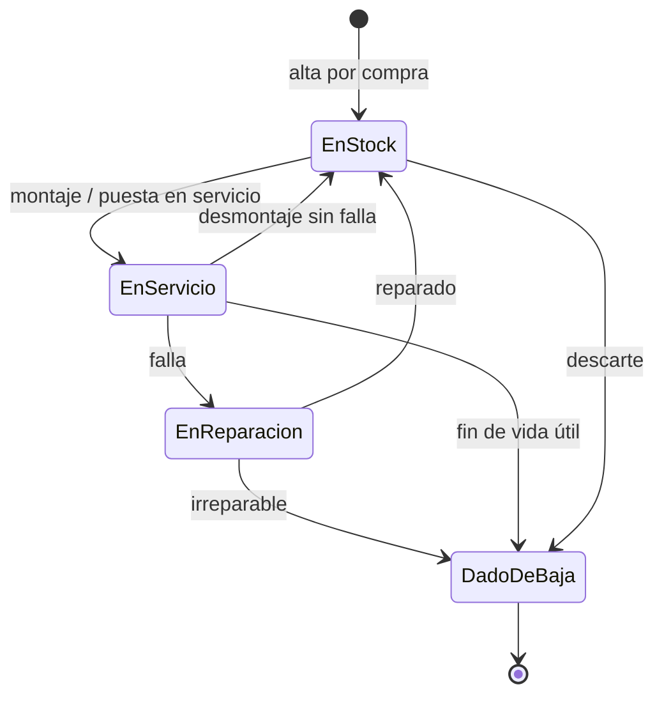
```mermaid
stateDiagram-v2
    [*] --> EnStock: alta por compra
    EnStock --> EnServicio: montaje / puesta en servicio
    EnServicio --> EnStock: desmontaje sin falla
    EnServicio --> EnReparacion: falla
    EnReparacion --> EnStock: reparado
    EnReparacion --> DadoDeBaja: irreparable
    EnServicio --> DadoDeBaja: fin de vida útil
    EnStock --> DadoDeBaja: descarte
    DadoDeBaja --> [*]
```

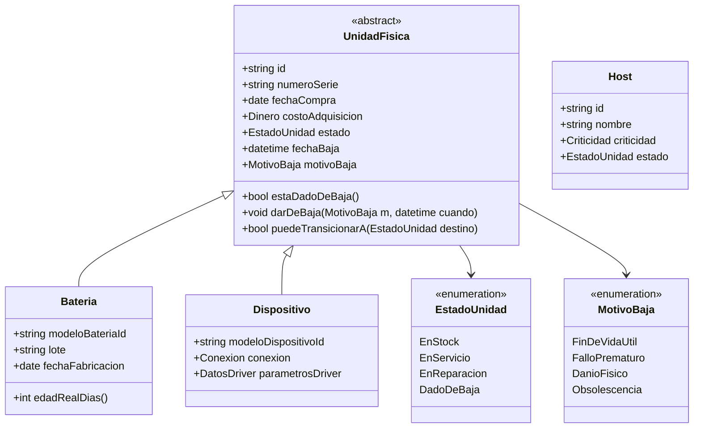
```mermaid
classDiagram
    class UnidadFisica {
        <<abstract>>
        +string id
        +string numeroSerie
        +date fechaCompra
        +Dinero costoAdquisicion
        +EstadoUnidad estado
        +datetime fechaBaja
        +MotivoBaja motivoBaja
        +bool estaDadoDeBaja()
        +void darDeBaja(MotivoBaja m, datetime cuando)
        +bool puedeTransicionarA(EstadoUnidad destino)
    }
    class Bateria {
        +string modeloBateriaId
        +string lote
        +date fechaFabricacion
        +int edadRealDias()
    }
    class Dispositivo {
        +string modeloDispositivoId
        +Conexion conexion
        +DatosDriver parametrosDriver
    }
    class Host {
        +string id
        +string nombre
        +Criticidad criticidad
        +EstadoUnidad estado
    }
    class EstadoUnidad {
        <<enumeration>>
        EnStock
        EnServicio
        EnReparacion
        DadoDeBaja
    }
    class MotivoBaja {
        <<enumeration>>
        FinDeVidaUtil
        FalloPrematuro
        DanioFisico
        Obsolescencia
    }
    UnidadFisica <|-- Bateria
    UnidadFisica <|-- Dispositivo
    UnidadFisica --> EstadoUnidad
    UnidadFisica --> MotivoBaja
```

> **`darDeBaja()` en vez de `delete()`.** La clase base **no expone borrado**: la única forma de
> retirar una unidad es una transición de estado con motivo y fecha. Es P-4 impuesto por el tipo.
>
> **`Bateria.edadRealDias()`** cuenta desde `fechaFabricacion` cuando existe, y solo cae a
> `fechaCompra` si no. Importa porque [§6.9](#69-lo-que-realmente-va-a-predecir-el-recambio-la-edad)
> concluye que **la edad es el mejor predictor**, y en E-6 la batería nueva se fabricó 3 meses antes
> de comprarse.

**`Bateria`**

| Campo | Tipo | Nota |
|-------|------|------|
| `id` | id | |
| `modeloBateriaId` | ref | → catálogo |
| `numeroSerie` | texto? | Muchas SLA de gama baja no lo traen: **anulable a propósito** |
| `lote` | texto? | |
| `fechaFabricacion` | fecha? | Determina la edad real, que suele ser mayor que la de compra |
| `fechaCompra` | fecha | |
| `costoAdquisicion` | Dinero | Ver [§7.14](#714-transversales) |
| `estado` | enum | Diagrama de arriba |
| `fechaBaja` | fechaHora? | **Baja lógica** |
| `motivoBaja` | enum? | `FinDeVidaUtil`, `FalloPrematuro`, `DanioFisico`, `Obsolescencia` |

`Dispositivo` es análogo, más `identificacionUsb`, `dialectoProtocolo` y `parametrosDriver`.

> **Nota sobre la identidad del SAI.** El descriptor USB (`0665:5161`, `INNO TECH`, serie **vacía**)
> **no identifica marca ni modelo del SAI**. El modelo no puede asumir que el dispositivo se
> autoidentifica: `modeloDispositivoId` es un dato **declarado por el operador**, y debe estar
> marcado como tal en su procedencia.

### 7.9 Vínculos temporales

Es el corazón del replanteo.

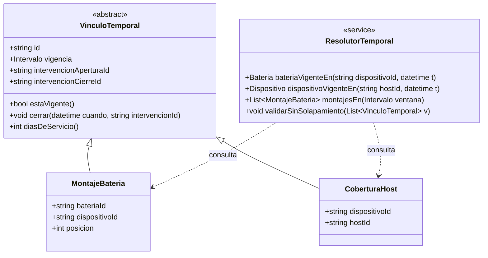
```mermaid
classDiagram
    class VinculoTemporal {
        <<abstract>>
        +string id
        +Intervalo vigencia
        +string intervencionAperturaId
        +string intervencionCierreId
        +bool estaVigente()
        +void cerrar(datetime cuando, string intervencionId)
        +int diasDeServicio()
    }
    class MontajeBateria {
        +string bateriaId
        +string dispositivoId
        +int posicion
    }
    class CoberturaHost {
        +string dispositivoId
        +string hostId
    }
    class ResolutorTemporal {
        <<service>>
        +Bateria bateriaVigenteEn(string dispositivoId, datetime t)
        +Dispositivo dispositivoVigenteEn(string hostId, datetime t)
        +List~MontajeBateria~ montajesEn(Intervalo ventana)
        +void validarSinSolapamiento(List~VinculoTemporal~ v)
    }
    VinculoTemporal <|-- MontajeBateria
    VinculoTemporal <|-- CoberturaHost
    ResolutorTemporal ..> MontajeBateria : consulta
    ResolutorTemporal ..> CoberturaHost : consulta
```

> **`ResolutorTemporal` es la pieza central del replanteo.** Ninguna entidad de historia guarda a
> qué batería pertenece: guarda dispositivo + instante, y **pregunta**. Por eso corregir la fecha de
> un recambio reatribuye el histórico solo, sin migrar datos. Todo el
> [Anexo A](#anexo-a--escenarios-con-ejemplos-completos) depende de este servicio, y las consultas
> de E-7 son literalmente llamadas a él.
>
> **`cerrar()` es la única operación que muta** algo en el modelo, y solo una vez: `hasta` pasa de
> `null` a una fecha. Cualquier otro cambio se registra como hecho nuevo (P-1).

**`MontajeBateria`** — resuelve C-1.

| Campo | Tipo | Nota |
|-------|------|------|
| `id` | id | |
| `bateriaId`, `dispositivoId` | ref | |
| `desde` | fechaHora | |
| `hasta` | fechaHora? | `null` = **vigente**. Es el único campo mutable del modelo, y solo una vez |
| `intervencionAperturaId` | ref? | Qué servicio técnico lo instaló |
| `intervencionCierreId` | ref? | Cuál lo retiró |
| `posicion` | entero? | Para SAI con varias baterías en serie |

**Invariante:** para un mismo `dispositivoId` y `posicion`, **los intervalos no se solapan**. Es la
primera prueba unitaria a escribir.

**`CoberturaHost`** — mismo patrón, `dispositivoId` ↔ `hostId`. Es lo que permite decir *«durante
2027 el host estuvo protegido 340 días por `ups-01` y 25 días por `ups-02` mientras el primero
estaba en reparación»*, y con ello **calcular disponibilidad del servicio de respaldo**, que es uno
de los objetivos planteados.

### 7.10 Historia: la muestra y su procedencia

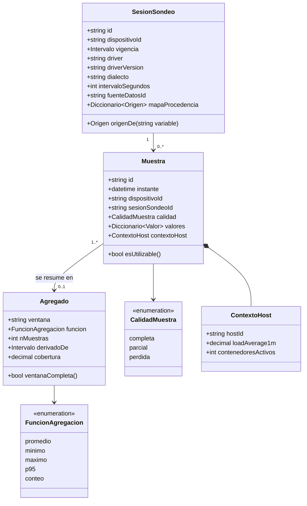
```mermaid
classDiagram
    class SesionSondeo {
        +string id
        +string dispositivoId
        +Intervalo vigencia
        +string driver
        +string driverVersion
        +string dialecto
        +int intervaloSegundos
        +string fuenteDatosId
        +Diccionario~Origen~ mapaProcedencia
        +Origen origenDe(string variable)
    }
    class Muestra {
        +string id
        +datetime instante
        +string dispositivoId
        +string sesionSondeoId
        +CalidadMuestra calidad
        +Diccionario~Valor~ valores
        +ContextoHost contextoHost
        +bool esUtilizable()
    }
    class Agregado {
        +string ventana
        +FuncionAgregacion funcion
        +int nMuestras
        +Intervalo derivadoDe
        +decimal cobertura
        +bool ventanaCompleta()
    }
    class CalidadMuestra {
        <<enumeration>>
        completa
        parcial
        perdida
    }
    class FuncionAgregacion {
        <<enumeration>>
        promedio
        minimo
        maximo
        p95
        conteo
    }
    class ContextoHost {
        +string hostId
        +decimal loadAverage1m
        +int contenedoresActivos
    }
    SesionSondeo "1" --> "0..*" Muestra
    Muestra --> CalidadMuestra
    Muestra *-- ContextoHost
    Muestra "1..*" --> "0..1" Agregado : se resume en
    Agregado --> FuncionAgregacion
```

> **`Agregado` NO hereda de `Muestra`**, aunque comparta forma. Es deliberado: si heredara, cualquier
> función que acepte una `Muestra` aceptaría un promedio horario sin notarlo — que es exactamente el
> fallo de C-7. Son tipos distintos porque significan cosas distintas, y **el compilador debe
> obligar a distinguirlos**.
>
> **`Muestra.esUtilizable()`** devuelve `false` para `calidad = perdida`. Los cálculos de E-5 pasan
> por ahí, y por eso las dos muestras perdidas reales no rompen nada (**I-17**).

**`SesionSondeo`** agrupa muestras bajo una misma configuración de captura. Existe para no repetir
la procedencia en cada muestra:

| Campo | Nota |
|-------|------|
| `id`, `dispositivoId` | |
| `desde`, `hasta` | |
| `driver`, `driverVersion` | `nutdrv_qx` + versión exacta |
| `dialecto` | El *subdriver* Megatec negociado |
| `intervaloSegundos` | |
| `fuenteDatosId` | Quién reporta: poller local, servicio externo, carga manual |

**`Muestra`** — el registro denso:

```
{ instante, dispositivoId, sesionSondeoId, valores{...}, calidad }
```

Y cada entrada de `valores` **no es un número suelto**, sino un valor con procedencia:

| Campo del valor | Nota |
|-----------------|------|
| `v` | El número |
| `u` | Unidad (`V`, `%`, `Hz`) |
| `o` | **Origen**: `medido` \| `derivado` \| `estimadoPorDriver` \| `declarado` \| `imputado` \| `noCalculable` |
| `de` | Si es derivado, de qué variables |

Resuelve C-3. Es más verboso, y a propósito: **el costo de tipear `"o": "medido"` es trivial
comparado con el de descubrir en 2028 que las tendencias de salud se construyeron sobre
`battery.charge`**, que nunca fue una medición.

> **Optimización prevista.** En almacenamiento real, `o` y `de` no se repiten por muestra: se
> declaran una vez por `SesionSondeo` (el mapa variable→origen es fijo mientras no cambie el
> driver). Los ejemplos JSON del [Anexo A](#anexo-a--escenarios-con-ejemplos-completos) los muestran
> expandidos **por legibilidad y porque esa es la forma que viaja por la API**.

**`Agregado`** — resuelve C-7. Mismo *shape* que `Muestra` más:

| Campo | Nota |
|-------|------|
| `ventana` | `PT1H`, `P1D` |
| `funcion` | `promedio`, `minimo`, `maximo`, `p95`, `conteo` |
| `nMuestras` | Cuántas lo componen — permite detectar ventanas incompletas |
| `derivadoDe` | Rango de muestras origen |
| `cobertura` | Fracción de la ventana efectivamente cubierta |

**Regla dura:** un `Agregado` **nunca** se sirve por el mismo canal que una `Muestra` sin decir que
lo es. Y para `input.voltage` se conservan **mínimo y máximo además del promedio**, porque el
promedio horario borra los microcortes, que son el fenómeno de interés.

**Retención.** Resolución completa 30 días; luego agregación horaria; agregados 10 años; eventos
indefinidos. Es la respuesta a los ~6,3 millones de filas al año.

### 7.11 Historia: eventos, pruebas, acciones

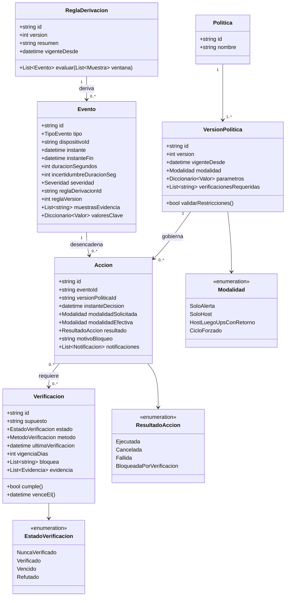
```mermaid
classDiagram
    class Evento {
        +string id
        +TipoEvento tipo
        +string dispositivoId
        +datetime instante
        +datetime instanteFin
        +int duracionSegundos
        +int incertidumbreDuracionSeg
        +Severidad severidad
        +string reglaDerivacionId
        +int reglaVersion
        +List~string~ muestrasEvidencia
        +Diccionario~Valor~ valoresClave
    }
    class ReglaDerivacion {
        +string id
        +int version
        +string resumen
        +datetime vigenteDesde
        +List~Evento~ evaluar(List~Muestra~ ventana)
    }
    class Politica {
        +string id
        +string nombre
    }
    class VersionPolitica {
        +string id
        +int version
        +datetime vigenteDesde
        +Modalidad modalidad
        +Diccionario~Valor~ parametros
        +List~string~ verificacionesRequeridas
        +bool validarRestricciones()
    }
    class Accion {
        +string id
        +string eventoId
        +string versionPoliticaId
        +datetime instanteDecision
        +Modalidad modalidadSolicitada
        +Modalidad modalidadEfectiva
        +ResultadoAccion resultado
        +string motivoBloqueo
        +List~Notificacion~ notificaciones
    }
    class Verificacion {
        +string id
        +string supuesto
        +EstadoVerificacion estado
        +MetodoVerificacion metodo
        +datetime ultimaVerificacion
        +int vigenciaDias
        +List~string~ bloquea
        +List~Evidencia~ evidencia
        +bool cumple()
        +datetime venceEl()
    }
    class Modalidad {
        <<enumeration>>
        SoloAlerta
        SoloHost
        HostLuegoUpsConRetorno
        CicloForzado
    }
    class ResultadoAccion {
        <<enumeration>>
        Ejecutada
        Cancelada
        Fallida
        BloqueadaPorVerificacion
    }
    class EstadoVerificacion {
        <<enumeration>>
        NuncaVerificado
        Verificado
        Vencido
        Refutado
    }
    ReglaDerivacion "1" --> "0..*" Evento : deriva
    Evento "1" --> "0..*" Accion : desencadena
    Politica "1" --> "1..*" VersionPolitica
    VersionPolitica "1" --> "0..*" Accion : gobierna
    Accion "0..*" --> "0..*" Verificacion : requiere
    VersionPolitica --> Modalidad
    Accion --> ResultadoAccion
    Verificacion --> EstadoVerificacion
```

> **Tres decisiones de tipos que son reglas de seguridad:**
>
> - `Accion` referencia `VersionPolitica`, **nunca `Politica`** (**I-13**). No existe forma de
>   escribir el bug de «con qué configuración se decidió esto».
> - `modalidadSolicitada` y `modalidadEfectiva` son **dos campos**. Si fueran uno, la degradación a
>   `SoloAlerta` de E-4 sería invisible en el registro.
> - `EstadoVerificacion` incluye **`Refutado`**, distinto de `Vencido`: una prueba que falló no es lo
>   mismo que una que caducó. La primera debe bloquear para siempre hasta que alguien la resuelva.
>
> **`Verificacion.cumple()`** es la función de la que depende la seguridad del sistema entero: solo
> devuelve `true` con estado `Verificado` **y** dentro de vigencia. Es **I-11** e **I-12**.

**`Evento`** — resuelve C-6:

| Campo | Nota |
|-------|------|
| `id`, `instante`, `dispositivoId` | |
| `tipo` | `CorteSuministro`, `Microcorte`, `RetornoRed`, `DesconexionUsb`, `TensionFueraDeRango`, … |
| `reglaDerivacionId` + `reglaVersion` | **Con qué criterio se derivó** |
| `muestrasEvidencia[]` | Qué muestras lo originaron |
| `instanteFin`, `duracionSegundos`, `incertidumbreDuracionSeg` | Para eventos con extensión |
| `severidad` | |

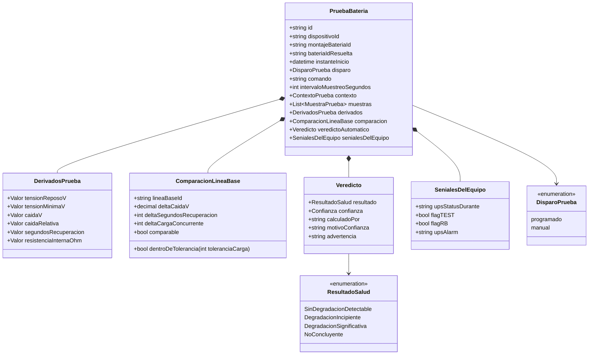
```mermaid
classDiagram
    class PruebaBateria {
        +string id
        +string dispositivoId
        +string montajeBateriaId
        +string bateriaIdResuelta
        +datetime instanteInicio
        +DisparoPrueba disparo
        +string comando
        +int intervaloMuestreoSegundos
        +ContextoPrueba contexto
        +List~MuestraPrueba~ muestras
        +DerivadosPrueba derivados
        +ComparacionLineaBase comparacion
        +Veredicto veredictoAutomatico
        +SenialesDelEquipo senialesDelEquipo
    }
    class DerivadosPrueba {
        +Valor tensionReposoV
        +Valor tensionMinimaV
        +Valor caidaV
        +Valor caidaRelativa
        +Valor segundosRecuperacion
        +Valor resistenciaInternaOhm
    }
    class ComparacionLineaBase {
        +string lineaBaseId
        +decimal deltaCaidaV
        +int deltaSegundosRecuperacion
        +int deltaCargaConcurrente
        +bool comparable
        +bool dentroDeTolerancia(int toleranciaCarga)
    }
    class Veredicto {
        +ResultadoSalud resultado
        +Confianza confianza
        +string calculadoPor
        +string motivoConfianza
        +string advertencia
    }
    class SenialesDelEquipo {
        +string upsStatusDurante
        +bool flagTEST
        +bool flagRB
        +string upsAlarm
    }
    class ResultadoSalud {
        <<enumeration>>
        SinDegradacionDetectable
        DegradacionIncipiente
        DegradacionSignificativa
        NoConcluyente
    }
    class DisparoPrueba {
        <<enumeration>>
        programado
        manual
    }
    PruebaBateria *-- DerivadosPrueba
    PruebaBateria *-- ComparacionLineaBase
    PruebaBateria *-- Veredicto
    PruebaBateria *-- SenialesDelEquipo
    Veredicto --> ResultadoSalud
    PruebaBateria --> DisparoPrueba
```

> **`SenialesDelEquipo` existe para registrar una ausencia.** Sus cuatro campos van a estar siempre
> vacíos en este SAI (**O-U10**). Guardarlos igual documenta que se preguntó y no hubo respuesta —
> y si algún día se cambia el equipo por uno que sí reporta, el histórico muestra desde cuándo.
>
> **`DerivadosPrueba.resistenciaInternaOhm` es un `Valor`, no un `decimal`.** Por eso puede valer
> `null` con `o = noCalculable` y un motivo, en lugar de cero o de un número inventado (**O-M7**).
>
> **`Veredicto.calculadoPor` no es auditoría decorativa**: es la diferencia entre «lo dijo el SAI» y
> «lo calculó nuestro software a partir de una caída de tensión». La [§6](#6-salud-de-batería-qué-se-puede-calcular-de-verdad)
> entera existe para justificar por qué esa distinción importa.

**`PruebaBateria`** — el procedimiento de [§6.7](#67-método-que-se-adopta-y-sus-límites-declarados),
con su contexto:

| Campo | Nota |
|-------|------|
| `id`, `dispositivoId`, `instanteInicio` | |
| `disparo` | `programado` \| `manual` |
| `montajeBateriaId` | **Resuelto en el momento**, para congelar a qué batería corresponde |
| `muestras[]` | Muestreo denso — a 1/s se pierden muestras y a 1/30 s el evento es invisible |
| `contexto` | `ups.load` concurrente, carga del host, temperatura si existiera |
| `derivados` | `caidaV`, `tensionMinima`, `segundosRecuperacion`, `resistenciaInterna` |
| `comparacionLineaBase` | Contra la referencia de −0,47 V / 13,24 V / ~35 s / carga 13 % |
| `veredictoAutomatico` | **Calculado por el servicio**, nunca leído del equipo (**O-U10**) |

**`Accion`** liga evento → política-versión → resultado, e incorpora el supuesto verificado:

| Campo | Nota |
|-------|------|
| `eventoId`, `versionPoliticaId` | Con qué configuración exacta se decidió |
| `modalidadSolicitada` / `modalidadEfectiva` | Las cuatro de [§7.12](#712-modalidades-de-la-acción-de-apagado) |
| `verificacionesRequeridas[]` | Los supuestos de [§4.8](#48-consecuencia-la-entidad-verificacion-y-la-regla-de-bloqueo) |
| `resultado` | `Ejecutada`, `Cancelada`, `Fallida`, `BloqueadaPorVerificacion` |

Ese último valor de `resultado` es la materialización de la regla de
[§4.8](#48-consecuencia-la-entidad-verificacion-y-la-regla-de-bloqueo): **el sistema se niega a
apagar el host si no puede probar que va a volver a encenderse.**

### 7.12 Modalidades de la acción de apagado

La acción de apagado se modela con una **modalidad** explícita, porque las variantes tienen
consecuencias muy distintas:

| Modalidad | Qué hace | Cuándo usarla | Riesgo |
|-----------|----------|---------------|--------|
| `SoloAlerta` | Notifica, no actúa | Puesta en marcha, hasta validar [§4.5](#45-qué-hay-que-verificar-antes-de-confiar-en-esto). **Y es el estado forzado por el sistema mientras haya supuestos sin verificar** | Ninguno |
| `SoloHost` | Apaga el SO, **no toca el SAI** | Cuando el reencendido se resuelve por otro medio | **El host no vuelve solo**: sin transición de energía, la BIOS no arranca |
| `HostLuegoUpsConRetorno` | Apaga el SO y programa `shutdown.return` | **Modalidad objetivo** | Depende del firmware ([§4.4](#44-la-trampa-de-firmware)) |
| `CicloForzado` | Ídem, pero **no cancela el corte** aunque vuelva la red | Garantiza el reencendido ([§4.2](#42-el-bloqueo-que-hay-que-evitar)) | Apagón controlado innecesario si el corte fue breve |

Parámetros que toda modalidad de apagado necesita:

| Parámetro | Significado | Restricción |
|-----------|-------------|-------------|
| `umbralDisparoSegundos` | Tiempo sostenido en `OB`, y/o `battery.voltage` bajo un valor | Punto de partida propuesto: 300 s |
| `tiempoReservadoApagadoSeg` | Cuánto se le da al host para bajar | **≤ 540 s** — techo duro ([§4.3](#43-el-presupuesto-de-tiempo)), invariante **I-10** |
| `cancelableAlVolverLaRed` | Si el temporizador se cancela | `false` en `CicloForzado` |
| `retardoReencendidoSeg` | `ups.delay.start` | Actual 180 s, rango 60–599940 |

> **Recomendación de puesta en marcha:** arrancar en `SoloAlerta` y operar así algunas semanas.
> El histórico de microcortes que se acumule es lo que permite elegir el umbral con datos en vez
> de con intuición. Y mientras los supuestos no estén verificados, **no es una recomendación: es lo
> único que el sistema permite**.

### 7.13 Mantenimiento y costos

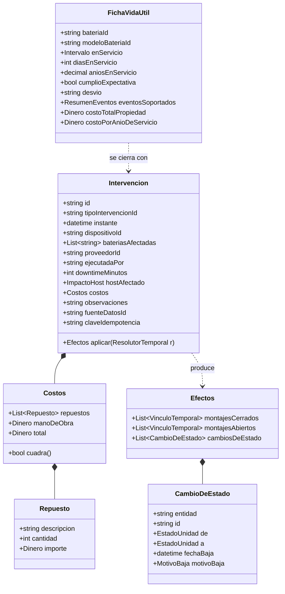
```mermaid
classDiagram
    class Intervencion {
        +string id
        +string tipoIntervencionId
        +datetime instante
        +string dispositivoId
        +List~string~ bateriasAfectadas
        +string proveedorId
        +string ejecutadaPor
        +int downtimeMinutos
        +ImpactoHost hostAfectado
        +Costos costos
        +string observaciones
        +string fuenteDatosId
        +string claveIdempotencia
        +Efectos aplicar(ResolutorTemporal r)
    }
    class Costos {
        +List~Repuesto~ repuestos
        +Dinero manoDeObra
        +Dinero total
        +bool cuadra()
    }
    class Repuesto {
        +string descripcion
        +int cantidad
        +Dinero importe
    }
    class Efectos {
        +List~VinculoTemporal~ montajesCerrados
        +List~VinculoTemporal~ montajesAbiertos
        +List~CambioDeEstado~ cambiosDeEstado
    }
    class CambioDeEstado {
        +string entidad
        +string id
        +EstadoUnidad de
        +EstadoUnidad a
        +datetime fechaBaja
        +MotivoBaja motivoBaja
    }
    class FichaVidaUtil {
        +string bateriaId
        +string modeloBateriaId
        +Intervalo enServicio
        +int diasEnServicio
        +decimal aniosEnServicio
        +bool cumplioExpectativa
        +string desvio
        +ResumenEventos eventosSoportados
        +Dinero costoTotalPropiedad
        +Dinero costoPorAnioDeServicio
    }
    Intervencion *-- Costos
    Costos *-- Repuesto
    Intervencion ..> Efectos : produce
    Efectos *-- CambioDeEstado
    FichaVidaUtil ..> Intervencion : se cierra con
```

> **`Intervencion.aplicar()` devuelve `Efectos`** en lugar de mutar el mundo por su cuenta. Los tres
> efectos de un recambio —cerrar un montaje, abrir otro, cambiar dos estados— quedan **explícitos y
> verificables** en un objeto, que es exactamente lo que C-4 pedía separar. Y hace que E-6 sea
> testeable sin base de datos.
>
> **`FichaVidaUtil` no es una entidad almacenada, es una proyección**: se calcula al cerrar un
> montaje. Es la unidad de comparación entre marcas (flujo F-7) y el único lugar donde vive
> `costoPorAnioDeServicio`.
>
> **`Costos.cuadra()`** verifica que `total == Σ repuestos + manoDeObra`, normalizando por `Dinero`.
> Trivial, y sin embargo es el tipo de invariante que la ingesta externa de E-8 rompe primero.

### 7.14 Transversales

**`Dinero`** — no un decimal suelto. En este contexto (Argentina, inflación, repuestos importados)
un costo sin moneda ni fecha no es comparable en el tiempo:

```json
{ "monto": 45000.00, "moneda": "ARS", "fecha": "2026-03-14", "equivalenteUsd": 38.50, "fuenteCotizacion": "BNA-divisa-venta" }
```

**`FuenteDatos`** — resuelve el requisito de captura automatizada por terceros:

| Campo | Nota |
|-------|------|
| `tipo` | `PollerLocal`, `ApiExterna`, `CargaManual`, `Importacion` |
| `identidad` | Qué sistema o persona |
| `confianza` | Un dato cargado a mano meses después no vale lo mismo que uno sondeado |

**Idempotencia de ingesta:** todo hecho recibido por API lleva `claveIdempotencia` provista por el
emisor. Reenviar el mismo hecho no lo duplica. Sin esto, la captura automatizada por servicios
externos corrompe el histórico en el primer reintento de red.

**Bitemporalidad:** todo hecho lleva `tiempoValido` (cuándo ocurrió) y `tiempoRegistrado` (cuándo lo
supo el sistema). En carga manual la diferencia es de días y es normal; conservarla permite auditar
qué se sabía al decidir.

### 7.15 Cómo se responden las consultas objetivo

Cada requisito planteado, contra el modelo:

| Requisito | Cómo se resuelve |
|-----------|------------------|
| «Saber cuál fue el historial de la batería» | `MontajeBateria` por `bateriaId` → intervalos → métricas del dispositivo en esos rangos + intervenciones sobre esa batería |
| «…o del UPS» | Ídem por `dispositivoId`, uniendo todos sus montajes |
| «En un período, qué dispositivo estuvo activo» | `CoberturaHost` intersecando el período |
| «…qué servicios técnicos y de qué tipo» | `Intervencion` por rango + `TipoIntervencion` |
| «…qué batería intervino» | `MontajeBateria` intersecando el período |
| «…qué eventos intervinieron» | `Evento` por rango |
| «Calidad de servicio de red durante la vida del host» | `Agregado` de `input.voltage`/`frequency` + eventos de corte, sobre `CoberturaHost` |
| «Estimar costos de mantenimiento» | Σ `Intervencion.costos` normalizado por `Dinero`, agrupable por dispositivo, modelo o período |
| «Decidir marcas con mejor desempeño» | Vida útil observada (`MontajeBateria.hasta − desde`) y costo por año de servicio, **agrupado por `ModeloBateria`** |
| «Planificar recambios» | Edad + tendencia de `PruebaBateria.derivados` + vida esperada del catálogo |
| «Captura por servicios externos» | `FuenteDatos` + `claveIdempotencia` en la API de ingesta |

---

## 8. Add-ons de protocolo

La idea de una capa de add-ons que aporte el dialecto de cada equipo es **arquitectónicamente
correcta** — tanto que es exactamente como está construido `nutdrv_qx`, con 19 subdrivers de
protocolo y 13 de puente USB. Por eso la primera entrega **reutiliza esa capa** en lugar de
duplicarla.

El add-on propio se justifica en un solo caso: **un equipo que NUT no soporte**. Para ese
escenario, el proceso planteado —caracterizar el equipo en un host con ese SAI, generar el add-on,
probarlo con una carga de prueba— es viable **con dos condiciones no negociables**:

1. **Sobre un SAI de banco con carga de prueba, nunca sobre el de producción.** La caracterización
   exige *enviar* comandos, y el espacio de comandos Megatec son letras sueltas y adyacentes: `T`
   es un test inocuo de 10 s, **`TL` descarga la batería hasta el corte**, y **`S` corta la
   salida**. Un sondeo exploratorio apaga el servidor.
2. **Con verdad de referencia instrumental** (multímetro, carga conocida). Sin ella no hay forma
   de validar: `voltronic-qs` y `voltronic-qs-hex` producen **números plausibles a partir de los
   mismos bytes** — el dialecto equivocado no falla ruidosamente, falla con valores creíbles.

Y **el firmware manda**: aunque el SAI sea de la misma marca y modelo, hay que relevarlo para
determinar su dialecto. El administrador que registra un equipo nuevo en el servicio debe pasar por
esa experiencia guiada — es el flujo [UF-7](#98-uf-7--reparación-y-sustitución-del-sai).

> **Interfaz del add-on: sin definir.** No tiene sentido especificarla antes de tener el servicio;
> el contrato del adaptador ([§5.2](#52-el-adaptador-de-conexión)) es el que la va a determinar.

El **borrador del prompt de caracterización** está en el
[Anexo C](#anexo-c--borrador-de-prompt-de-caracterización). Es un borrador: **no fue probado** y su
sección de salida es un marcador de posición hasta que exista la interfaz.

---

## 9. Flujos de usuario

> **Naturaleza de esta sección.** Los flujos son **propuesta de diseño**, no comportamiento
> verificado: describen cómo el administrador usaría el servicio para cumplir los objetivos de
> [§2](#2-objetivos-del-servicio). Lo que **no** es propuesta son los datos que atraviesan cada
> flujo: cada uno se ancla a un escenario del [Anexo A](#anexo-a--escenarios-con-ejemplos-completos)
> con su JSON completo, y a los invariantes del
> [Anexo B](#anexo-b--cobertura-invariantes-y-flujos-end-to-end). Un flujo sin escenario que lo
> respalde estaría inventando, y está marcado como tal donde ocurre.

### 9.1 Mapa de flujos

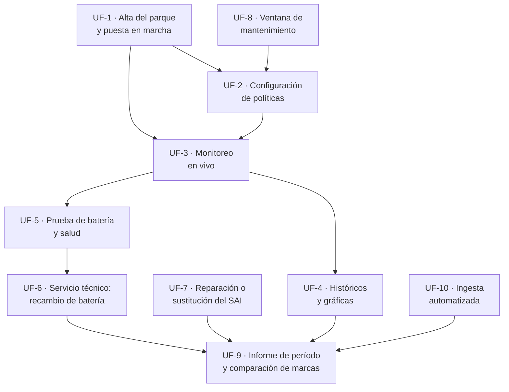
```mermaid
flowchart TB
    UF1["UF-1 · Alta del parque<br/>y puesta en marcha"]
    UF2["UF-2 · Configuración<br/>de políticas"]
    UF3["UF-3 · Monitoreo<br/>en vivo"]
    UF4["UF-4 · Históricos<br/>y gráficas"]
    UF5["UF-5 · Prueba de batería<br/>y salud"]
    UF6["UF-6 · Servicio técnico:<br/>recambio de batería"]
    UF7["UF-7 · Reparación o<br/>sustitución del SAI"]
    UF8["UF-8 · Ventana de<br/>mantenimiento"]
    UF9["UF-9 · Informe de período<br/>y comparación de marcas"]
    UF10["UF-10 · Ingesta<br/>automatizada"]

    UF1 --> UF2
    UF1 --> UF3
    UF2 --> UF3
    UF3 --> UF4
    UF3 --> UF5
    UF5 --> UF6
    UF6 --> UF9
    UF7 --> UF9
    UF8 --> UF2
    UF4 --> UF9
    UF10 --> UF9
```

| Flujo | Objetivo que sirve | Escenario de respaldo |
|-------|--------------------|-----------------------|
| UF-1 · Alta del parque y puesta en marcha | 2, 5 | [E-1](#e-1--alta-del-parque-catálogo-inventario-y-vínculos) |
| UF-2 · Configuración de políticas | 1 | [E-1](#e-1--alta-del-parque-catálogo-inventario-y-vínculos), [E-4](#e-4--corte-prolongado-la-política-dispara-y-el-sistema-se-niega) |
| UF-3 · Monitoreo en vivo | 3, 4 | [E-2](#e-2--sondeo-normal-con-procedencia-por-variable), [E-3](#e-3--microcorte-evento-derivado-sin-acción), [E-4](#e-4--corte-prolongado-la-política-dispara-y-el-sistema-se-niega) |
| UF-4 · Históricos y gráficas | 3, 6 | [E-2](#e-2--sondeo-normal-con-procedencia-por-variable), [E-7](#e-7--consulta-inversa-qué-pasó-en-este-período) |
| UF-5 · Prueba de batería y salud | 4 | [E-5](#e-5--prueba-de-batería-periódica) |
| UF-6 · Recambio de batería | 2, 7 | [E-6](#e-6--recambio-de-batería-intervención-baja-lógica-y-cierre-de-vigencia) |
| UF-7 · Reparación o sustitución del SAI | 2 | [E-1](#e-1--alta-del-parque-catálogo-inventario-y-vínculos) (`ups-02` en stock) |
| UF-8 · Ventana de mantenimiento | 1 | [E-4](#e-4--corte-prolongado-la-política-dispara-y-el-sistema-se-niega) |
| UF-9 · Informe de período y marcas | 2, 7 | [E-7](#e-7--consulta-inversa-qué-pasó-en-este-período) |
| UF-10 · Ingesta automatizada | 8 | [E-8](#e-8--ingesta-desde-un-servicio-externo) |

### 9.2 UF-1 · Alta del parque y puesta en marcha

**Quién.** El administrador único, la primera vez que abre el panel.

**Precondición.** El servicio está desplegado y el SAI conectado por USB.

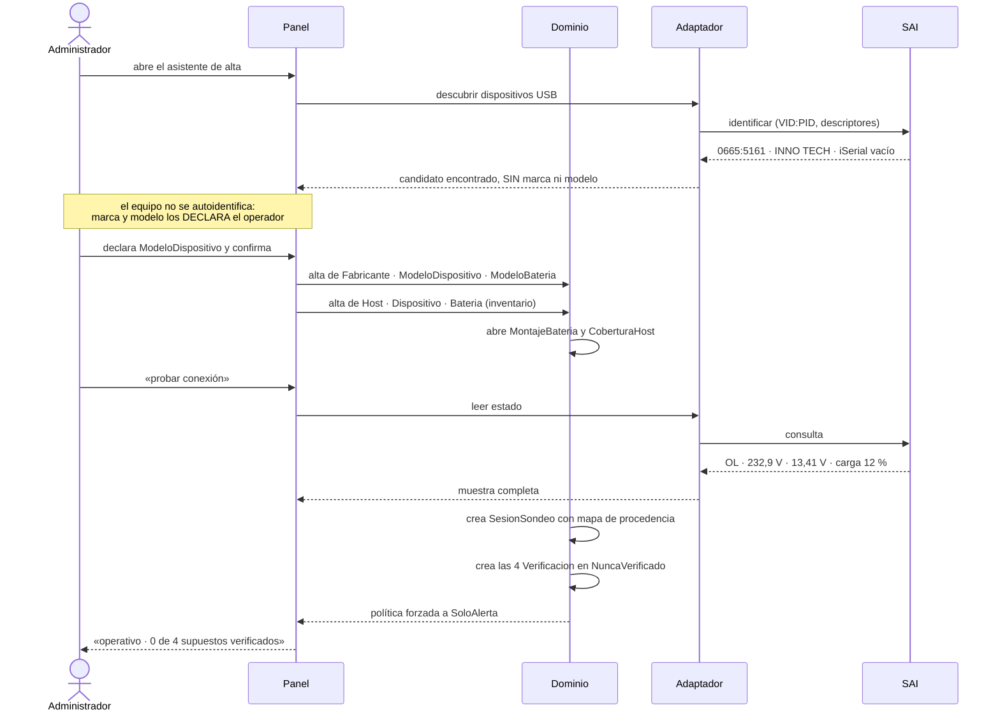
```mermaid
sequenceDiagram
    actor A as Administrador
    participant P as Panel
    participant D as Dominio
    participant AD as Adaptador
    participant U as SAI

    A->>P: abre el asistente de alta
    P->>AD: descubrir dispositivos USB
    AD->>U: identificar (VID:PID, descriptores)
    U-->>AD: 0665:5161 · INNO TECH · iSerial vacío
    AD-->>P: candidato encontrado, SIN marca ni modelo
    Note over P,A: el equipo no se autoidentifica:<br/>marca y modelo los DECLARA el operador
    A->>P: declara ModeloDispositivo y confirma
    P->>D: alta de Fabricante · ModeloDispositivo · ModeloBateria
    P->>D: alta de Host · Dispositivo · Bateria (inventario)
    D->>D: abre MontajeBateria y CoberturaHost
    A->>P: «probar conexión»
    P->>AD: leer estado
    AD->>U: consulta
    U-->>AD: OL · 232,9 V · 13,41 V · carga 12 %
    AD-->>P: muestra completa
    D->>D: crea SesionSondeo con mapa de procedencia
    D->>D: crea las 4 Verificacion en NuncaVerificado
    D-->>P: política forzada a SoloAlerta
    P-->>A: «operativo · 0 de 4 supuestos verificados»
```

**Pasos del asistente**

1. **Descubrir el dispositivo.** El panel lista los candidatos USB con sus descriptores.
2. **Declarar lo que el equipo no dice.** Marca, modelo y potencia nominal se ingresan a mano y
   quedan marcados con procedencia `declarado`. La potencia nominal, si se desconoce, queda `null`
   con procedencia `imputado` — nunca un número inventado.
3. **Dar de alta catálogo e inventario.** Fabricante, modelos, host, SAI y batería.
4. **Abrir los vínculos.** `MontajeBateria` y `CoberturaHost` con `hasta = null`.
5. **Probar la conexión** y crear la `SesionSondeo` con su mapa variable→origen.
6. **Sembrar las verificaciones** en `NuncaVerificado`, lo que fuerza `SoloAlerta`.

**Qué ve el administrador al final.** Estado en vivo, y un aviso permanente: *«la política de
apagado se apoya en 4 supuestos; 0 verificados»*, con enlace a UF-8.

**Postcondición y prueba.** Es la *fixture* de
[E-1](#e-1--alta-del-parque-catálogo-inventario-y-vínculos). Invariantes involucrados: **I-1**,
**I-2**, **I-4**, **I-21**.

### 9.3 UF-2 · Configuración de políticas de apagado

**Quién.** El administrador, tras acumular algunas semanas de histórico.

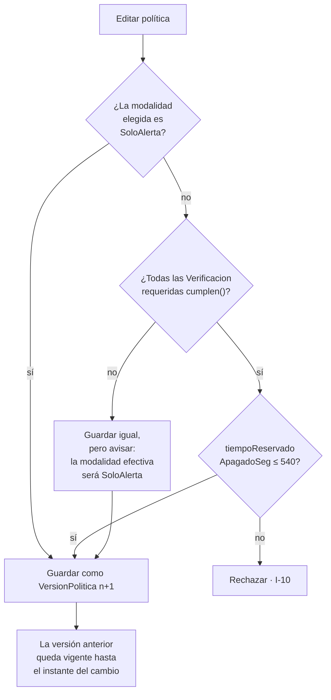
```mermaid
flowchart TB
    A["Editar política"] --> B{"¿La modalidad<br/>elegida es<br/>SoloAlerta?"}
    B -- sí --> G["Guardar como VersionPolitica n+1"]
    B -- no --> C{"¿Todas las Verificacion<br/>requeridas cumplen()?"}
    C -- no --> D["Guardar igual,<br/>pero avisar:<br/>la modalidad efectiva<br/>será SoloAlerta"]
    C -- sí --> E{"tiempoReservado<br/>ApagadoSeg ≤ 540?"}
    E -- no --> F["Rechazar · I-10"]
    E -- sí --> G
    D --> G
    G --> H["La versión anterior<br/>queda vigente hasta<br/>el instante del cambio"]
```

**Reglas que el panel hace visibles, no implícitas**

- **Nunca se edita una política: se crea una versión nueva.** Las acciones pasadas siguen apuntando
  a la versión con la que se decidieron (**I-13**).
- `tiempoReservadoApagadoSeg` tiene **tope duro de 540 s** y el formulario lo valida (**I-10**). El
  panel debe además mostrar cuánto de ese presupuesto ya consume el apagado de contenedores
  ([§4.3](#43-el-presupuesto-de-tiempo)).
- Elegir `HostLuegoUpsConRetorno` o `CicloForzado` con supuestos sin verificar **está permitido pero
  no surte efecto**: el sistema lo dice de antemano y lo registra después en cada `Accion`.
- El umbral de disparo se sugiere a partir del **histórico de microcortes acumulado**, no de una
  intuición.

**Postcondición y prueba.** Nueva `VersionPolitica` vigente. Ver
[E-4](#e-4--corte-prolongado-la-política-dispara-y-el-sistema-se-niega) para el caso en que la
política dispara y el sistema degrada la modalidad.

### 9.4 UF-3 · Monitoreo en vivo

**Quién.** El administrador, desde cualquier equipo de la LAN.

**Qué muestra el panel**

| Bloque | Contenido | Advertencia obligatoria |
|--------|-----------|-------------------------|
| Estado | `ups.status`, tensión de entrada/salida, frecuencia, carga | — |
| Batería | `battery.voltage` medido | `battery.charge` se muestra **marcado como derivado** |
| Conectividad | Última muestra correcta, sondeos fallidos | Alerta a los 3 fallidos consecutivos (**O-U11**) |
| Supuestos | *n* de *m* verificaciones cumplen | Si falta alguna: «la política está degradada a `SoloAlerta`» |
| Eventos recientes | Microcortes y cortes derivados del sondeo | Cada uno con su regla y versión |

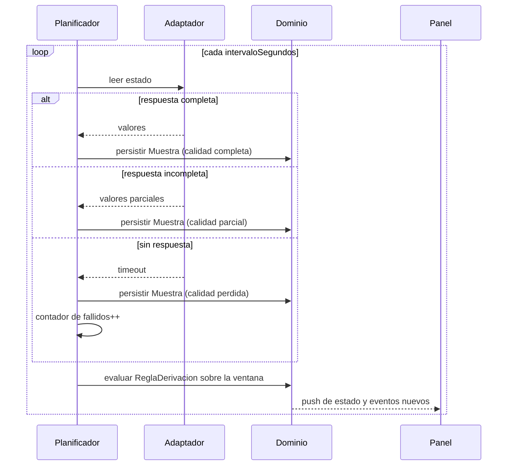
```mermaid
sequenceDiagram
    participant S as Planificador
    participant AD as Adaptador
    participant D as Dominio
    participant P as Panel

    loop cada intervaloSegundos
        S->>AD: leer estado
        alt respuesta completa
            AD-->>S: valores
            S->>D: persistir Muestra (calidad completa)
        else respuesta incompleta
            AD-->>S: valores parciales
            S->>D: persistir Muestra (calidad parcial)
        else sin respuesta
            AD-->>S: timeout
            S->>D: persistir Muestra (calidad perdida)
            S->>S: contador de fallidos++
        end
        S->>D: evaluar ReglaDerivacion sobre la ventana
        D-->>P: push de estado y eventos nuevos
    end
```

> **Detalle que no es cosmético.** Una muestra **parcial se conserva**: descartarla entera perdería
> las variables que sí llegaron. El panel debe poder dibujar una serie con huecos por variable, no
> solo por muestra.

**Postcondición y prueba.** [E-2](#e-2--sondeo-normal-con-procedencia-por-variable) (régimen
normal, incluida una muestra parcial) y [E-3](#e-3--microcorte-evento-derivado-sin-acción)
(microcorte que se registra y no dispara nada). Invariantes: **I-7**, **I-8**, **I-14**, **I-17**.

### 9.5 UF-4 · Consulta de históricos y gráficas

**Quién.** El administrador, revisando calidad de suministro o preparando una decisión.

**Pasos**

1. Elegir **período** y **variables** (una o varias superpuestas).
2. El servicio resuelve, para cada tramo del período, **qué dispositivo y qué batería estaban
   vigentes** — vía `ResolutorTemporal`, no vía un campo guardado.
3. Devuelve la serie, **etiquetada según su fuente**:
   - dentro de la ventana de resolución completa → `Muestra`;
   - fuera → `Agregado`, y entonces **con advertencia y `cobertura` obligatorias** (**I-20**).
4. Los **eventos** se superponen como marcas sobre la serie. El conteo de microcortes **sale de
   `Evento`, nunca de la serie agregada**: el promedio horario los borra.

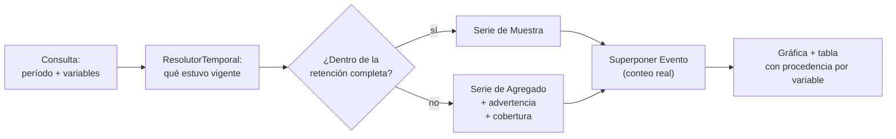
```mermaid
flowchart LR
    Q["Consulta:<br/>período + variables"] --> R["ResolutorTemporal:<br/>qué estuvo vigente"]
    R --> S{"¿Dentro de la<br/>retención completa?"}
    S -- sí --> M["Serie de Muestra"]
    S -- no --> G["Serie de Agregado<br/>+ advertencia<br/>+ cobertura"]
    M --> E["Superponer Evento<br/>(conteo real)"]
    G --> E
    E --> V["Gráfica + tabla<br/>con procedencia por variable"]
```

> **Regla de honestidad del panel.** Cualquier serie que provenga de agregados lo dice en pantalla,
> y cualquier variable derivada o estimada por el driver aparece marcada. Un gráfico de
> `battery.charge` sin su etiqueta de *derivado* es exactamente el modo de falla de C-3.

**Postcondición y prueba.** [E-7](#e-7--consulta-inversa-qué-pasó-en-este-período). Invariantes:
**I-5**, **I-20**.

### 9.6 UF-5 · Prueba de batería y seguimiento de salud

**Quién.** El planificador (programada) o el administrador (manual).

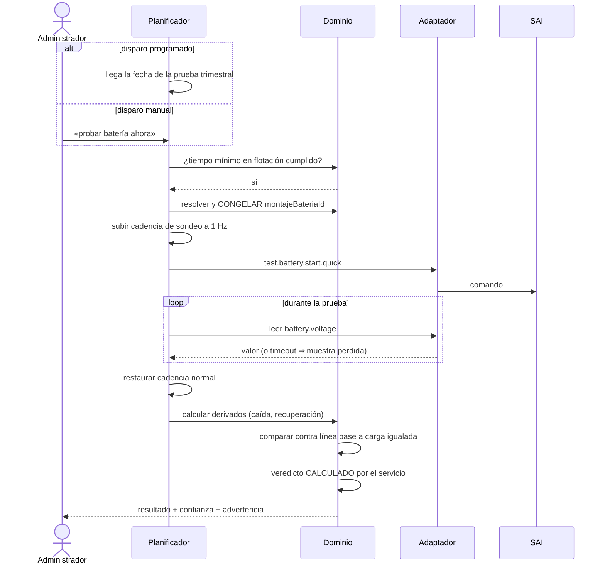
```mermaid
sequenceDiagram
    actor A as Administrador
    participant S as Planificador
    participant D as Dominio
    participant AD as Adaptador
    participant U as SAI

    alt disparo programado
        S->>S: llega la fecha de la prueba trimestral
    else disparo manual
        A->>S: «probar batería ahora»
    end
    S->>D: ¿tiempo mínimo en flotación cumplido?
    D-->>S: sí
    S->>D: resolver y CONGELAR montajeBateriaId
    S->>S: subir cadencia de sondeo a 1 Hz
    S->>AD: test.battery.start.quick
    AD->>U: comando
    loop durante la prueba
        S->>AD: leer battery.voltage
        AD-->>S: valor (o timeout ⇒ muestra perdida)
    end
    S->>S: restaurar cadencia normal
    S->>D: calcular derivados (caída, recuperación)
    D->>D: comparar contra línea base a carga igualada
    D->>D: veredicto CALCULADO por el servicio
    D-->>A: resultado + confianza + advertencia
```

**Reglas del flujo**

- **Precondición de estado de carga:** una prueba poco después de un corte mide otra cosa. Se exige
  un tiempo mínimo en flotación.
- **Cadencia densa mientras dura**, y vuelta a la normal después. A 1 Hz igual se pierden muestras,
  y se pierden **justo en la conmutación**, que es el instante más informativo.
- **Comparabilidad por carga concurrente.** Si `deltaCargaConcurrente` excede la tolerancia, la
  prueba se registra pero se marca `comparable: false` y **no entra en la tendencia** (**I-16**).
- **El veredicto lo calcula el servicio**, y lo dice: el equipo no reporta ninguno (**O-U10**). La
  confianza es explícita y arranca en `baja` mientras haya pocos puntos.
- **`resistenciaInternaOhm` queda `noCalculable` con motivo.** No es un cero ni un hueco: es una
  afirmación ([§6.6](#66-se-puede-calcular-la-resistencia-interna-acá)).

**Postcondición y prueba.** [E-5](#e-5--prueba-de-batería-periódica). Invariantes: **I-15**,
**I-16**, **I-17**.

### 9.7 UF-6 · Alta de servicio técnico: recambio de batería

**Quién.** El administrador, después de que un técnico intervino.

```mermaid
sequenceDiagram
    actor A as Administrador
    participant P as Panel
    participant D as Dominio
    participant R as ResolutorTemporal

    A->>P: nueva Intervencion · tipo «Recambio de batería»
    A->>P: fecha real, proveedor, downtime, hallazgos
    A->>P: costos (repuestos + mano de obra + total)
    P->>D: validar Costos.cuadra()
    A->>P: alta de la batería nueva (serie, lote, fabricación)
    P->>D: aplicar(intervencion)
    D->>R: cerrar MontajeBateria vigente
    D->>R: abrir MontajeBateria nuevo en el mismo instante
    D->>D: bat vieja → DadoDeBaja (FinDeVidaUtil)
    D->>D: bat nueva → EnServicio
    D->>D: proyectar FichaVidaUtil de la batería retirada
    D-->>A: efectos aplicados + ficha de vida útil
```

**Lo que el flujo garantiza**

- **Un solo acto produce tres efectos explícitos**: cierre de vigencia, apertura de la nueva, y dos
  cambios de estado. El objeto `Efectos` los deja auditables (C-4).
- **Baja lógica, nunca borrado.** La batería retirada sigue consultable con todo su historial
  (**I-5**).
- **Sin hueco ni solapamiento**: `mnt-001.hasta == mnt-002.desde` (**I-3**).
- **`fechaFabricacion` anterior a `fechaCompra` no es un error**: es lo normal, y la edad real se
  cuenta desde ahí.
- **`tiempoValido` ≠ `tiempoRegistrado`.** Cargar la intervención tres días después con la factura
  en la mano es el caso corriente, y ambas fechas se conservan.
- Al cerrar el montaje se **proyecta la ficha de vida útil**: cuánto duró de verdad, cuántos eventos
  soportó, si cumplió la expectativa del catálogo y cuánto costó por año de servicio.

**Postcondición y prueba.**
[E-6](#e-6--recambio-de-batería-intervención-baja-lógica-y-cierre-de-vigencia). Invariantes:
**I-3**, **I-5**, **I-6**, **I-18**.

### 9.8 UF-7 · Reparación y sustitución del SAI

**Quién.** El administrador, cuando el SAI falla o se cambia por otro.

Es el caso que el modelo anterior **no podía representar** (C-1): mientras `ups-01` está en
reparación, `ups-02` cubre el host.

```mermaid
stateDiagram-v2
    [*] --> Cubriendo: ups-01 EnServicio<br/>CoberturaHost abierta
    Cubriendo --> SinCobertura: falla ⇒ Intervencion<br/>cierra CoberturaHost<br/>ups-01 → EnReparacion
    SinCobertura --> CubriendoSuplente: se monta ups-02<br/>(EnStock → EnServicio)<br/>nueva CoberturaHost
    CubriendoSuplente --> Cubriendo: ups-01 reparado vuelve<br/>cierra cobertura suplente<br/>abre la original
    CubriendoSuplente --> [*]: ups-01 irreparable<br/>→ DadoDeBaja
```

**Reglas del flujo**

- Cada tramo es una `CoberturaHost` distinta. **Los días sin protección quedan registrados** como el
  hueco entre dos coberturas — y son exactamente lo que el informe de UF-9 reporta como
  `diasSinProteccion`.
- Un SAI que se retira **puede volver**: `EnReparacion → EnStock → EnServicio` es un camino válido
  del diagrama de estados. Solo `DadoDeBaja` es terminal.
- **Si el SAI nuevo es de otro modelo, el dialecto hay que relevarlo otra vez.** El panel debe
  disparar el procedimiento de caracterización ([§8](#8-add-ons-de-protocolo)) en lugar de asumir
  que el driver actual sirve — y **todas las verificaciones de firmware vuelven a
  `NuncaVerificado`**, porque fueron probadas contra otro equipo.
- El anclaje del USB **por ruta física de puerto** ([§5.4](#54-el-contenedor-y-el-usb)) hace que el
  reemplazo no rompa el binding: significa *«el SAI que esté enchufado ahí»*.

> **Nota de alcance.** Este flujo **no tiene escenario JSON propio** en el Anexo A. `ups-02` existe
> en [E-1](#e-1--alta-del-parque-catálogo-inventario-y-vínculos) precisamente para que la sucesión
> de coberturas sea representable, pero la secuencia completa de sustitución no está ejemplificada.
> Es un hueco conocido del juego de datos, no una capacidad que falte en el modelo.

### 9.9 UF-8 · Ventana de mantenimiento: verificar los supuestos

**Quién.** El administrador, con presencia física, en una ventana planificada.

Es el flujo que **desbloquea el objetivo 1**. Sin él, el servicio nunca sale de `SoloAlerta`.

```mermaid
sequenceDiagram
    actor A as Administrador
    participant P as Panel
    participant D as Dominio
    participant H as Host
    participant U as SAI

    A->>P: iniciar «ventana de verificación»
    P-->>A: checklist de los 4 supuestos
    Note over A: contenedores detenidos, presencia física
    A->>H: cronometrar apagado completo bajo carga
    A->>P: registrar tiempo medido
    P->>D: Verificacion presupuesto-apagado → Verificado (vigencia 180 d)
    A->>U: cortar alimentación de red al SAI
    U-->>D: ups.status = OB (evidencia)
    P->>D: Verificacion flag-OB → Verificado
    A->>P: ejecutar shutdown.return controlado
    U--xH: corta la salida
    A->>U: restaurar la energía
    U->>H: restablece la salida
    H->>H: ¿arranca solo?
    alt arranca sin tocar el botón
        A->>P: registrar resultado
        P->>D: bios-autoencendido → Verificado
        P->>D: shutdown-return → Verificado
        D-->>A: modalidad HostLuegoUpsConRetorno ya es efectiva
    else no arranca
        P->>D: bios-autoencendido → Refutado
        D-->>A: bloqueo permanente hasta resolverlo
    end
```

**Reglas del flujo**

- Cada verificación se guarda **con su evidencia, su método y su vigencia**. La del presupuesto de
  apagado lleva **vigencia corta a propósito** (180 días): la carga del host cambia.
- **`Refutado` no es `Vencido`.** Una prueba que falló bloquea hasta que alguien la resuelva; una
  vencida solo pide repetirla.
- **Las verificaciones también se renuevan solas.** Un corte real que muestre `OB` renueva
  `ver-flag-ob` sin prueba destructiva, y un corte seguido de arranque automático renueva
  `ver-bios-autoencendido` ([§4.7](#47-la-vía-que-aporta-el-servicio-verificación-continua-por-evidencia)).
  Ese es el aporte del servicio: la ventana de mantenimiento se hace una vez, la verificación sigue
  viva sola.
- **Sin este flujo, la modalidad efectiva es siempre `SoloAlerta`.** El panel debe decirlo en la
  pantalla principal, no enterrarlo en configuración.

**Postcondición y prueba.** El estado inicial y su bloqueo están en
[E-4](#e-4--corte-prolongado-la-política-dispara-y-el-sistema-se-niega); la variante con supuestos
verificados es el flujo **F-3**, el único que **no se puede probar solo con software**.

### 9.10 UF-9 · Informe de período y comparación de marcas

**Quién.** El administrador, al cerrar un año o al decidir una compra.

**Informe de período** — una sola consulta por intervalo devuelve:

| Sección | Contenido |
|---------|-----------|
| Dispositivos activos | Qué SAI cubrió el host, cuántos días, qué porcentaje |
| Cobertura | Días con y sin protección, disponibilidad del respaldo |
| Baterías intervinientes | Con sus intervalos **recortados al período**, incluidas las dadas de baja |
| Intervenciones | Tipo, fecha, costo, *downtime* |
| Costo de mantenimiento | Total y desglose por tipo, normalizado a USD |
| Eventos | Resumen por tipo y los más significativos |
| Calidad de suministro | Promedio/mín/máx/p95 de `input.voltage` **con advertencia de agregado y cobertura** |
| Pruebas de batería | Con veredicto y confianza |

**Comparación de marcas** — se apoya en las fichas de vida útil cerradas:

```mermaid
flowchart LR
    F1["FichaVidaUtil<br/>bat A · modelo X"] --> AG["Agrupar por<br/>ModeloBateria"]
    F2["FichaVidaUtil<br/>bat B · modelo X"] --> AG
    F3["FichaVidaUtil<br/>bat C · modelo Y"] --> AG
    AG --> N["Normalizar<br/>costoPorAnioDeServicio<br/>a USD"]
    N --> C["¿Qué modelo rinde<br/>mejor por peso gastado?"]
```

> **Por qué la normalización no es un detalle.** Comparar 52 000 ARS de 2026 con 180 000 ARS de 2024
> no significa nada. Y el valor normalizado **es derivado**: viaja marcado como tal, igual que
> cualquier otro valor calculado ([§7.14](#714-transversales)).

**Postcondición y prueba.** [E-7](#e-7--consulta-inversa-qué-pasó-en-este-período) y el flujo
**F-7**. Invariantes: **I-5**, **I-18**, **I-20**.

### 9.11 UF-10 · Ingesta automatizada desde un servicio externo

**Quién.** Un sistema externo de gestión de mantenimiento, sin intervención humana.

```mermaid
sequenceDiagram
    participant X as Sistema externo
    participant API as API de ingesta
    participant D as Dominio

    X->>API: POST /intervenciones<br/>X-Idempotency-Key + X-Fuente-Datos
    API->>D: validar Costos.cuadra() · Dinero con moneda y fecha
    alt válido y clave nueva
        D-->>API: creado
        API-->>X: 201 · id · confianza «media»
    else clave ya procesada, mismo cuerpo
        API-->>X: 200 · creado=false · mismo id
    else clave ya procesada, cuerpo distinto
        API-->>X: 409 · conflicto_idempotencia + huellas
    else invariante roto
        API-->>X: 422 · campo + invariante violado
    end
```

**Reglas del flujo**

- **El reintento no duplica.** Es el caso normal, no el excepcional: la red falla y el emisor
  reintenta (**I-19**).
- **Misma clave con cuerpo distinto devuelve 409, no 200.** Devolver 200 sería peor que duplicar: el
  emisor creería que su corrección se aplicó.
- **La confianza del dato externo es menor** que la del *poller* local, y queda registrada en el
  hecho.
- **Se puede consultar una entidad dada de baja, pero no operarla.** Una intervención fechada
  después de la baja se rechaza; consultar su historial es válido (**I-5**).

**Postcondición y prueba.** [E-8](#e-8--ingesta-desde-un-servicio-externo). Invariantes: **I-18**,
**I-19**.

### 9.12 Trazabilidad: flujo → escenario → invariante

| Flujo | Escenarios | Invariantes que ejercita |
|-------|-----------|--------------------------|
| UF-1 | E-1 | I-1, I-2, I-4, I-21 |
| UF-2 | E-1, E-4 | I-10, I-13 |
| UF-3 | E-2, E-3 | I-7, I-8, I-14, I-17 |
| UF-4 | E-2, E-7 | I-5, I-9, I-20 |
| UF-5 | E-5 | I-15, I-16, I-17 |
| UF-6 | E-6 | I-3, I-5, I-6, I-18 |
| UF-7 | E-1 (parcial) | I-4, I-6 |
| UF-8 | E-4 | I-11, I-12 |
| UF-9 | E-7 | I-5, I-18, I-20 |
| UF-10 | E-8 | I-18, I-19 |

> **Lectura de esta tabla.** Todo invariante del Anexo B queda cubierto por al menos un flujo,
> salvo lo señalado en UF-7. Es la comprobación de que los flujos y el modelo describen el mismo
> sistema.

---

## 10. Riesgos y decisiones abiertas

| ID | Riesgo / decisión | Impacto | Estado |
|----|-------------------|---------|--------|
| **S-1** | El ciclo de apagado y reencendido **no está verificado** en este equipo; la trampa de firmware ([§4.4](#44-la-trampa-de-firmware)) podría dejar el SAI apagado para siempre | **Crítico** | Requiere prueba en ventana de mantenimiento (UF-8) |
| **S-2** | El presupuesto de 540 s **no está medido** contra el apagado real del host, y la corrección de **R-1** consume 150 s de ese techo | **Alto** | Medir antes de habilitar el apagado |
| **S-3** | La BIOS debe tener *Restore on AC Power Loss* = **Power On**; sin verificar, y **no es legible por software** ([§4.6](#46-se-puede-verificar-por-software-el-restore-on-ac-power-loss)) | **Alto** | Verificar por comportamiento; después se mantiene solo por evidencia ([§4.7](#47-la-vía-que-aporta-el-servicio-verificación-continua-por-evidencia)) |
| **S-4** | El flag `LB` **no fue observado**: la política no debería depender de él | Medio | Usar tiempo en `OB` + `battery.voltage` |
| **S-5** | Competencia por el nodo USB entre el contenedor, NUT en el host (**O-U1**) y otro contenedor (**O-U2**) | Medio | Decidir dónde vive NUT ([§5.4](#54-el-contenedor-y-el-usb)) |
| **S-6** | Desapariciones del bus USB documentadas en este modelo (**O-U11**) | Medio | Vigilancia de conectividad obligatoria |
| **S-7** | Retención de métricas: definida en el modelo, **no probada** contra el volumen real | Bajo | Validar la agregación antes de producción |
| **S-8** | ¿NUT dentro del contenedor o en el host? | Bajo | Decisión abierta ([§5.4](#54-el-contenedor-y-el-usb)) |
| **S-9** | **Sin sensor de temperatura**: el confusor de la tendencia de salud no tiene solución con este equipo (**O-M5**) | **Alto** para la salud de batería | Declarado; toda conclusión de salud lleva esa reserva |
| **S-10** | El modelo de datos **no se implementó**: los invariantes del Anexo B son hipótesis de diseño hasta que existan como pruebas que corran | Medio | Escribirlos como pruebas antes de codificar |
| **S-11** | La secuencia completa de **sustitución de SAI** (UF-7) no tiene escenario de datos que la ejercite | Bajo | Agregar un E-9 cuando se implemente |

---

## 11. Observaciones

Separando hechos de interpretaciones. Las **O-U** provienen del relevamiento del equipo; las **O-M**,
del análisis del modelo de datos.

| # | Observación | Tipo | Severidad |
|---|-------------|------|-----------|
| **O-U1** | Las unidades systemd de NUT quedaron `enabled` en el host y competirían por el equipo con el contenedor | Hecho | Media |
| **O-U2** | Un contenedor vecino monta `/dev/bus/usb` con `rwm`: hay competencia por el nodo USB | Hecho | Media |
| **O-U8** | `ups.load` pasó de 13 % a 30 % al sumar dos contenedores: la carga del host varía mucho | Hecho | Media |
| **O-U9** | Sin la carga concurrente, las mediciones de batería **no son comparables entre sí** | Interpretación | **Alta** |
| **O-U10** | El equipo **no señala el test** por software: 51 muestras sin `TEST`/`RB`/`ups.alarm` | Hecho | **Alta** |
| **O-U11 / O-U12** | Desapariciones documentadas del bus USB en este modelo de dispositivo | Hecho | Media |
| **O-U13** | El software del fabricante tiene RCE sin parche: no es una alternativa | Hecho | — |
| **O-M1** | El ajuste «Restore on AC Power Loss» **no es legible** por ninguna vía soportada. Está en la variable UEFI `Setup-ec87d643…` (1222 bytes, solo root) como *blob* sin estructura documentada | Hecho (verificado 2026-07-19) | — |
| **O-M2** | `wtmp` ya distingue arranques sucios (`crash`) de limpios. Cruzado con eventos del SAI, **verifica el reencendido automático sin prueba destructiva** | Interpretación | — |
| **O-M3** | Los dos `crash` registrados (10 y 15 de julio) **no prueban nada**: `wtmp` no distingue corte de energía de *reset* manual o *panic* | Hecho | — |
| **O-M4** | Un microcorte de 3 s **no es detectable de forma confiable** con sondeo cada 5 s. La duración de eventos cortos lleva incertidumbre estructural | Interpretación | Media |
| **O-M5** | **No hay sensor de temperatura.** La resistencia interna depende fuertemente de ella, y la oscilación estacional del gabinete **puede rivalizar con la señal de degradación** en un año. Sin solución con este equipo | Hecho | **Alta** |
| **O-M6** | La línea base de salud se tomó con la batería **ya en servicio desde 2024**. IEEE 1188 pide tomarla a los ~6 meses de vida. Es una referencia de conveniencia, **no una línea base de batería nueva** | Hecho | Media |
| **O-M7** | La resistencia interna absoluta **no es calculable** con las señales disponibles: `ups.load` es un entero porcentual de una nominal desconocida, sin factor de potencia ni rendimiento del inversor | Hecho | — |
| **O-M8** | **Ningún proyecto de software libre calcula salud de batería a partir de datos de NUT**; todos retransmiten la bandera del firmware. En este equipo esa bandera nunca llega (**O-U10**) | Hecho | Media |
| **O-M9** | Las cifras «25 %» y «20 %» de umbral óhmico que circulan atribuidas a IEEE 1188 **no tienen respaldo**: la primera es experiencia de campo de un fabricante, la segunda una entrada de blog sin cláusula citada | Hecho | — |
| **O-M10** | **Contradicción sin resolver** entre fuentes sobre si existe una revisión IEEE 1188-2025 que sustituya a la de 2005. No se pudo leer el texto normativo (norma de pago) | Hecho | Baja |
| **O-M11** | El exponente de Peukert **no es constante**: para estas baterías de 7 Ah va de 1,11 (20 h) a ~1,5 (5 min). El rango «AGM 1,05–1,15» que circula **no tiene cita** y corresponde a regímenes lentos | Hecho | Media |
| **O-M12** | Con **un solo bloque de 12 V** no existe dispersión de flotación entre bloques, que es la señal de flotación que sí es diagnóstica | Hecho | Baja |
| **O-M13** | La **corriente de flotación** —el mejor indicador en modo flotación— **no está disponible por NUT** y requiere sonda dedicada | Hecho | Media |
| **O-M14** | La flotación medida (13,41 V = 2,235 V/celda) está **apenas por encima** del umbral de celda en corto que publica CSB (2,2 V/celda). No es alarma, pero conviene seguirlo | Hecho | Baja |
| **O-M15** | Las cifras de tensión en reposo que circulan (12,6 / 11,8 V) son de baterías **inundadas**. Para AGM son 12,96 / 11,64 V. Aplicar la tabla equivocada **subestima el estado de carga** | Hecho | Media |
| **O-M16** | Varias «reglas» de vida útil por temperatura provienen de **cláusulas de garantía**, no de secciones de ingeniería. Son asignación de riesgo comercial citada después como física | Interpretación | Baja |
| **O-M17** | El modelo de dominio inicial **no podía responder** «en este período, qué dispositivo estuvo activo»: la vigencia como atributo de `Bateria` no representa la sustitución de un SAI | Hecho | **Alta** |
| **O-M18** | Guardar `battery.charge` sin marcar que es una interpolación del driver es **el modo de falla más probable** del sistema: no un error de código, sino una conclusión falsa sobre datos que parecían medidos | Interpretación | **Alta** |

---

## 12. Qué queda sin verificar

- **El ciclo completo de apagado y reencendido.** Nada de la
  [§4](#4-el-problema-crítico-garantizar-el-reencendido) fue probado en este equipo. Es el riesgo
  **S-1** y el flujo [UF-8](#99-uf-8--ventana-de-mantenimiento-verificar-los-supuestos).
- **El tiempo real de apagado completo del host bajo carga.** Sin ese número, cualquier valor de
  retardo es una conjetura.
- **El texto normativo de IEEE 1188 y 1491.** Normas de pago; todas las citas son reproducciones
  secundarias de fuentes identificadas. Si alguna cifra va a fundamentar una compra, hay que
  comprar la norma.
- **Coup de fouet en baterías de 7–9 Ah.** No se encontró literatura: es un vacío de evidencia, no
  un resultado negativo.
- **Error de normalización de autonomía para cargas de potencia constante en VRLA.** No se encontró
  ninguna fuente que lo cuantifique. Cualquier número que se use debe ser derivación propia.
- **El modelo de datos no se implementó.** Es un diseño en papel: los invariantes del
  [Anexo B](#anexo-b--cobertura-invariantes-y-flujos-end-to-end) son hipótesis de diseño hasta que
  existan como pruebas que corran.
- **Los flujos de usuario de [§9](#9-flujos-de-usuario) son propuesta.** Están anclados a escenarios
  con datos, pero ninguna interfaz fue construida ni validada con uso real.

---

## 13. Referencias

### Protocolo y software de monitoreo

- **NUT — protocolo Megatec**: juego de comandos y la advertencia de firmware sobre `S<n>R<m>`
  citada en [§4.4](#44-la-trampa-de-firmware).
  <https://networkupstools.org/protocols/megatec.html>
- **NUT — `upsmon.conf`** y **`nutdrv_qx`**: modelo de políticas y parámetros del driver.
  <https://networkupstools.org/docs/man/upsmon.conf.html> ·
  <https://networkupstools.org/docs/man/nutdrv_qx.html>
- **NUT — *Developer Guide***, tabla de variables (espacio de nombres, `battery.status`,
  `battery.packs.bad`). <https://networkupstools.org/docs/developer-guide.chunked/apas02.html>

### Normas

- **IEEE Std 1188-2005** — *Recommended Practice for Maintenance, Testing, and Replacement of VRLA
  Batteries for Stationary Applications*. Anexo C.4 (tendencia óhmica), Cláusula 8 (criterio del
  80 %). Enmendada por **1188a-2014**. Texto no verificado (de pago); ver **O-M10**.
- **IEEE Std 450**, **IEEE Std 1491-2012** (inactiva), **IEC 60095-1**, **IEC 61056**.
- **Eurobat**, *Guide on VRLA batteries* (2022) — clasificación de vida calendario a 20 °C.
  <https://www.eurobat.org/wp-content/uploads/2022/06/Eurobat-guide-on-VRLA-2022_exe.pdf>

### Literatura técnica

- **EPRI** (Davis, Funk, Johnson), *Internal Ohmic Measurements and their Relationship to Battery
  Capacity*, Battcon 2002 — dispersión de la correlación óhmica.
- **Cantor, W.**, *Battery Maintenance is (mostly) Worthless*, Battcon 2017 — el caso del 6 % de
  capacidad con tensiones en especificación.
  <https://www.vertiv.com/4aff68/globalassets/documents/battcon-static-assets/2017/battery-maintenance-is-mostly-worthless.pdf>
- **Nispel & Kim**, *The Study of Internal Ohmic Testing*, Battcon 2004 — correlación con capacidad
  de 60,3 a 64,9.
- **Floyd & Boisvert**, *A Proposed Float Current Estimation Technique*, Battcon 2002 — corriente de
  flotación, duplicación por 10 °C.
- **Delaille, Perrin, Huet & Hernout**, *Study of the «coup de fouet» of lead-acid cells as a
  function of their state-of-charge and state-of-health*, J. Power Sources 158(2) 2006.
  <https://doi.org/10.1016/j.jpowsour.2005.11.015>
- **Li et al.**, *Electronics* 10(19):2425, 2021 (acceso abierto) — el coup de fouet puede no
  ocurrir bajo ciertas tensiones de carga. <https://doi.org/10.3390/electronics10192425>
- **Doerffel & Abu-Sharkh**, *A critical review of using the Peukert equation…*, J. Power Sources
  155(2) 2006. <https://doi.org/10.1016/j.jpowsour.2005.04.030>
- **Kramm**, INTELEC 2006 (Exide) — ensayos de flotación a alta temperatura; el modelo tradicional
  es «optimista» para baterías de UPS.
- **Sandia National Laboratories**, SAND2004-3149 — vida por ciclos según profundidad de descarga.

### Hojas de datos y documentación de producto

- **CSB GP1272** (12 V 7,2 Ah AGM) — tablas de descarga a corriente y potencia constante, 23 mΩ.
- **Power-Sonic PS-1270** — tablas por tensión de corte; OCV AGM 2,16 / 1,94 V por celda.
- **GS Yuasa NP7-12** — tablas de potencia constante.
- **APC / Schneider** — criterio del autotest: velocidad de caída de tensión para una carga dada.
- **Eaton** — *ABM Technology* (AP162001EN / AP162003EN), prueba de fin de vida útil.
- **CyberPower PowerPanel** — «Mandatory Power Cycle», citado en
  [§4.2](#42-el-bloqueo-que-hay-que-evitar).

---

# Anexo A — Escenarios con ejemplos completos

> **Cómo leer este anexo.** Cada escenario tiene: **contexto** (qué situación real representa),
> **qué ejercita del modelo**, el **JSON completo**, y **qué verificar** — la traducción directa a
> casos de prueba. Los identificadores son legibles a propósito (`ups-01`, `bat-2026-a`) para que
> las *fixtures* de test se lean solas.
>
> Los ocho escenarios están encadenados: forman **una única línea de tiempo coherente**, de la
> puesta en marcha al recambio de batería. Sirven como juego de datos de un *end-to-end* completo.
>
> **Sobre la veracidad de los datos.** Los valores marcados como medidos provienen del relevamiento
> del 2026-07-19. Los marcados `reconstruido`, `_advertenciaFixture` o «ficticio» **no son
> mediciones**: rellenan las series para que las *fixtures* sean ejecutables. La distinción es el
> mismo principio de procedencia de [§7.10](#710-historia-la-muestra-y-su-procedencia) aplicado a
> los datos de prueba.

## Línea de tiempo de los escenarios

```mermaid
gantt
    dateFormat YYYY-MM-DD
    axisFormat %m/%y
    section Inventario
    bat-2024-a montada           :2024-11-20, 2026-09-05
    bat-2026-a montada           :2026-09-05, 2027-06-30
    ups-01 cubre i7infra         :2024-11-20, 2027-06-30
    section Hechos
    E2 sondeo normal             :milestone, 2026-07-19, 0d
    E3 microcorte                :milestone, 2026-07-24, 0d
    E4 corte prolongado          :milestone, 2026-08-11, 0d
    E5 prueba de bateria         :milestone, 2026-09-01, 0d
    E6 recambio de bateria       :milestone, 2026-09-05, 0d
```

---

## E-1 · Alta del parque: catálogo, inventario y vínculos

**Contexto.** Día cero. Se da de alta el SAI existente, la batería que tiene puesta y el host que
protege. Es la *fixture* base de la que parten los demás escenarios. Corresponde al flujo
[UF-1](#92-uf-1--alta-del-parque-y-puesta-en-marcha).

**Qué ejercita.** Las tres capas y el principio P-5. Y un caso incómodo pero real: **el modelo del
SAI no se puede leer del dispositivo**, así que entra como dato declarado por el operador — y el
modelo tiene que decirlo.

```json
{
  "catalogo": {
    "fabricantes": [
      { "id": "fab-apc",     "nombre": "APC",              "pais": "US" },
      { "id": "fab-generico","nombre": "Sin identificar",   "nota": "El descriptor USB no expone marca del SAI" }
    ],
    "modelosDispositivo": [
      {
        "id": "mod-sai-desconocido",
        "fabricanteId": "fab-generico",
        "denominacion": "SAI línea interactiva 220V (modelo no identificado)",
        "topologia": "line-interactive",
        "potenciaVaNominal": null,
        "dialectoProtocolo": "megatec/qx",
        "identificacionUsb": { "vendorId": "0665", "productId": "5161", "descriptorFabricante": "INNO TECH" },
        "procedencia": {
          "topologia":        { "o": "medido",    "de": ["ups.type"] },
          "potenciaVaNominal":{ "o": "imputado",  "nota": "El equipo no la expone; ups.load es % de una nominal desconocida" },
          "denominacion":     { "o": "declarado", "por": "operador" }
        }
      }
    ],
    "modelosBateria": [
      {
        "id": "mod-bat-12v9ah-agm",
        "fabricanteId": "fab-apc",
        "denominacion": "12V 9Ah AGM VRLA",
        "tecnologia": "AGM",
        "tensionNominalV": 12.0,
        "capacidadNominalAh": 9.0,
        "capacidadC20Ah": 9.0,
        "vidaFlotacionEsperadaAnios": {
          "min": 3, "max": 5,
          "temperaturaReferenciaC": 20,
          "convencion": "Eurobat",
          "clasificacion": "Standard Commercial",
          "nota": "SIN la temperatura de referencia el dato es incomparable entre modelos: la misma batería se declara '3-5 años Eurobat (20 °C)' y 'hasta 5 años a 25 °C' según la convención. Ver §6.9."
        },
        "exponentePeukert": {
          "porRegimen": [
            { "ventana": "10-20h",   "k": 1.115 },
            { "ventana": "15min-5h", "k": 1.268 },
            { "ventana": "5min-1h",  "k": 1.383 }
          ],
          "nota": "k NO es constante: depende del régimen de descarga. Un SAI descarga en minutos, donde k ≈ 1.38, no el 1.15 que se cita habitualmente. Ver §6.5.",
          "o": "derivado", "de": ["tabla de descarga del fabricante"]
        },
        "tablaPotenciaConstante": {
          "referencia": "W por batería vs duración vs tensión de corte",
          "nota": "Preferible a Peukert: es medida, es de potencia constante (que es como carga un SAI) y no necesita exponente.",
          "disponible": false
        },
        "tensionFlotacionRecomendadaV": 13.6,
        "umbralCeldaEnCortoV": 13.3,
        "umbralCeldaAbiertaV": 14.5,
        "procedencia": { "todos": { "o": "declarado", "por": "ficha del fabricante" } }
      }
    ],
    "tiposIntervencion": [
      { "id": "ti-recambio-bat", "nombre": "Recambio de batería",   "afecta": "Bateria",     "planificable": true },
      { "id": "ti-reparacion",   "nombre": "Reparación de equipo",  "afecta": "Dispositivo", "planificable": false },
      { "id": "ti-inspeccion",   "nombre": "Inspección preventiva", "afecta": "Dispositivo", "planificable": true },
      { "id": "ti-limpieza",     "nombre": "Limpieza de bornes",    "afecta": "Dispositivo", "planificable": true },
      { "id": "ti-reemplazo-eq", "nombre": "Reemplazo del equipo",  "afecta": "Dispositivo", "planificable": false }
    ],
    "proveedores": [
      { "id": "prov-taller-electronica-sur", "razonSocial": "Taller Electrónica Sur (ficticio)",
        "contacto": "taller@ejemplo.invalid", "especialidad": "SAI y electrónica de potencia" }
    ]
  },

  "inventario": {
    "hosts": [
      { "id": "host-i7infra", "nombre": "i7infra", "estado": "EnServicio",
        "fechaAlta": "2024-11-20", "criticidad": "alta" }
    ],
    "dispositivos": [
      {
        "id": "ups-01",
        "modeloDispositivoId": "mod-sai-desconocido",
        "numeroSerie": null,
        "nota": "iSerial vacío en el descriptor USB",
        "fechaCompra": "2024-11-15",
        "costoAdquisicion": { "monto": 180000.00, "moneda": "ARS", "fecha": "2024-11-15",
                              "equivalenteUsd": 178.00, "fuenteCotizacion": "BNA-divisa-venta" },
        "estado": "EnServicio",
        "fechaBaja": null,
        "motivoBaja": null,
        "conexion": { "tipo": "usb", "rutaSysfs": "/sys/bus/usb/devices/3-3", "driver": "nutdrv_qx" },
        "parametrosDriver": {
          "ups.delay.shutdown": { "v": 30,  "u": "s", "o": "medido", "rangoAdmitido": [12, 540] },
          "ups.delay.start":    { "v": 180, "u": "s", "o": "medido", "rangoAdmitido": [60, 599940] },
          "driver.flag.allow_killpower": { "v": 0, "o": "medido", "nota": "Bloqueado. Habilitarlo es el último paso del apagado." }
        }
      },
      {
        "id": "ups-02",
        "modeloDispositivoId": "mod-sai-desconocido",
        "numeroSerie": null,
        "fechaCompra": "2026-02-10",
        "costoAdquisicion": { "monto": 240000.00, "moneda": "ARS", "fecha": "2026-02-10",
                              "equivalenteUsd": 205.00, "fuenteCotizacion": "BNA-divisa-venta" },
        "estado": "EnStock",
        "fechaBaja": null,
        "motivoBaja": null,
        "conexion": null,
        "nota": "Unidad de repuesto, sin conectar. Existe en el modelo para que la sucesión de CoberturaHost sea representable (C-1)."
      }
    ],
    "baterias": [
      {
        "id": "bat-2024-a",
        "modeloBateriaId": "mod-bat-12v9ah-agm",
        "numeroSerie": null,
        "lote": null,
        "fechaFabricacion": null,
        "fechaCompra": "2024-11-15",
        "costoAdquisicion": { "monto": 0.00, "moneda": "ARS", "fecha": "2024-11-15",
                              "nota": "Incluida con el equipo; costo no discriminado" },
        "estado": "EnServicio",
        "fechaBaja": null,
        "motivoBaja": null,
        "edadRealDias": { "v": null, "o": "noCalculable",
                          "motivo": "Sin fechaFabricacion. Se degrada a fechaCompra, que subestima la edad real." }
      }
    ]
  },

  "configuracionOperativa": {
    "fuentesDatos": [
      { "id": "fd-poller-local", "tipo": "PollerLocal", "identidad": "sai-service poller v1",
        "confianzaBase": "alta", "nota": "Valores medidos por el propio servicio vía NUT." },
      { "id": "fd-carga-manual", "tipo": "CargaManual", "identidad": "operador",
        "confianzaBase": "media" },
      { "id": "fd-gmao-externo", "tipo": "ApiExterna", "identidad": "GMAO Corporativo v4",
        "confianzaBase": "media" }
    ],

    "reglasDerivacion": [
      {
        "id": "rd-transicion-ups-status", "version": 2, "vigenteDesde": "2026-07-19T00:00:00-03:00",
        "resumen": "OL→OB seguido de OB→OL en menos de 60 s ⇒ Microcorte; ≥60 s ⇒ CorteSuministro",
        "parametros": { "umbralMicrocorteSegundos": 60 },
        "produce": ["Microcorte", "CorteSuministro", "RetornoRed"],
        "historial": [
          { "version": 1, "vigenteDesde": "2026-07-01T00:00:00-03:00", "vigenteHasta": "2026-07-19T00:00:00-03:00",
            "resumen": "Umbral de microcorte en 30 s",
            "nota": "Los eventos derivados con v1 NO son comparables con los de v2 sin normalizar. Ver I-14." }
        ]
      },
      { "id": "rd-perdida-comunicacion", "version": 1, "vigenteDesde": "2026-07-19T00:00:00-03:00",
        "resumen": "3 sondeos consecutivos sin respuesta ⇒ DesconexionUsb",
        "parametros": { "sondeosFallidos": 3 }, "produce": ["DesconexionUsb"] },
      { "id": "rd-tension-fuera-rango", "version": 1, "vigenteDesde": "2026-07-19T00:00:00-03:00",
        "resumen": "input.voltage fuera de [198, 242] V sostenido 30 s ⇒ TensionFueraDeRango",
        "parametros": { "minV": 198.0, "maxV": 242.0, "sostenidoSegundos": 30 },
        "produce": ["TensionFueraDeRango"] }
    ],

    "politicas": [
      {
        "id": "pol-apagado-por-corte", "nombre": "Apagado ordenado ante corte prolongado",
        "versiones": [
          { "id": "vp-001", "version": 1, "vigenteDesde": "2026-07-19T00:00:00-03:00",
            "modalidad": "SoloAlerta",
            "parametros": { "umbralDisparoSegundos": { "v": 300, "u": "s", "o": "declarado" } },
            "verificacionesRequeridas": [],
            "nota": "Versión inicial. SoloAlerta no requiere verificaciones porque no actúa sobre el hardware." }
        ]
      }
    ],

    "usuarios": [
      { "id": "usr-admin", "nombre": "administrador", "rol": "administrador",
        "nota": "Administrador único. Autenticación mínima." }
    ],

    "retencion": {
      "muestras":  { "resolucionCompleta": "P30D", "luego": "agregar a PT1H" },
      "agregados": { "conservar": "P10Y" },
      "eventos":   { "conservar": "indefinido" },
      "nota": "Una muestra cada 5 s son ~6,3 millones de filas al año. Para input.voltage se conservan mínimo y máximo además del promedio: el promedio horario borra los microcortes, que son el fenómeno de interés."
    }
  },

  "vinculos": {
    "montajesBateria": [
      { "id": "mnt-001", "bateriaId": "bat-2024-a", "dispositivoId": "ups-01", "posicion": 1,
        "desde": "2024-11-20T00:00:00-03:00", "hasta": null,
        "intervencionAperturaId": null,
        "nota": "Montaje original de fábrica; sin intervención registrada" }
    ],
    "coberturasHost": [
      { "id": "cob-001", "dispositivoId": "ups-01", "hostId": "host-i7infra",
        "desde": "2024-11-20T00:00:00-03:00", "hasta": null }
    ]
  },

  "verificaciones": [
    { "id": "ver-bios-autoencendido", "supuesto": "BIOS reenciende el host tras restaurar la energía",
      "estado": "NuncaVerificado", "metodo": "PruebaFisica | EvidenciaAcumulada",
      "ultimaVerificacion": null, "vigenciaDias": 365, "bloquea": ["HostLuegoUpsConRetorno", "CicloForzado", "SoloHost"] },
    { "id": "ver-shutdown-return",    "supuesto": "El firmware del SAI ejecuta shutdown.return sin quedar apagado",
      "estado": "NuncaVerificado", "metodo": "PruebaFisica",
      "ultimaVerificacion": null, "vigenciaDias": null, "bloquea": ["HostLuegoUpsConRetorno", "CicloForzado"] },
    { "id": "ver-presupuesto-apagado","supuesto": "El apagado completo del host cabe en 540 s",
      "estado": "NuncaVerificado", "metodo": "Cronometrado",
      "ultimaVerificacion": null, "vigenciaDias": 180, "bloquea": ["HostLuegoUpsConRetorno", "CicloForzado", "SoloHost"],
      "nota": "Vigencia corta a propósito: la carga del host cambia (3 contenedores en 2026-07-12, 8 en 2026-07-18)" },
    { "id": "ver-flag-ob",            "supuesto": "ups.status señala OB en un corte real",
      "estado": "NuncaVerificado", "metodo": "CorteControlado",
      "ultimaVerificacion": null, "vigenciaDias": 365, "bloquea": ["*"] }
  ]
}
```

**Qué verificar.**

- Un `Dispositivo` sin `numeroSerie` es válido — no puede ser `NOT NULL`.
- `montajesBateria[0].hasta = null` significa vigente, no «desconocido».
- Con las cuatro verificaciones en `NuncaVerificado`, **la única modalidad admisible es
  `SoloAlerta`**. Cualquier intento de configurar otra debe rechazarse (ver E-4).
- `potenciaVaNominal: null` con procedencia `imputado` es la representación honesta de que
  `ups.load = 12 %` es **un porcentaje de una nominal que no conocemos**.
- `ups-02` está `EnStock` **sin conexión y sin cobertura**. Una unidad puede existir sin estar en
  servicio: el inventario y los vínculos son independientes.
- `bat-2024-a.edadRealDias` es `noCalculable` por falta de `fechaFabricacion`. Dado que
  [§6.9](#69-lo-que-realmente-va-a-predecir-el-recambio-la-edad) concluye que **la edad es el mejor
  predictor**, esta carencia es una limitación real del caso, no un hueco del modelo — y el modelo la
  hace visible en vez de rellenarla con la fecha de compra.
- **`rd-transicion-ups-status` conserva su versión 1 en `historial`.** Los eventos derivados antes
  del 2026-07-19 usaron umbral de 30 s. Una consulta de tendencia de microcortes que mezcle ambas
  versiones sin normalizar **produce una serie corrupta**, y este campo es lo que permite detectarlo
  (**I-14**).
- La política arranca en `vp-001` con modalidad `SoloAlerta` y **cero verificaciones requeridas** —
  coherente: no actuar sobre el hardware no exige probar nada.

---

## E-2 · Sondeo normal, con procedencia por variable

**Contexto.** Régimen permanente. Una muestra cada 5 s. Estos son los **valores reales medidos** el
2026-07-19. Corresponde al flujo [UF-3](#94-uf-3--monitoreo-en-vivo).

**Qué ejercita.** El núcleo de C-3: la misma muestra contiene valores **medidos**, uno **derivado por
el driver** y dos **estimados** por él. El modelo los distingue.

```json
{
  "sesionSondeo": {
    "id": "ses-2026-07-19-a",
    "dispositivoId": "ups-01",
    "desde": "2026-07-19T00:00:00-03:00",
    "hasta": null,
    "driver": "nutdrv_qx",
    "driverVersion": "2.8.1",
    "dialecto": "megatec",
    "intervaloSegundos": 5,
    "fuenteDatosId": "fd-poller-local",
    "mapaProcedencia": {
      "input.voltage":         { "o": "medido" },
      "output.voltage":        { "o": "medido" },
      "output.frequency":      { "o": "medido" },
      "battery.voltage":       { "o": "medido" },
      "ups.load":              { "o": "medido" },
      "ups.status":            { "o": "medido" },
      "battery.charge":        { "o": "derivado",          "de": ["battery.voltage", "battery.voltage.high", "battery.voltage.low"] },
      "battery.voltage.high":  { "o": "estimadoPorDriver", "nota": "guesstimation del driver, no leído del equipo" },
      "battery.voltage.low":   { "o": "estimadoPorDriver", "nota": "ídem" }
    }
  },

  "constantesDeSesion": {
    "_nota": "Valores que el driver expone pero que no cambian entre muestras. Se guardan una vez por sesión, no 17.280 veces por día.",
    "ups.type":                 { "v": "offline / line interactive", "o": "medido" },
    "ups.firmware.aux":         { "v": "PM-T",  "o": "medido" },
    "ups.beeper.status":        { "v": "enabled", "o": "medido" },
    "battery.voltage.nominal":  { "v": 12.0,  "u": "V", "o": "medido" },
    "output.voltage.nominal":   { "v": 220.0, "u": "V", "o": "medido" },
    "output.frequency.nominal": { "v": 50.0,  "u": "Hz","o": "medido" },
    "battery.voltage.high":     { "v": 13.00, "u": "V", "o": "estimadoPorDriver",
                                  "advertencia": "guesstimation del driver. NO es un umbral leído del equipo." },
    "battery.voltage.low":      { "v": 10.40, "u": "V", "o": "estimadoPorDriver",
                                  "advertencia": "ídem" },
    "battery.runtime":          { "v": null,  "o": "noCalculable",
                                  "motivo": "Variable inexistente en este equipo. NO puede usarse como umbral de disparo." }
  },

  "muestras": [
    { "id": "mue-20260719T011500", "instante": "2026-07-19T01:15:00-03:00", "calidad": "completa",
      "valores": {
        "ups.status":       { "v": "OL",  "o": "medido" },
        "ups.load":         { "v": 12,    "u": "%",  "o": "medido" },
        "input.voltage":    { "v": 232.9, "u": "V",  "o": "medido" },
        "output.voltage":   { "v": 232.9, "u": "V",  "o": "medido" },
        "output.frequency": { "v": 50.0,  "u": "Hz", "o": "medido" },
        "battery.voltage":  { "v": 13.41, "u": "V",  "o": "medido" },
        "battery.charge":   { "v": 100,   "u": "%",  "o": "derivado",
                              "de": ["battery.voltage", "battery.voltage.high", "battery.voltage.low"],
                              "advertencia": "Interpolación del driver sobre umbrales estimados. NO usar como umbral duro ni para tendencias de salud." }
      },
      "contextoHost": { "hostId": "host-i7infra", "loadAverage1m": 8.56, "contenedoresActivos": 8 } },

    { "id": "mue-20260719T011505", "instante": "2026-07-19T01:15:05-03:00", "calidad": "completa",
      "valores": {
        "ups.status":       { "v": "OL",  "o": "medido" },
        "ups.load":         { "v": 12,    "u": "%",  "o": "medido" },
        "input.voltage":    { "v": 232.9, "u": "V",  "o": "medido" },
        "output.voltage":   { "v": 232.9, "u": "V",  "o": "medido" },
        "output.frequency": { "v": 50.0,  "u": "Hz", "o": "medido" },
        "battery.voltage":  { "v": 13.41, "u": "V",  "o": "medido" },
        "battery.charge":   { "v": 100,   "u": "%",  "o": "derivado",
                              "de": ["battery.voltage", "battery.voltage.high", "battery.voltage.low"] }
      },
      "contextoHost": { "hostId": "host-i7infra", "loadAverage1m": 8.41, "contenedoresActivos": 8 } },

    { "id": "mue-20260719T011510", "instante": "2026-07-19T01:15:10-03:00", "calidad": "parcial",
      "valores": {
        "ups.status":       { "v": "OL",  "o": "medido" },
        "ups.load":         { "v": null,  "o": "noCalculable", "motivo": "sin respuesta del driver en esta variable" },
        "input.voltage":    { "v": 231.7, "u": "V",  "o": "medido" },
        "output.voltage":   { "v": 231.7, "u": "V",  "o": "medido" },
        "output.frequency": { "v": 50.0,  "u": "Hz", "o": "medido" },
        "battery.voltage":  { "v": 13.41, "u": "V",  "o": "medido" },
        "battery.charge":   { "v": 100,   "u": "%",  "o": "derivado",
                              "de": ["battery.voltage", "battery.voltage.high", "battery.voltage.low"] }
      },
      "contextoHost": { "hostId": "host-i7infra", "loadAverage1m": 8.62, "contenedoresActivos": 8 },
      "nota": "Respuesta incompleta del driver: la muestra se conserva, marcada 'parcial'. Descartarla perdería las variables que sí llegaron." },

    { "id": "mue-20260719T011515", "instante": "2026-07-19T01:15:15-03:00", "calidad": "completa",
      "valores": {
        "ups.status":       { "v": "OL",  "o": "medido" },
        "ups.load":         { "v": 13,    "u": "%",  "o": "medido" },
        "input.voltage":    { "v": 231.7, "u": "V",  "o": "medido" },
        "output.voltage":   { "v": 231.7, "u": "V",  "o": "medido" },
        "output.frequency": { "v": 50.0,  "u": "Hz", "o": "medido" },
        "battery.voltage":  { "v": 13.41, "u": "V",  "o": "medido" },
        "battery.charge":   { "v": 100,   "u": "%",  "o": "derivado",
                              "de": ["battery.voltage", "battery.voltage.high", "battery.voltage.low"] }
      },
      "contextoHost": { "hostId": "host-i7infra", "loadAverage1m": 9.03, "contenedoresActivos": 8 } },

    { "id": "mue-20260719T011520", "instante": "2026-07-19T01:15:20-03:00", "calidad": "completa",
      "valores": {
        "ups.status":       { "v": "OL",  "o": "medido" },
        "ups.load":         { "v": 13,    "u": "%",  "o": "medido" },
        "input.voltage":    { "v": 233.4, "u": "V",  "o": "medido" },
        "output.voltage":   { "v": 233.4, "u": "V",  "o": "medido" },
        "output.frequency": { "v": 50.0,  "u": "Hz", "o": "medido" },
        "battery.voltage":  { "v": 13.41, "u": "V",  "o": "medido" },
        "battery.charge":   { "v": 100,   "u": "%",  "o": "derivado",
                              "de": ["battery.voltage", "battery.voltage.high", "battery.voltage.low"] }
      },
      "contextoHost": { "hostId": "host-i7infra", "loadAverage1m": 9.11, "contenedoresActivos": 8 } }
  ],

  "agregadoResultante": {
    "id": "agg-20260719T01-inputvoltage",
    "dispositivoId": "ups-01",
    "variable": "input.voltage",
    "ventana": "PT1H",
    "instanteInicio": "2026-07-19T01:00:00-03:00",
    "derivadoDe": { "desde": "2026-07-19T01:00:00-03:00", "hasta": "2026-07-19T01:59:55-03:00" },
    "nMuestras": 718,
    "muestrasEsperadas": 720,
    "cobertura": 0.997,
    "funciones": {
      "promedio": { "v": 232.4, "u": "V", "o": "derivado", "de": ["input.voltage"] },
      "minimo":   { "v": 229.8, "u": "V", "o": "derivado", "de": ["input.voltage"] },
      "maximo":   { "v": 235.1, "u": "V", "o": "derivado", "de": ["input.voltage"] },
      "p95":      { "v": 234.6, "u": "V", "o": "derivado", "de": ["input.voltage"] }
    },
    "advertencia": "AGREGADO, no muestra. El promedio horario NO representa microcortes: para eso está la entidad Evento."
  }
}
```

> **Sobre el tamaño real.** La serie de arriba son 5 muestras de las **720 por hora** que produce un
> sondeo cada 5 s — unos 6,3 millones de filas al año. Se muestran cinco porque es lo que hace falta
> para las pruebas: una normal, una repetida (estabilidad), una `parcial`, y dos con variación de
> carga. El `agregadoResultante` es lo que queda de esa hora tras la retención de E-1.

**Qué verificar.**

- Una consulta de *«tendencia de salud de batería»* que intente usar `battery.charge` debe **fallar
  o advertir**: su procedencia es `derivado` sobre umbrales `estimadoPorDriver`. Es el test que
  protege contra el modo de falla de C-3.
- **La muestra `parcial` se conserva.** Tiene `ups.load = null` pero el resto de las variables
  llegaron: descartarla entera perdería datos buenos. Los cálculos deben tolerar nulos por variable,
  no solo por muestra.
- `contextoHost` no es decorativo: **O-U9** estableció que sin la carga concurrente las mediciones
  no son comparables entre sí. Nótese que `loadAverage1m` ronda 8,5–9,1 con 8 contenedores: es la
  carga atípica que la evidencia documentó.
- **`battery.runtime` está presente con `noCalculable`, no ausente.** La diferencia importa: un campo
  faltante se lee como «no lo sondeamos»; este dice «no existe en este equipo», que es lo que impide
  usar autonomía como umbral de disparo.
- Las constantes viven en la sesión, no en la muestra. Un test debe verificar que **no se dupliquen
  17.280 veces por día**, y que `battery.voltage.high/low` conserven su marca de
  `estimadoPorDriver` allí donde se guarden.
- `cobertura: 0.997` en el agregado: faltan 2 de 720 muestras. Ese número debe viajar con el
  agregado siempre (**I-20**).

---

## E-3 · Microcorte: evento derivado, sin acción

**Contexto.** Un parpadeo de red de 3 segundos. El SAI conmuta a batería y vuelve. No hay que apagar
nada, pero **hay que registrarlo**: la acumulación de microcortes es lo que caracteriza la calidad
del suministro, uno de los objetivos del servicio.

**Qué ejercita.** C-6: el evento se **deriva** de muestras, con la regla y su versión.

```json
{
  "muestrasDeEntrada": {
    "_nota": "Las muestras crudas de las que la regla deriva el evento. El sondeo es cada 5 s.",
    "serie": [
      { "id": "mue-20260724T183005", "instante": "2026-07-24T18:30:05-03:00", "calidad": "completa",
        "valores": { "ups.status": { "v": "OL", "o": "medido" },
                     "input.voltage":   { "v": 231.4, "u": "V", "o": "medido" },
                     "output.voltage":  { "v": 231.4, "u": "V", "o": "medido" },
                     "battery.voltage": { "v": 13.41, "u": "V", "o": "medido" },
                     "ups.load":        { "v": 14, "u": "%", "o": "medido" } } },

      { "id": "mue-20260724T183010", "instante": "2026-07-24T18:30:10-03:00", "calidad": "completa",
        "valores": { "ups.status": { "v": "OL", "o": "medido" },
                     "input.voltage":   { "v": 231.4, "u": "V", "o": "medido" },
                     "output.voltage":  { "v": 231.4, "u": "V", "o": "medido" },
                     "battery.voltage": { "v": 13.41, "u": "V", "o": "medido" },
                     "ups.load":        { "v": 14, "u": "%", "o": "medido" } },
        "rol": "última muestra en OL antes de la transición" },

      { "id": "mue-20260724T183015", "instante": "2026-07-24T18:30:15-03:00", "calidad": "completa",
        "valores": { "ups.status": { "v": "OB", "o": "medido" },
                     "input.voltage":   { "v": 0.0,   "u": "V", "o": "medido" },
                     "output.voltage":  { "v": 228.9, "u": "V", "o": "medido" },
                     "battery.voltage": { "v": 12.88, "u": "V", "o": "medido" },
                     "ups.load":        { "v": 14, "u": "%", "o": "medido" } },
        "rol": "PRIMERA y ÚNICA muestra que atrapó el corte" },

      { "id": "mue-20260724T183020", "instante": "2026-07-24T18:30:20-03:00", "calidad": "completa",
        "valores": { "ups.status": { "v": "OL", "o": "medido" },
                     "input.voltage":   { "v": 230.8, "u": "V", "o": "medido" },
                     "output.voltage":  { "v": 230.8, "u": "V", "o": "medido" },
                     "battery.voltage": { "v": 13.02, "u": "V", "o": "medido" },
                     "ups.load":        { "v": 14, "u": "%", "o": "medido" } },
        "rol": "retorno; la batería aún recuperando hacia flotación" },

      { "id": "mue-20260724T183045", "instante": "2026-07-24T18:30:45-03:00", "calidad": "completa",
        "valores": { "ups.status": { "v": "OL", "o": "medido" },
                     "input.voltage":   { "v": 231.1, "u": "V", "o": "medido" },
                     "battery.voltage": { "v": 13.38, "u": "V", "o": "medido" },
                     "ups.load":        { "v": 14, "u": "%", "o": "medido" } },
        "rol": "flotación restablecida ~30 s después" }
    ]
  },

  "evento": {
    "id": "evt-20260724T183012",
    "tipo": "Microcorte",
    "dispositivoId": "ups-01",
    "instante": "2026-07-24T18:30:12-03:00",
    "instanteFin": "2026-07-24T18:30:17-03:00",
    "duracionSegundos": 5,
    "incertidumbreDuracionSeg": 10,
    "notaIncertidumbre": "El corte ocurrió en algún momento entre 18:30:10 (última OL) y 18:30:15 (primera OB), y volvió entre 18:30:15 y 18:30:20. Con sondeo cada 5 s la duración real está en [0, 10] s: se reporta el punto medio con su incertidumbre. Ver O-M4.",
    "severidad": "informativa",
    "reglaDerivacionId": "rd-transicion-ups-status",
    "reglaVersion": 2,
    "reglaResumen": "OL→OB seguido de OB→OL en menos de 60 s ⇒ Microcorte; ≥60 s ⇒ CorteSuministro",
    "muestrasEvidencia": ["mue-20260724T183010", "mue-20260724T183015", "mue-20260724T183020"],
    "valoresClave": {
      "input.voltage.previo":   { "v": 231.4, "u": "V", "o": "medido" },
      "input.voltage.durante":  { "v": 0.0,   "u": "V", "o": "medido" },
      "battery.voltage.minimo": { "v": 12.88, "u": "V", "o": "medido" },
      "caidaBateriaV":          { "v": -0.53, "u": "V", "o": "derivado",
                                  "de": ["battery.voltage"],
                                  "advertencia": "NO comparable con la línea base de PruebaBateria: descarga no controlada, duración desconocida. No entra en la tendencia de salud." },
      "segundosHastaFlotacion": { "v": 30, "u": "s", "o": "derivado", "incertidumbre": "±5 s" },
      "ups.load":               { "v": 14,    "u": "%", "o": "medido" }
    },
    "accionesDesencadenadas": [],
    "motivoSinAccion": "Duración (5 s) muy por debajo del umbralDisparoSegundos de la política vigente (300 s)."
  }
}
```

**Qué verificar.**

- **La regla versionada es el punto.** Los eventos viejos conservan `reglaVersion: 1` (umbral de
  30 s, ver `historial` en E-1) y una consulta de tendencia puede excluirlos o normalizarlos. Sin
  ese campo, la serie histórica queda silenciosamente corrupta.
- **Una sola muestra atrapó el corte.** Es el caso realista, no el excepcional: con sondeo cada 5 s
  un microcorte deja una o ninguna muestra en `OB`. Una regla que exija dos muestras consecutivas
  **no detectaría nada**.
- **`duracionSegundos: 5` viene con `incertidumbreDuracionSeg: 10`**, y la nota explica por qué: el
  valor real está en [0, 10] s. Un informe que sume duraciones de microcortes sin propagar esa
  incertidumbre produce un total con error del 100 % (**O-M4**).
- **`caidaBateriaV` existe pero está excluida de la tendencia de salud**, y lo dice en su propia
  advertencia. Es la distinción de
  [§6.7](#67-método-que-se-adopta-y-sus-límites-declarados): solo se comparan descargas controladas
  a carga igualada. Una descarga de un corte real no lo es.
- `accionesDesencadenadas: []` con `motivoSinAccion` explícito: no todo evento produce acción, y el
  motivo debe quedar registrado para que un operador no se pregunte después por qué no pasó nada.

---

## E-4 · Corte prolongado: la política dispara y el sistema se niega

**Contexto.** Corte real de 6 minutos. La política está configurada con umbral de 5. **Pero los
supuestos de [§4.8](#48-consecuencia-la-entidad-verificacion-y-la-regla-de-bloqueo) no están
verificados.** Es el escenario más importante del documento.

**Qué ejercita.** La regla de bloqueo y el valor `BloqueadaPorVerificacion`.

```json
{
  "muestrasDeEntrada": {
    "_nota": "Serie abreviada del corte. Sondeo cada 5 s ⇒ ~74 muestras en los 370 s; se listan los puntos de inflexión y el descenso de battery.voltage bajo descarga sostenida.",
    "serie": [
      { "instante": "2026-08-11T04:14:55-03:00", "ups.status": "OL", "input.voltage": 229.6, "battery.voltage": 13.41, "ups.load": 11, "calidad": "completa" },
      { "instante": "2026-08-11T04:15:00-03:00", "ups.status": "OB", "input.voltage": 0.0,   "battery.voltage": 12.91, "ups.load": 11, "calidad": "completa", "rol": "transición OL→OB" },
      { "instante": "2026-08-11T04:15:30-03:00", "ups.status": "OB", "input.voltage": 0.0,   "battery.voltage": 12.84, "ups.load": 11, "calidad": "completa" },
      { "instante": "2026-08-11T04:16:00-03:00", "ups.status": "OB", "input.voltage": 0.0,   "battery.voltage": 12.79, "ups.load": 11, "calidad": "completa" },
      { "instante": "2026-08-11T04:17:00-03:00", "ups.status": "OB", "input.voltage": 0.0,   "battery.voltage": 12.71, "ups.load": 11, "calidad": "completa" },
      { "instante": "2026-08-11T04:18:00-03:00", "ups.status": "OB", "input.voltage": 0.0,   "battery.voltage": 12.64, "ups.load": 11, "calidad": "completa" },
      { "instante": "2026-08-11T04:19:00-03:00", "ups.status": "OB", "input.voltage": 0.0,   "battery.voltage": 12.58, "ups.load": 11, "calidad": "completa" },
      { "instante": "2026-08-11T04:20:00-03:00", "ups.status": "OB", "input.voltage": 0.0,   "battery.voltage": 12.52, "ups.load": 11, "calidad": "completa", "rol": "instante de decisión: 300 s sostenidos en OB" },
      { "instante": "2026-08-11T04:21:00-03:00", "ups.status": "OB", "input.voltage": 0.0,   "battery.voltage": 12.46, "ups.load": 11, "calidad": "completa" },
      { "instante": "2026-08-11T04:21:10-03:00", "ups.status": "OL", "input.voltage": 227.3, "battery.voltage": 12.49, "ups.load": 11, "calidad": "completa", "rol": "retorno de red" },
      { "instante": "2026-08-11T04:35:00-03:00", "ups.status": "OL", "input.voltage": 230.1, "battery.voltage": 13.29, "ups.load": 12, "calidad": "completa", "rol": "recarga en curso" },
      { "instante": "2026-08-11T06:00:00-03:00", "ups.status": "OL", "input.voltage": 231.8, "battery.voltage": 13.41, "ups.load": 12, "calidad": "completa", "rol": "flotación restablecida" }
    ],
    "_advertenciaFixture": "Los valores intermedios de battery.voltage son RECONSTRUIDOS para la fixture: representan un descenso plausible bajo descarga sostenida, no una medición. Solo los de E-5 y las líneas base provienen de mediciones reales documentadas.",
    "observacionUtil": "El descenso de 12,91 → 12,46 V en 370 s a carga 11 % es, en principio, la señal de capacidad más valiosa que produce el sistema (§6.9, punto 3). Requiere carga comparable para servir; queda registrado para eso."
  },

  "evento": {
    "id": "evt-20260811T041500",
    "tipo": "CorteSuministro",
    "dispositivoId": "ups-01",
    "instante": "2026-08-11T04:15:00-03:00",
    "instanteFin": "2026-08-11T04:21:10-03:00",
    "duracionSegundos": 370,
    "incertidumbreDuracionSeg": 10,
    "severidad": "critica",
    "reglaDerivacionId": "rd-transicion-ups-status",
    "reglaVersion": 2,
    "muestrasEvidencia": ["mue-20260811T041455", "mue-20260811T041500", "mue-20260811T042000", "mue-20260811T042110"],
    "valoresClave": {
      "battery.voltage.inicial": { "v": 12.91, "u": "V", "o": "medido" },
      "battery.voltage.minimo":  { "v": 12.46, "u": "V", "o": "medido" },
      "caidaTotalV":             { "v": -0.45, "u": "V", "o": "derivado", "de": ["battery.voltage"] },
      "cargaMedia":              { "v": 11,    "u": "%", "o": "medido" },
      "segundosHastaFlotacion":  { "v": 4730,  "u": "s", "o": "derivado",
                                   "nota": "~79 min de recarga tras 6 min de descarga. Relación relevante: dos cortes seguidos NO encuentran la batería llena." }
    },
    "accionesDesencadenadas": ["acc-20260811T042000"]
  },

  "versionPolitica": {
    "id": "vp-003",
    "politicaId": "pol-apagado-por-corte",
    "version": 3,
    "vigenteDesde": "2026-08-01T00:00:00-03:00",
    "modalidad": "HostLuegoUpsConRetorno",
    "parametros": {
      "umbralDisparoSegundos":    { "v": 300, "u": "s", "o": "declarado" },
      "tiempoReservadoApagadoSeg":{ "v": 240, "u": "s", "o": "declarado",
                                    "restriccion": "≤ 540 — techo duro de ups.delay.shutdown (§4.3)" },
      "cancelableAlVolverLaRed":  { "v": true,  "o": "declarado" },
      "retardoReencendidoSeg":    { "v": 180, "u": "s", "o": "medido", "de": ["ups.delay.start"] }
    }
  },

  "accion": {
    "id": "acc-20260811T042000",
    "eventoId": "evt-20260811T041500",
    "versionPoliticaId": "vp-003",
    "instanteDecision": "2026-08-11T04:20:00-03:00",
    "modalidadSolicitada": "HostLuegoUpsConRetorno",
    "modalidadEfectiva": "SoloAlerta",
    "resultado": "BloqueadaPorVerificacion",
    "verificacionesRequeridas": [
      { "id": "ver-bios-autoencendido", "estado": "NuncaVerificado", "cumple": false },
      { "id": "ver-shutdown-return",    "estado": "NuncaVerificado", "cumple": false },
      { "id": "ver-presupuesto-apagado","estado": "NuncaVerificado", "cumple": false },
      { "id": "ver-flag-ob",            "estado": "Verificado", "cumple": true,
        "ultimaVerificacion": "2026-08-11T04:15:00-03:00",
        "nota": "Verificado por este mismo evento: el equipo sí señaló OB en un corte real" }
    ],
    "motivoBloqueo": "3 de 4 supuestos sin verificar. Apagar el host sin ver-bios-autoencendido arriesga dejarlo apagado indefinidamente.",
    "notificaciones": [
      { "canal": "log", "instante": "2026-08-11T04:20:00-03:00", "entregado": true, "intentos": 1 },
      { "canal": "correo", "destino": "operador@ejemplo.invalid", "entregado": false, "intentos": 3,
        "historialIntentos": [
          { "instante": "2026-08-11T04:20:01-03:00", "error": "connect: network is unreachable" },
          { "instante": "2026-08-11T04:20:31-03:00", "error": "connect: network is unreachable" },
          { "instante": "2026-08-11T04:21:31-03:00", "error": "connect: network is unreachable" }
        ],
        "diagnostico": "Sin conectividad: el router también está sin energía. ESPERABLE en un corte de red — un diseño que dependa solo del correo no alerta nunca cuando importa." },
      { "canal": "webhook-local", "destino": "http://192.168.1.110:9000/alertas", "entregado": false, "intentos": 1,
        "historialIntentos": [ { "instante": "2026-08-11T04:20:02-03:00", "error": "connect: no route to host" } ],
        "diagnostico": "Mismo problema: el destino está detrás del mismo corte." }
    ],
    "notaCanales": "Ningún canal remoto funcionó. El único registro que sobrevivió al corte es el log local, que es justamente el que se lee después. Es un argumento a favor de que el histórico local sea la fuente primaria y las notificaciones un extra."
  },

  "verificacionActualizada": {
    "id": "ver-flag-ob",
    "supuesto": "ups.status señala OB en un corte real",
    "estado": "Verificado",
    "metodo": "EvidenciaAcumulada",
    "ultimaVerificacion": "2026-08-11T04:15:00-03:00",
    "vigenciaDias": 365,
    "venceEl": "2027-08-11",
    "evidencia": [
      { "tipo": "evento", "ref": "evt-20260811T041500",
        "detalle": "Transición OL→OB observada en muestra mue-20260811T041500 durante corte real de 370 s" }
    ]
  }
}
```

**Qué verificar.**

- **`modalidadSolicitada` ≠ `modalidadEfectiva`.** El sistema degradó a `SoloAlerta` por sí mismo.
  Este es el test de seguridad central: *con supuestos sin verificar, el servicio nunca apaga el
  host*.
- **Un corte real verifica un supuesto gratis.** `ver-flag-ob` pasó a `Verificado` por evidencia, sin
  prueba destructiva. Es el mecanismo de
  [§4.7](#47-la-vía-que-aporta-el-servicio-verificación-continua-por-evidencia) funcionando.
- **La notificación por correo falló** — y es lo esperable: en un corte de energía la red también
  cae. Un diseño que dependa solo del correo no alerta nunca cuando importa. El modelo registra el
  fallo en lugar de asumir la entrega.
- La restricción `≤ 540` sobre `tiempoReservadoApagadoSeg` es un invariante de validación, no un
  comentario (**I-10**).

---

## E-5 · Prueba de batería periódica

**Contexto.** Test trimestral programado. Los valores son los **realmente medidos** el 2026-07-19,
incluidas **las dos muestras que se perdieron**. Corresponde al flujo
[UF-5](#96-uf-5--prueba-de-batería-y-seguimiento-de-salud).

**Qué ejercita.** `PruebaBateria`, el muestreo denso, la resolución del montaje vigente, `calidad:
"perdida"`, y el veredicto **calculado por el servicio** — porque el equipo no lo da (**O-U10**).

```json
{
  "pruebaBateria": {
    "id": "prb-20260901T010000",
    "dispositivoId": "ups-01",
    "montajeBateriaId": "mnt-001",
    "bateriaIdResuelta": "bat-2024-a",
    "instanteInicio": "2026-09-01T01:00:00-03:00",
    "disparo": "programado",
    "comando": "test.battery.start.quick",
    "intervaloMuestreoSegundos": 1,

    "contexto": {
      "ups.load": { "v": 13, "u": "%", "o": "medido" },
      "hostLoadAverage1m": 8.56,
      "contenedoresActivos": 8,
      "temperaturaAmbienteC": null,
      "advertencia": "Sin sensor de temperatura. La comparabilidad entre pruebas asume ambiente similar; ver O-M5."
    },

    "leyendaMuestras": {
      "t": "segundos relativos al inicio del test",
      "v": "battery.voltage en V",
      "s": "ups.status",
      "q": "calidad: completa | parcial | perdida",
      "src": "documentado = punto que consta en la evidencia del relevamiento · reconstruido = valor de fixture, NO medido"
    },
    "muestras": [
      { "t": -5, "v": 13.41, "s": "OL", "q": "completa", "src": "documentado" },
      { "t": -4, "v": 13.41, "s": "OL", "q": "completa", "src": "documentado" },
      { "t": -3, "v": 13.41, "s": "OL", "q": "completa", "src": "documentado" },
      { "t": -2, "v": 13.41, "s": "OL", "q": "completa", "src": "documentado" },
      { "t": -1, "v": 13.41, "s": "OL", "q": "completa", "src": "documentado" },
      { "t":  0, "v": 13.41, "s": "OL", "q": "completa", "src": "reconstruido", "nota": "envío del comando test.battery.start.quick" },
      { "t":  1, "v": 13.41, "s": "OL", "q": "completa", "src": "reconstruido" },
      { "t":  2, "v": 13.40, "s": "OL", "q": "completa", "src": "reconstruido" },
      { "t":  3, "v": 13.40, "s": "OL", "q": "completa", "src": "reconstruido" },
      { "t":  4, "v": 13.39, "s": "OL", "q": "completa", "src": "reconstruido" },
      { "t":  5, "v": 13.38, "s": "OL", "q": "completa", "src": "reconstruido" },
      { "t":  6, "v": 13.36, "s": "OL", "q": "completa", "src": "reconstruido" },
      { "t":  7, "v": 13.32, "s": "OL", "q": "completa", "src": "reconstruido" },
      { "t":  8, "v": 13.21, "s": "OL", "q": "completa", "src": "reconstruido" },
      { "t":  9, "v": null,  "s": null, "q": "perdida",  "src": "documentado",
        "nota": "El driver no respondió — coherente con el instante de conmutación a batería" },
      { "t": 10, "v": null,  "s": null, "q": "perdida",  "src": "documentado" },
      { "t": 11, "v": 12.98, "s": "OL", "q": "completa", "src": "reconstruido" },
      { "t": 12, "v": 12.96, "s": "OL", "q": "completa", "src": "reconstruido" },
      { "t": 13, "v": 12.95, "s": "OL", "q": "completa", "src": "reconstruido" },
      { "t": 14, "v": 12.95, "s": "OL", "q": "completa", "src": "reconstruido" },
      { "t": 15, "v": 12.94, "s": "OL", "q": "completa", "src": "reconstruido" },
      { "t": 16, "v": 12.94, "s": "OL", "q": "completa", "src": "documentado", "nota": "inicio de la meseta documentada" },
      { "t": 20, "v": 12.94, "s": "OL", "q": "completa", "src": "documentado" },
      { "t": 25, "v": 12.94, "s": "OL", "q": "completa", "src": "documentado" },
      { "t": 30, "v": 12.94, "s": "OL", "q": "completa", "src": "documentado" },
      { "t": 35, "v": 12.94, "s": "OL", "q": "completa", "src": "documentado" },
      { "t": 40, "v": 12.94, "s": "OL", "q": "completa", "src": "documentado" },
      { "t": 45, "v": 12.94, "s": "OL", "q": "completa", "src": "documentado", "nota": "fin de la meseta documentada" },
      { "t": 46, "v": 13.02, "s": "OL", "q": "completa", "src": "reconstruido" },
      { "t": 47, "v": 13.09, "s": "OL", "q": "completa", "src": "reconstruido" },
      { "t": 48, "v": 13.15, "s": "OL", "q": "completa", "src": "reconstruido" },
      { "t": 49, "v": 13.20, "s": "OL", "q": "completa", "src": "reconstruido" },
      { "t": 50, "v": 13.24, "s": "OL", "q": "completa", "src": "documentado", "nota": "recuperando hacia flotación" },
      { "t": 52, "v": 13.31, "s": "OL", "q": "completa", "src": "reconstruido" },
      { "t": 55, "v": 13.38, "s": "OL", "q": "completa", "src": "reconstruido" }
    ],
    "resumenSerie": {
      "muestrasTotales": 35,
      "muestrasCompletas": 33,
      "muestrasPerdidas": 2,
      "documentadas": 19,
      "reconstruidas": 16,
      "advertencia": "Las muestras 'reconstruido' NO son mediciones: rellenan la serie para que la fixture sea ejecutable. Los derivados de abajo se calculan SOLO con las documentadas, y por eso coinciden exactamente con la evidencia del relevamiento."
    },

    "derivados": {
      "tensionReposoV":        { "v": 13.41, "o": "medido" },
      "tensionMinimaV":        { "v": 12.94, "o": "medido" },
      "caidaV":                { "v": -0.47, "o": "derivado", "de": ["tensionReposoV", "tensionMinimaV"] },
      "caidaRelativa":         { "v": -0.035, "u": "fracción", "o": "derivado" },
      "segundosRecuperacion":  { "v": 35, "o": "derivado", "incertidumbre": "±5 s por las muestras perdidas" },
      "resistenciaInternaOhm": { "v": null, "o": "noCalculable",
                                 "motivo": "Requiere la corriente de descarga. El equipo solo expone ups.load como % de una potencia nominal desconocida (E-1). Ver §6.6." }
    },

    "comparacionLineaBase": {
      "lineaBaseId": "prb-20260719T010000",
      "deltaCaidaV": 0.00,
      "deltaSegundosRecuperacion": 0,
      "deltaCargaConcurrente": 0,
      "comparable": true,
      "nota": "Carga concurrente equivalente (13 %), por lo que la comparación es válida."
    },

    "veredictoAutomatico": {
      "resultado": "SinDegradacionDetectable",
      "confianza": "baja",
      "calculadoPor": "sai-service",
      "motivoConfianza": "Solo 2 puntos de la serie histórica. Se necesitan ≥4 pruebas comparables para una tendencia.",
      "advertencia": "El equipo NO reporta veredicto de test (sin TEST/RB/ups.alarm — O-U10). Este resultado lo calcula el servicio a partir de la caída de tensión, no lo dice el SAI."
    },

    "senialesDelEquipo": {
      "ups.status.durante": "OL",
      "flagTEST": false, "flagRB": false, "upsAlarm": null,
      "nota": "51 muestras consecutivas sin cambio de estado. El equipo no señala el test por software."
    }
  }
}
```

**Qué verificar.**

- `calidad: "perdida"` con valores `null` es un estado de primera clase. Un parser que exija
  `battery.voltage` no nulo falla contra datos reales. **Y las dos muestras perdidas caen justo en
  el instante de conmutación**, que es el más informativo: no es mala suerte, es sistemático —
  el equipo deja de atender consultas mientras conmuta.
- **La distinción `documentado` / `reconstruido` de la fixture es el mismo principio de procedencia
  aplicado a los datos de prueba.** Los derivados se calculan solo con las documentadas, y por eso
  reproducen exactamente −0,47 V y ~35 s. Un test que use las reconstruidas para validar el cálculo
  estaría verificando contra números inventados — que es el error que todo el documento trata de
  evitar.
- El muestreo es **a 1 Hz y aun así se pierden dos muestras**. Con el sondeo normal de 5 s el evento
  entero (unos 50 s) daría ~10 muestras y la meseta sería irreconocible. La `PruebaBateria` debe
  subir la cadencia de sondeo mientras dura, y volver a la normal después.
- `resistenciaInternaOhm: null` con `noCalculable` y motivo: **el modelo dice explícitamente qué no
  puede calcular**, en vez de guardar un número inventado.
- `comparable: true` depende de `deltaCargaConcurrente`. Una prueba con carga muy distinta debe
  marcarse `comparable: false` y **quedar excluida de la tendencia** (**I-16**).
- `veredictoAutomatico.calculadoPor` ≠ el equipo. Este campo evita que dentro de dos años alguien
  crea que el SAI dictaminó algo.

---

## E-6 · Recambio de batería: intervención, baja lógica y cierre de vigencia

**Contexto.** La batería llegó al final de su vida. El técnico la reemplaza. **Esto es lo que el
requisito llama «baja lógica al hacer el servicio técnico de recambio».** Corresponde al flujo
[UF-6](#97-uf-6--alta-de-servicio-técnico-recambio-de-batería).

**Qué ejercita.** C-4 y C-5 juntos: una `Intervencion` **cierra** un montaje, **abre** otro, cambia
el estado de dos unidades y aporta el costo.

```json
{
  "intervencion": {
    "id": "int-20260905-001",
    "tipoIntervencionId": "ti-recambio-bat",
    "instante": "2026-09-05T10:30:00-03:00",
    "dispositivoId": "ups-01",
    "bateriasAfectadas": ["bat-2024-a", "bat-2026-a"],
    "proveedorId": "prov-taller-electronica-sur",
    "ejecutadaPor": "técnico externo",
    "downtimeMinutos": 25,
    "hostAfectado": { "hostId": "host-i7infra", "requirioApagado": false,
                      "nota": "El host siguió alimentado por red durante el recambio" },
    "costos": {
      "repuestos": [
        { "descripcion": "Batería 12V 9Ah AGM", "cantidad": 1,
          "importe": { "monto": 52000.00, "moneda": "ARS", "fecha": "2026-09-05",
                       "equivalenteUsd": 41.00, "fuenteCotizacion": "BNA-divisa-venta" } }
      ],
      "manoDeObra": { "monto": 15000.00, "moneda": "ARS", "fecha": "2026-09-05",
                      "equivalenteUsd": 11.80, "fuenteCotizacion": "BNA-divisa-venta" },
      "total":       { "monto": 67000.00, "moneda": "ARS", "fecha": "2026-09-05",
                       "equivalenteUsd": 52.80, "fuenteCotizacion": "BNA-divisa-venta" }
    },
    "observaciones": "Batería original hinchada en un lateral. Bornes con sulfatación leve, limpiados.",
    "hallazgos": [
      { "codigo": "deformacion-carcasa", "severidad": "alta",
        "detalle": "Abombamiento lateral visible. Señal típica de sobrecarga sostenida o de recombinación excesiva por temperatura (§6.9).",
        "afecta": "bat-2024-a" },
      { "codigo": "sulfatacion-bornes", "severidad": "baja",
        "detalle": "Sulfatación leve en borne positivo, removida mecánicamente.", "afecta": "ups-01" }
    ],
    "mediciones": [
      { "variable": "battery.voltage", "momento": "antes", "valor": { "v": 12.71, "u": "V", "o": "medido" },
        "nota": "En flotación, POR DEBAJO del umbral de celda en corto de 13,3 V del catálogo. Coherente con el abombamiento." },
      { "variable": "battery.voltage", "momento": "despues", "valor": { "v": 13.44, "u": "V", "o": "medido" } }
    ],
    "disposicionFinal": {
      "bateriaId": "bat-2024-a", "destino": "reciclado",
      "receptor": "prov-taller-electronica-sur",
      "nota": "El proveedor retira la unidad agotada. Se registra para trazabilidad ambiental; no altera la baja lógica en el sistema."
    },
    "fuenteDatosId": "fd-carga-manual",
    "claveIdempotencia": "recambio-ups01-20260905",
    "tiempoValido": "2026-09-05T10:30:00-03:00",
    "tiempoRegistrado": "2026-09-08T21:14:00-03:00",
    "notaBitemporal": "Cargado 3 días después por el operador, con la factura en la mano. La diferencia entre ambos tiempos es normal en carga manual y hay que conservarla."
  },

  "efectos": {
    "montajesCerrados": [
      { "id": "mnt-001", "hasta": "2026-09-05T10:30:00-03:00", "intervencionCierreId": "int-20260905-001",
        "duracionDiasServicio": 654 }
    ],
    "montajesAbiertos": [
      { "id": "mnt-002", "bateriaId": "bat-2026-a", "dispositivoId": "ups-01", "posicion": 1,
        "desde": "2026-09-05T10:30:00-03:00", "hasta": null,
        "intervencionAperturaId": "int-20260905-001" }
    ],
    "cambiosDeEstado": [
      { "entidad": "Bateria", "id": "bat-2024-a",
        "de": "EnServicio", "a": "DadoDeBaja",
        "fechaBaja": "2026-09-05T10:30:00-03:00",
        "motivoBaja": "FinDeVidaUtil",
        "nota": "BAJA LÓGICA — la unidad y todo su historial se conservan" },
      { "entidad": "Bateria", "id": "bat-2026-a", "de": "EnStock", "a": "EnServicio" }
    ]
  },

  "bateriaNueva": {
    "id": "bat-2026-a",
    "modeloBateriaId": "mod-bat-12v9ah-agm",
    "numeroSerie": "AGM9-2026-8841",
    "lote": "L2606",
    "fechaFabricacion": "2026-06-01",
    "fechaCompra": "2026-09-05",
    "costoAdquisicion": { "monto": 52000.00, "moneda": "ARS", "fecha": "2026-09-05",
                          "equivalenteUsd": 41.00, "fuenteCotizacion": "BNA-divisa-venta" },
    "estado": "EnServicio",
    "nota": "Fecha de fabricación 3 meses anterior a la compra: la edad real arranca en 2026-06, no en 2026-09."
  },

  "fichaVidaUtilCerrada": {
    "bateriaId": "bat-2024-a",
    "modeloBateriaId": "mod-bat-12v9ah-agm",
    "enServicioDesde": "2024-11-20", "enServicioHasta": "2026-09-05",
    "diasEnServicio": 654,
    "aniosEnServicio": 1.79,
    "vidaEsperadaAnios": { "min": 3, "max": 5 },
    "cumplioExpectativa": false,
    "desvio": "-1.21 años respecto del mínimo declarado",
    "eventosSoportados": {
      "microcortes": 47, "cortesProlongados": 3, "pruebasEjecutadas": 8,
      "segundosTotalesEnBateria": 1284,
      "descargasProfundas": 0,
      "notaCiclado": "Cero descargas profundas en 654 días. Con 150-200 ciclos al 100 % de vida útil por ciclado (§6.9), esta batería NO se consumió por ciclado: su degradación fue calendario/temperatura."
    },
    "tendenciaSalud": {
      "pruebasComparables": 6,
      "pruebasDescartadas": 2,
      "motivoDescarte": "carga concurrente fuera de tolerancia",
      "serie": [
        { "fecha": "2025-03-01", "caidaV": -0.31, "segundosRecuperacion": 22, "ups.load": 12 },
        { "fecha": "2025-09-01", "caidaV": -0.35, "segundosRecuperacion": 25, "ups.load": 13 },
        { "fecha": "2026-03-01", "caidaV": -0.41, "segundosRecuperacion": 29, "ups.load": 12 },
        { "fecha": "2026-07-19", "caidaV": -0.47, "segundosRecuperacion": 35, "ups.load": 13 },
        { "fecha": "2026-09-01", "caidaV": -0.47, "segundosRecuperacion": 35, "ups.load": 13 }
      ],
      "lectura": "Caída creciente y recuperación cada vez más lenta, a carga equivalente: es EXACTAMENTE la señal que §6.7 dice que se puede afirmar. Progresión de -0,31 a -0,47 V en 18 meses.",
      "advertencia": "Sigue siendo una tendencia relativa en unidades arbitrarias. NO permite afirmar capacidad remanente, SoH en porcentaje ni autonomía. Y la serie no arranca con la batería nueva (O-M6).",
      "_advertenciaFixture": "Los cuatro puntos anteriores al 2026-07-19 son reconstruidos para la fixture. Solo el del 2026-07-19 es una medición documentada."
    },
    "costoTotalPropiedad": { "monto": 67000.00, "moneda": "ARS", "fecha": "2026-09-05" },
    "costoPorAnioDeServicio": { "monto": 37430.00, "moneda": "ARS", "fecha": "2026-09-05",
                                "o": "derivado", "de": ["costoTotalPropiedad", "aniosEnServicio"],
                                "nota": "67000 / 1.79" },
    "comparablePorModelo": {
      "modeloBateriaId": "mod-bat-12v9ah-agm",
      "clave": "costoPorAnioDeServicio normalizado a USD",
      "valorUsd": 29.50,
      "nota": "Esta es la magnitud con la que se comparan marcas (flujo F-7). Normalizada a USD porque comparar ARS entre 2024 y 2026 no significa nada."
    }
  }
}
```

**Qué verificar.**

- **`bat-2024-a` sigue existiendo.** Estado `DadoDeBaja`, no borrada. Todas sus métricas y pruebas
  siguen consultables. Test explícito: tras la baja, la consulta de historial de esa batería sigue
  devolviendo sus 8 pruebas.
- **Los intervalos encajan sin hueco ni solapamiento**: `mnt-001.hasta == mnt-002.desde` (**I-3**).
- **`fichaVidaUtilCerrada` es el registro que habilita la comparación de marcas.** Con varias de
  estas agrupadas por `modeloBateriaId` se responde *«¿qué marca rinde mejor por peso gastado?»*.
- `fechaFabricacion` anterior a `fechaCompra` **no es un error de datos**: es la situación normal, y
  la edad real de la batería debe contarse desde ahí.
- El costo lleva moneda y fecha. Comparar 52 000 ARS de 2026 con 180 000 ARS de 2024 sin eso no
  significa nada (**I-18**).

---

## E-7 · Consulta inversa: «qué pasó en este período»

**Contexto.** La pregunta que el requisito plantea al revés: *«saber en un período de tiempo qué
dispositivo tuvo activo, en ese período qué servicios técnicos y de qué tipo, en ese período de vida
dónde intervino qué UPS, qué batería, qué eventos intervinieron»*. Corresponde a los flujos
[UF-4](#95-uf-4--consulta-de-históricos-y-gráficas) y
[UF-9](#910-uf-9--informe-de-período-y-comparación-de-marcas).

**Qué ejercita.** Que el modelo responda **sin consultas especiales**: todo sale de intersecar
intervalos.

```json
{
  "consulta": { "hostId": "host-i7infra", "desde": "2026-01-01T00:00:00-03:00", "hasta": "2026-12-31T23:59:59-03:00" },

  "respuesta": {
    "dispositivosActivos": [
      { "dispositivoId": "ups-01", "desde": "2026-01-01T00:00:00-03:00", "hasta": "2026-12-31T23:59:59-03:00",
        "diasCobertura": 365, "porcentajePeriodo": 100.0 }
    ],
    "cobertura": { "diasConProteccion": 365, "diasSinProteccion": 0, "disponibilidadRespaldo": 1.0 },

    "bateriasIntervinientes": [
      { "bateriaId": "bat-2024-a", "modeloBateriaId": "mod-bat-12v9ah-agm",
        "desde": "2026-01-01T00:00:00-03:00", "hasta": "2026-09-05T10:30:00-03:00", "diasEnElPeriodo": 247,
        "estadoActual": "DadoDeBaja" },
      { "bateriaId": "bat-2026-a", "modeloBateriaId": "mod-bat-12v9ah-agm",
        "desde": "2026-09-05T10:30:00-03:00", "hasta": "2026-12-31T23:59:59-03:00", "diasEnElPeriodo": 118,
        "estadoActual": "EnServicio" }
    ],

    "intervenciones": [
      { "id": "int-20260905-001", "tipo": "Recambio de batería", "instante": "2026-09-05T10:30:00-03:00",
        "costoTotal": { "monto": 67000.00, "moneda": "ARS", "fecha": "2026-09-05" }, "downtimeMinutos": 25 }
    ],
    "costoMantenimientoPeriodo": {
      "total":  { "monto": 67000.00, "moneda": "ARS" },
      "totalUsdEquivalente": 52.80,
      "desglosePorTipo": { "Recambio de batería": { "monto": 67000.00, "moneda": "ARS", "cantidad": 1 } }
    },

    "eventos": {
      "resumen": { "Microcorte": 31, "CorteSuministro": 2, "DesconexionUsb": 1, "TensionFueraDeRango": 6 },
      "masSignificativos": [
        { "id": "evt-20260811T041500", "tipo": "CorteSuministro", "instante": "2026-08-11T04:15:00-03:00",
          "duracionSegundos": 370, "bateriaVigente": "bat-2024-a", "accionResultado": "BloqueadaPorVerificacion" }
      ]
    },

    "calidadSuministro": {
      "fuente": "Agregado",
      "advertencia": "Serie construida sobre agregados horarios: los promedios NO representan microcortes. El conteo de microcortes viene de Evento, no de esta serie.",
      "inputVoltage": { "promedioV": 228.4, "minimoV": 0.0, "maximoV": 241.2, "p95V": 236.1,
                        "muestrasAgregadas": 6307200, "ventana": "PT1H", "cobertura": 0.987 },
      "horasFueraDeRango": 14.2,
      "disponibilidadRed": 0.9994
    },

    "pruebasBateria": [
      { "id": "prb-20260901T010000", "instante": "2026-09-01T01:00:00-03:00", "bateriaId": "bat-2024-a",
        "caidaV": -0.47, "veredicto": "SinDegradacionDetectable", "confianza": "baja" }
    ]
  }
}
```

**Qué verificar.**

- Las dos baterías aparecen **con sus intervalos recortados al período consultado** (247 + 118 = 365
  días, sin solapamiento).
- `bat-2024-a` figura aunque esté `DadoDeBaja` — la baja lógica no la saca de los informes
  históricos. **Este es el test que prueba que la baja es lógica y no física** (**I-5**).
- `calidadSuministro.advertencia` es obligatoria cuando la serie viene de `Agregado`, por C-7
  (**I-20**).
- `cobertura: 0.987` dice que falta el 1,3 % de las ventanas. Un informe que presente el promedio
  sin esa cifra está mintiendo por omisión.

---

## E-8 · Ingesta desde un servicio externo

**Contexto.** El requisito: *«esta información podría ser capturada por servicios externos de forma
automatizada»*. Un sistema de gestión de mantenimiento externo empuja una intervención — y la
reintenta porque no recibió la respuesta. Corresponde al flujo
[UF-10](#911-uf-10--ingesta-automatizada-desde-un-servicio-externo).

**Qué ejercita.** `FuenteDatos`, `claveIdempotencia` y la degradación de confianza.

```json
{
  "peticion": {
    "metodo": "POST", "recurso": "/api/v1/intervenciones",
    "cabeceras": { "X-Idempotency-Key": "gmao-ext-ot-88213", "X-Fuente-Datos": "fd-gmao-externo" },
    "cuerpo": {
      "tipoIntervencionId": "ti-inspeccion",
      "instante": "2026-10-02T09:00:00-03:00",
      "dispositivoId": "ups-01",
      "proveedorId": "prov-taller-electronica-sur",
      "downtimeMinutos": 0,
      "costos": { "total": { "monto": 12000.00, "moneda": "ARS", "fecha": "2026-10-02" } },
      "observaciones": "Inspección visual y medición de bornes. Sin anomalías."
    }
  },

  "respuestaPrimeraVez": {
    "http": 201,
    "cuerpo": {
      "id": "int-20261002-001", "creado": true,
      "fuenteDatosId": "fd-gmao-externo",
      "confianzaAsignada": "media",
      "motivoConfianza": "Origen ApiExterna sin verificación cruzada. Los valores no fueron medidos por este servicio.",
      "registradoEn": "2026-10-02T09:04:22-03:00"
    }
  },

  "respuestaReintento": {
    "http": 200,
    "cuerpo": {
      "id": "int-20261002-001", "creado": false,
      "nota": "Clave de idempotencia ya procesada (gmao-ext-ot-88213). No se duplicó el registro.",
      "registradoEn": "2026-10-02T09:04:22-03:00"
    }
  },

  "casosDeError": [
    {
      "nombre": "Misma clave, cuerpo distinto",
      "peticion": { "X-Idempotency-Key": "gmao-ext-ot-88213", "cambio": "costos.total.monto: 12000 → 19500" },
      "respuesta": {
        "http": 409,
        "cuerpo": { "error": "conflicto_idempotencia",
                    "detalle": "La clave gmao-ext-ot-88213 ya fue procesada con un cuerpo diferente.",
                    "huellaOriginal": "sha256:4f2a…", "huellaRecibida": "sha256:9b71…",
                    "accionSugerida": "Emitir una clave nueva si es una intervención distinta, o corregir por el endpoint de rectificación si el original estaba mal." }
      },
      "porQueImporta": "Devolver 200 acá sería peor que duplicar: el emisor creería que su corrección se aplicó."
    },
    {
      "nombre": "Costos que no cuadran",
      "peticion": { "repuestos": [ { "importe": 52000 } ], "manoDeObra": 15000, "total": 60000 },
      "respuesta": {
        "http": 422,
        "cuerpo": { "error": "validacion", "campo": "costos.total",
                    "detalle": "total (60000 ARS) ≠ Σ repuestos + manoDeObra (67000 ARS)",
                    "invariante": "Costos.cuadra()" }
      },
      "porQueImporta": "Es el invariante que la ingesta externa rompe primero. Sin él, los costos agregados de E-7 quedan mal en silencio."
    },
    {
      "nombre": "Dinero sin fecha ni moneda",
      "peticion": { "costos": { "total": { "monto": 12000 } } },
      "respuesta": {
        "http": 422,
        "cuerpo": { "error": "validacion", "campo": "costos.total",
                    "detalle": "Dinero requiere 'moneda' y 'fecha'.", "invariante": "I-18" }
      }
    },
    {
      "nombre": "Referencia a una entidad dada de baja",
      "peticion": { "dispositivoId": "ups-01", "bateriasAfectadas": ["bat-2024-a"], "instante": "2026-11-01T09:00:00-03:00" },
      "respuesta": {
        "http": 422,
        "cuerpo": { "error": "coherencia_temporal",
                    "detalle": "bat-2024-a fue dada de baja el 2026-09-05; no puede recibir una intervención fechada el 2026-11-01.",
                    "nota": "Referenciarla para CONSULTAR su historial sí es válido (I-5). Lo inválido es una intervención posterior a su baja." }
      },
      "porQueImporta": "Distingue las dos lecturas de la baja lógica: la entidad sigue siendo consultable, pero no sigue siendo operable."
    }
  ],

  "fuenteDatos": {
    "id": "fd-gmao-externo",
    "tipo": "ApiExterna",
    "identidad": "GMAO Corporativo v4",
    "confianzaBase": "media",
    "nota": "Se distingue de fd-poller-local (confianza alta, valores medidos por el propio servicio)."
  },

  "bitemporalidad": {
    "tiempoValido":     "2026-10-02T09:00:00-03:00",
    "tiempoRegistrado": "2026-10-02T09:04:22-03:00",
    "nota": "Cuando ocurrió vs. cuándo lo supimos. Si la carga llegara con semanas de atraso, la diferencia sería grande y relevante para auditar qué se sabía al decidir."
  }
}
```

**Qué verificar.**

- **El reintento devuelve `200` con `creado: false` y el mismo `id`.** Es el test de idempotencia; sin
  él, la captura automatizada duplica registros y arruina los costos agregados (**I-19**).
- La confianza del dato externo es **menor** que la del *poller* local, y queda registrada.
- `tiempoValido` ≠ `tiempoRegistrado`: los dos se guardan.

---

# Anexo B — Cobertura, invariantes y flujos end-to-end

## B.1 Cobertura de campos por escenario

Sirve para dos cosas: verificar que ningún campo del modelo quedó sin ejercitar, y elegir la
*fixture* mínima para cada prueba.

| Área del modelo | E-1 | E-2 | E-3 | E-4 | E-5 | E-6 | E-7 | E-8 |
|-----------------|:---:|:---:|:---:|:---:|:---:|:---:|:---:|:---:|
| Catálogo (modelos, fabricantes) | ●  |    |    |    |    | ●  | ○  |    |
| Inventario + estados | ●  |    |    |    |    | ●  | ○  |    |
| Baja lógica y motivo |    |    |    |    |    | ●  | ○  |    |
| `MontajeBateria` (apertura/cierre) | ●  |    |    |    | ○  | ●  | ○  |    |
| `CoberturaHost` | ●  |    |    |    |    |    | ●  |    |
| Procedencia por variable | ○  | ●  | ○  | ○  | ●  |    |    |    |
| `SesionSondeo` |    | ●  | ○  |    |    |    |    |    |
| Calidad de muestra (`perdida`) |    | ○  |    |    | ●  |    |    |    |
| Evento derivado + regla versionada |    |    | ●  | ●  |    |    | ○  |    |
| `PruebaBateria` y derivados |    |    |    |    | ●  |    | ○  |    |
| Política versionada + `Accion` |    |    | ○  | ●  |    |    |    |    |
| `Verificacion` y bloqueo | ●  |    |    | ●  |    |    |    |    |
| `Intervencion` + costos |    |    |    |    |    | ●  | ●  | ●  |
| `Dinero` (moneda + fecha) | ○  |    |    |    |    | ●  | ●  | ●  |
| `Agregado` + advertencia |    |    |    |    |    |    | ●  |    |
| `FuenteDatos` + idempotencia | ○  | ○  |    |    |    | ○  |    | ●  |
| Bitemporalidad |    |    |    |    |    | ○  |    | ●  |

● ejercitado a fondo · ○ presente de forma secundaria

## B.2 Invariantes verificables — pruebas unitarias

Cada uno es una prueba que puede escribirse **antes** de la primera línea de implementación:

| # | Invariante | Escenario |
|---|------------|-----------|
| I-1 | Para un `(dispositivoId, posicion)`, los intervalos de `MontajeBateria` **nunca se solapan** | E-1, E-6 |
| I-2 | A lo sumo **un** montaje vigente (`hasta = null`) por `(dispositivoId, posicion)` | E-1 |
| I-3 | Al cerrar un montaje y abrir otro en el mismo instante, **no queda hueco** | E-6 |
| I-4 | Ídem I-1/I-2 para `CoberturaHost` por `hostId` | E-1, E-7 |
| I-5 | Una entidad `DadoDeBaja` **sigue siendo consultable**; ninguna consulta histórica la excluye | E-6, E-7 |
| I-6 | Ninguna transición de estado salta pasos del diagrama de [§7.8](#78-inventario-con-ciclo-de-vida-explícito) | E-6 |
| I-7 | Todo valor almacenado tiene `o` (origen). **Sin excepción** | E-2, E-5 |
| I-8 | Un valor `derivado` declara `de` con al menos una variable | E-2 |
| I-9 | Una tendencia de salud **rechaza** entradas cuya procedencia sea `derivado` o `estimadoPorDriver` | E-2 |
| I-10 | `tiempoReservadoApagadoSeg ≤ 540` | E-4 |
| I-11 | Si alguna verificación requerida no cumple, `modalidadEfectiva == "SoloAlerta"` y `resultado == "BloqueadaPorVerificacion"` | E-4 |
| I-12 | Una `Verificacion` con `ultimaVerificacion + vigenciaDias < ahora` pasa a `Vencido` sola | E-4 |
| I-13 | Toda `Accion` referencia una **versión** de política, nunca la política | E-4 |
| I-14 | Un `Evento` referencia `reglaDerivacionId` **y** `reglaVersion` | E-3, E-4 |
| I-15 | `PruebaBateria` resuelve y **congela** `montajeBateriaId` en el instante de la prueba | E-5 |
| I-16 | Una prueba con `deltaCargaConcurrente` fuera de tolerancia se marca `comparable: false` y **no entra** en la tendencia | E-5 |
| I-17 | Una muestra `perdida` tiene valores `null` y **no rompe** el cálculo de derivados | E-5 |
| I-18 | Todo `Dinero` tiene `moneda` **y** `fecha` | E-6, E-7, E-8 |
| I-19 | Reenviar una `claveIdempotencia` ya procesada devuelve el registro existente, **sin crear otro** | E-8 |
| I-20 | Toda respuesta que contenga `Agregado` incluye la advertencia y la `cobertura` | E-7 |
| I-21 | `vidaFlotacionEsperada` sin `temperaturaReferenciaC` es **inválido** | E-1 |

## B.3 Flujos *end-to-end*

| Flujo | Recorrido | Qué prueba de verdad | Flujo de usuario |
|-------|-----------|----------------------|------------------|
| **F-1 · Puesta en marcha** | E-1 → E-2 | Que el sistema arranca en `SoloAlerta` **por sí solo**, sin que nadie lo configure así | UF-1 |
| **F-2 · Corte con supuestos sin verificar** | E-1 → E-3 → E-4 | El flujo de seguridad central: **el servicio se niega a apagar el host** | UF-3 |
| **F-3 · Corte con supuestos verificados** | E-1 + verificaciones en `Verificado` → E-4 | La variante que sí ejecuta: apagado, `shutdown.return`, reencendido, y el arranque del host cerrando el lazo de [§4.7](#47-la-vía-que-aporta-el-servicio-verificación-continua-por-evidencia) | UF-8 |
| **F-4 · Vida completa de una batería** | E-1 → E-5 (×N) → E-6 | Tendencia de salud, recambio, cierre de vigencia y ficha de vida útil | UF-5, UF-6 |
| **F-5 · Informe de período** | E-1…E-6 → E-7 | Que las consultas por intervalo devuelven todo lo que estuvo activo, incluidas las bajas | UF-4, UF-9 |
| **F-6 · Ingesta externa** | E-8 (×2, misma clave) | Idempotencia y confianza diferenciada | UF-10 |
| **F-7 · Comparación de marcas** | Dos ciclos de F-4 con distinto `ModeloBateria` | Que la agregación por modelo produce costo por año de servicio comparable | UF-9 |

> **Sobre F-3.** Es el único flujo que **no se puede probar solo con software**: depende de la
> ventana de mantenimiento de [§4.6](#46-se-puede-verificar-por-software-el-restore-on-ac-power-loss).
> En pruebas automatizadas se cubre con el adaptador simulado, y queda registrado que la verificación
> real es física.

---

# Anexo C — Borrador de prompt de caracterización

> **Estado: borrador no probado.** Se redacta ahora para no perder el planteo, pero la sección de
> salida es un **marcador de posición**: no puede completarse hasta que exista la interfaz de
> add-ons ([§8](#8-add-ons-de-protocolo)). **No ejecutar contra un equipo en producción.**

```markdown
# Tool-Prompt — Caracterizar un SAI y generar su add-on de dialecto

## Contexto

Se necesita determinar el dialecto de comunicación de un SAI conectado por USB a este host,
y producir un add-on que permita al servicio `sai-service` hablar con él.

## Restricciones de seguridad — LEER ANTES DE ACTUAR

Estas restricciones no son recomendaciones:

1. **Este procedimiento se ejecuta EXCLUSIVAMENTE sobre un SAI de banco con carga de prueba**
   (una lámpara o resistencia), NUNCA sobre un SAI que alimente un equipo en servicio.
   Confirmar este punto con el usuario antes de enviar el primer comando.
2. El espacio de comandos de la familia Megatec/Qx contiene comandos destructivos formados por
   letras sueltas y adyacentes a los de consulta:
   - `S<n>` — corta la salida en n minutos
   - `S<n>R<m>` — corta la salida y vuelve a los m minutos
   - `TL` — descarga la batería hasta el corte
   Un sondeo exploratorio puede apagar el equipo alimentado.
3. Existe una trampa de firmware documentada: `S01R0001` y `S01R0002` pueden hacer que el
   equipo **se apague y no vuelva a encenderse nunca**. No usar esos valores.
4. No ejecutar ningún comando cuyo efecto no se conozca sin declararlo primero al usuario y
   obtener confirmación explícita.

## Fase 1 — Identificación

- Identificar el dispositivo USB: `lsusb`, descriptores (`lsusb -v -d VID:PID`), atributos de
  sysfs, driver de kernel enlazado y nodos asignados.
- Registrar si el equipo declara marca, modelo y número de serie. Muchos son OEM y no lo hacen.

## Fase 2 — Intentar primero la vía ya resuelta

Antes de caracterizar nada, comprobar si NUT ya soporta el equipo:

- `nut-scanner -U`
- Arrancar `nutdrv_qx` en modo depuración (`-DD`) y observar la autodetección.

**Si NUT lo detecta, el trabajo terminó**: no hace falta add-on. Documentar el subdriver de
protocolo y el de puente USB detectados, y detenerse acá.

Solo continuar si la autodetección falla.

## Fase 3 — Verdad de referencia

Antes de mapear tramas hay que poder validarlas. Establecer con instrumental externo:

- Tensión de red medida con multímetro.
- Carga conectada conocida (potencia de la carga de prueba).
- Tensión de batería medida en bornes, si es accesible con seguridad.

Sin verdad de referencia el mapeo no es verificable: dialectos decimales y hexadecimales
producen números plausibles a partir de los mismos bytes.

## Fase 4 — Captura de tramas por estado

Capturar respuestas de consulta (`Q1`, `F`, `I` o sus equivalentes) en cada estado:

| Estado | Cómo provocarlo |
|--------|-----------------|
| En red, reposo | Estado normal |
| En red, con carga | Conectar la carga de prueba |
| En batería | **Desenchufar el SAI de la red** (seguro: la carga es de prueba) |
| Batería baja | Mantener en batería hasta que el equipo lo señale |

Los dos últimos estados son los que importan para el apagado y **son los que no se pueden
obtener en producción**. Es la razón de ser del banco de pruebas.

## Fase 5 — Mapeo

- Inferir posiciones, longitudes, escalas y codificación (decimal vs hexadecimal) de cada campo.
- Identificar los bits de estado (en red, en batería, batería baja, sobrecarga, fallo).
- **Contrastar cada campo inferido contra la verdad de referencia de la Fase 3.**
- Declarar explícitamente qué campos quedaron sin verificar.

## Fase 6 — Comandos de acción

Solo tras completar el mapeo de lectura, y con confirmación explícita del usuario:

- Determinar la sintaxis de apagado con retorno y verificar que el equipo **efectivamente
  vuelve a encender** al restablecer la red.
- Determinar la sintaxis de cancelación.
- Registrar los rangos admitidos de retardo (mínimo y máximo).

## Fase 7 — Salida

> **PENDIENTE DE DEFINIR.** El formato del add-on depende del contrato del adaptador de
> `sai-service`, que aún no existe. Hasta entonces, producir:
>
> - Un documento de caracterización con todas las tramas capturadas, el mapeo de campos y el
>   contraste contra la verdad de referencia.
> - La lista de comandos verificados con su sintaxis exacta y rangos.
> - La lista explícita de lo NO verificado.
>
> Cuando la interfaz exista, esta fase generará además el add-on y sus pruebas.

## Reglas

- No inventar. Todo campo mapeado debe contrastarse contra una medición.
- Distinguir hecho verificado de inferencia.
- Ante cualquier comando de efecto desconocido: detenerse y consultar.
- Si el equipo deja de responder, no insistir con reintentos automáticos: puede estar en una
  secuencia de apagado.
```


