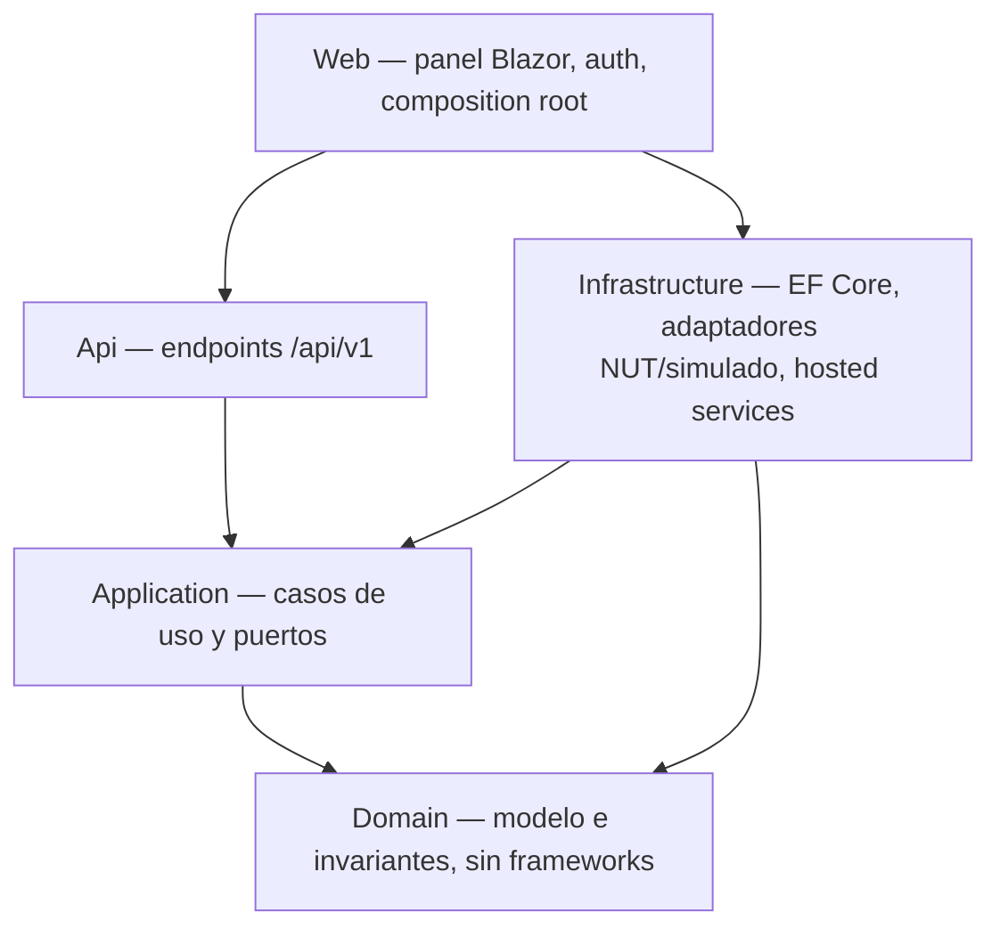

# 00 — Índice maestro

> **Propósito**: dar la visión general de `SAI.Service.Core` — problema, stack, estructura y decisiones
> que gobiernan todo lo demás — en una sola lectura.
> **Fuentes primarias**: [`SDD/Docs/11-Documentacion/Vision-General-Sistema-v1.0.md`](../../../SAI.Service.Core/SDD/Docs/11-Documentacion/Vision-General-Sistema-v1.0.md) ·
> [`SDD/Docs/README.md`](../../../SAI.Service.Core/SDD/Docs/README.md) ·
> [`AGENTS.md`](../../../SAI.Service.Core/AGENTS.md) ·
> [`Directory.Build.props`](../../../SAI.Service.Core/Directory.Build.props)

---

## 1. El problema y la propuesta

NUT (`upsmon` + `upssched`) ya resuelve el monitoreo básico y el apagado ordenado. Lo que **no** resuelve
—y es lo que este servicio aporta— es:

| Necesidad | Cómo la cubre el servicio |
| --- | --- |
| Garantizar que el host **vuelva a encenderse** tras un corte | Modalidad de ciclo forzado + bloqueo por verificación de los cuatro supuestos |
| Saber **qué batería estaba montada** cuando se registró cada métrica | Vínculos temporales (`MontajeBateria`) resueltos por instante, no por FK en la métrica |
| Detectar el **desgaste de la batería** en un equipo que nunca emite «replace battery» | Tendencia de salud derivada de la caída de tensión durante el autotest |
| **Ciclo de vida y costos** de los equipos | Inventario con baja lógica, intervenciones append-only, ficha de vida útil, costo por año |
| Recibir intervenciones desde un **sistema externo** | API REST de ingesta idempotente por clave |

Audiencia: **un administrador único** (propietario, implementador y beneficiario) sobre el host Linux
`i7infra`. Sin gestión de usuarios ni roles — es alcance explícito, no omisión.

## 2. Identidad y stack

| Dimensión | Valor |
| --- | --- |
| Tipo de proyecto | `web-monolith` (caso degenerado: un solo proyecto de solución) |
| Proceso que arranca | `SAI.Service.Core.Web` (único) |
| Runtime | .NET 10 (`net10.0`), C# `latest`, `Nullable enable`, `ImplicitUsings` |
| UI | Blazor **interactive server** + MudBlazor |
| Datos | EF Core + SQLite (archivo único, migraciones al arranque) |
| Acceso al SAI | NUT (`nutdrv_qx` + `upsd`) 2.8.0+, por TCP 3493, detrás de un adaptador |
| Empaquetado | Docker sobre `linux/amd64`; Dev Container para desarrollo |
| Reglas de compilación | `TreatWarningsAsErrors=true`, analizadores `latest-recommended`, `InvariantGlobalization=true` |
| Plataformas soportadas | Linux x86-64 (kernel ≥ 6.1), Docker ≥ 24.0, Chromium ≥ 120 / Firefox ≥ 121 |
| No soportado | Windows/macOS como host de producción, `linux/arm64`, Safari, acceso fuera de la LAN |

## 3. Estructura en cinco capas

Las flechas **nunca** apuntan hacia afuera del dominio. Detalle en [01_Arquitectura](01_Arquitectura.md).

## 4. Las decisiones que hay que conocer antes de tocar nada

| # | Decisión | ADR | Consecuencia práctica |
| --- | --- | --- | --- |
| 1 | Estado base seguro: arranca en `SoloAlerta` y bloquea por verificación | ADR-10 | Sin los 4 supuestos verificados y vigentes, **no apaga**; la modalidad efectiva degrada |
| 2 | Procedencia obligatoria en todo valor | ADR-06 | No existe un valor de dominio sin `Origen`; `battery.charge` es `estimadoPorDriver`, no medido |
| 3 | Validación por efecto observado | ADR-11 | «Sin excepción» ≠ «ejecutado»: se registra `EfectoNoConfirmado` cuando no se observa el efecto |
| 4 | Historia append-only, sin event store | ADR-04 | Nada de `UPDATE`/`DELETE` en tablas de hechos; corregir = agregar un hecho nuevo |
| 5 | Vigencia como entidad con intervalo | ADR-05 | La métrica guarda dispositivo+instante; la batería se resuelve por `MontajeBateria` |
| 6 | Adaptador de conexión como única puerta al SAI | ADR-02 / ADR-27 | Nadie habla NUT directo; dev corre con el simulado, prod con NUT |
| 7 | Disparo sin depender del flag `LB` | ADR-12 | Dispara por tiempo en batería + tensión, nunca por `LB` ni `battery.runtime` |
| 8 | Clean Architecture en cinco assemblies | ADR-15 | La dirección de dependencias es un test de arquitectura, no una convención |
| 9 | SQLite + EF Core con migraciones versionadas | ADR-18 | Se migra al arranque; no hay generación automática de esquema |
| 10 | Ciclo forzado no se cancela | ADR-09 | Iniciada la secuencia, **nunca** se emite `shutdown.stop` |

Índice completo de las 29 ADR en [01_Arquitectura §5](01_Arquitectura.md#5-adrs).

## 5. Qué NO hace el sistema

- No reemplaza a NUT ni habla USB: es cliente de `upsd` (ADR-01, ADR-03).
- No apaga el host hasta que los cuatro supuestos estén verificados (RN-01, RN-02).
- No presenta valores derivados como medidos (RN-05).
- No tiene gestión de usuarios ni roles (un administrador único).
- No tiene ambiente de staging (no habría a qué SAI conectarlo, ADR-24).
- **Todavía no tiene imagen de contenedor de producción**: no hay `Dockerfile` en el repositorio.

## 6. Mapa rápido «pregunta → índice»

| Pregunta típica | Índice |
| --- | --- |
| ¿Dónde pongo un archivo nuevo? | [01_Arquitectura](01_Arquitectura.md) §4 |
| ¿Qué invariante gobierna este cálculo? | [02_Dominio-Y-Reglas](02_Dominio-Y-Reglas.md) |
| ¿Cómo agrego una tabla o una migración? | [03_Modelo-De-Datos](03_Modelo-De-Datos.md) |
| ¿Qué servicio resuelve el caso de uso X? | [04_Aplicacion-Y-Casos-De-Uso](04_Aplicacion-Y-Casos-De-Uso.md) |
| ¿Qué expone el servicio hacia afuera? | [05_Interfaces-Panel-Y-Api](05_Interfaces-Panel-Y-Api.md) |
| ¿Cómo configuro NUT o el sondeo? | [06_Infraestructura-Y-Adaptador-Sai](06_Infraestructura-Y-Adaptador-Sai.md) |
| ¿Qué tengo que probar antes de cerrar un cambio? | [07_Calidad-Y-Pruebas](07_Calidad-Y-Pruebas.md) |
| ¿Cómo lo despliego / por qué falla en producción? | [08_Devops-Despliegue-Y-Operacion](08_Devops-Despliegue-Y-Operacion.md) |
| ¿Dónde está documentado esto en el SDD? | [09_Documentacion-Sdd](09_Documentacion-Sdd.md) |
| ¿Qué significa este término? | [10_Glosario](10_Glosario.md) |
| ¿Esto ya está hecho o está pendiente? | [11_Estado-Y-Pendientes](11_Estado-Y-Pendientes.md) |
