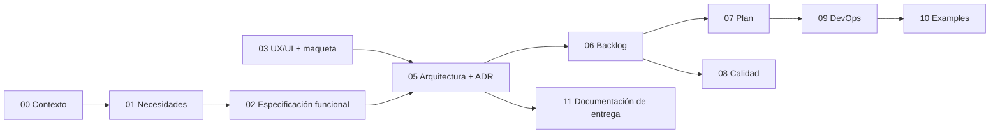

# 09 — Mapa de la documentación SDD

> **Propósito**: dónde vive cada documento del árbol SDD del repositorio y qué contiene, para poder abrir
> la fuente exacta sin recorrer carpetas.
> **Fuente primaria**: [`SDD/Docs/README.md`](../../../SAI.Service.Core/SDD/Docs/README.md)

---

## 1. Cómo está organizado

La documentación se generó con el framework **SDD v3.0** y sus subagentes AG-00..AG-11. Como la solución
es un **caso degenerado** (un solo proyecto), el layout está aplanado: las categorías 00–11 cuelgan
directo de `SDD/Docs/`, sin subnivel `Proyectos/<Nombre>/` ni carpeta `Solucion/`.

**El contenido derivado no se edita a mano**: se regenera corriendo el orquestador sobre el subagente
correspondiente, a partir del intake. Las contribuciones manuales se limitan a los insumos de intake y a
las correcciones marcadas en las auditorías.

> Para un agente: `SDD/` es **solo lectura** por contrato (`AGENTS.md`), igual que cualquier carpeta
> `PROMPTs/`.

## 2. Categorías

| Categoría | Contenido | Documentos destacados |
| --- | --- | --- |
| [00-Contexto](../../../SAI.Service.Core/SDD/Docs/00-Contexto/) | Visión, alcance, roadmap, plataformas | `Vision-Producto`, `Alcance-Proyecto`, `Roadmap-Producto`, `Compatibilidad-Plataformas` |
| [01-Necesidades-Negocio](../../../SAI.Service.Core/SDD/Docs/01-Necesidades-Negocio/) | 8 necesidades de negocio (NB-01..NB-08) | Apagado ordenado y reencendido garantizado; monitoreo y alertas; historia trazable; ciclo de vida; bloqueo por verificación; salud de baterías; políticas; ingesta |
| [02-Especificacion-Funcional](../../../SAI.Service.Core/SDD/Docs/02-Especificacion-Funcional/) | 12 casos de uso, 13 reglas de negocio, modelo conceptual y 9 reglas conceptuales | `Casos-De-Uso/CU-01..CU-12`, `Reglas-De-Negocio/RN-01..RN-13`, `Modelo-Datos/Modelo-Conceptual`, `reglas-conceptuales-de-modelo/RC-01..RC-09` |
| [03-UX-UI-DX](../../../SAI.Service.Core/SDD/Docs/03-UX-UI-DX/) | Experiencia de uso, línea base visual, 11 wireframes, contrato de datos de la maqueta, glosario UX | `Linea-Base-Visual`, `Wireframes-*`, `Contrato-Datos-Maqueta`, `Bitacora-Validacion-Maqueta` |
| [05-Arquitectura-Tecnica](../../../SAI.Service.Core/SDD/Docs/05-Arquitectura-Tecnica/) | Arquitectura maestra, 29 ADR, contratos REST, modelo de datos lógico, extensibilidad, flujo de ejecución | `Arquitectura-Solucion`, `Adrs/ADR-01..ADR-29`, `Contratos-REST`, `Modelo-Datos-Logico`, `Flujo-Ejecucion`, `Extensibilidad` |
| [06-Backlog-Tecnico](../../../SAI.Service.Core/SDD/Docs/06-Backlog-Tecnico/) | 26 historias de usuario, backlog técnico (BT), Definition of Ready | `Product-Backlog`, `Backlog-Tecnico`, `historias-usuario/US-01..US-26`, `Definition-Of-Ready` |
| [07-Plan-Sprint](../../../SAI.Service.Core/SDD/Docs/07-Plan-Sprint/) | Mini-Plan (sustituye a los planes por sprint: es un proyecto de un solo desarrollador) | `Mini-Plan` |
| [08-Calidad-Y-Pruebas](../../../SAI.Service.Core/SDD/Docs/08-Calidad-Y-Pruebas/) | Estrategia de calidad y testing, cobertura, DoD, casos referenciales | `Estrategia-Testing`, `Estrategia-Calidad`, `Matriz-Cobertura-Pruebas`, `Matriz-Sensado-Deriva`, `Definition-Of-Done`, `Criterios-Validacion`, `Plan-Pruebas`, `Guia-Testing-Extensibilidad`, `Casos-Prueba-Referenciales` |
| [09-Devops](../../../SAI.Service.Core/SDD/Docs/09-Devops/) | Pipeline de 10 stages, versionado, ambientes, publicación de imagen, supply chain | `Pipeline-CI-CD`, `Estrategia-Versionado`, `Entornos-Deploy`, `Guia-Publicacion-Image-Docker`, `Supply-Chain-Seguridad` |
| [10-Examples](../../../SAI.Service.Core/SDD/Docs/10-Examples/) | Ejemplos progresivos con contrato de verificación `VER-XX` | `Ejemplo-01-Datos-Seed`, `Ejemplo-02-Api-Ingesta` |
| [11-Documentacion](../../../SAI.Service.Core/SDD/Docs/11-Documentacion/) | Cuerpo documental de entrega (**la categoría más útil para un agente**) | `Vision-General-Sistema`, `Recorrido-Codigo`, `Guia-Contribucion`, `Guia-Extension`, `Guia-Inicio-Rapido`, `Guia-Contenedor`, `Guia-Despliegue`, `Runbook-Operacion`, `Bitacora-Eventualidades`, `Contrato-Agentes` |

**04-Prompts-AI no existe**: el producto no usa LLM ni en su funcionamiento ni en su operación.

## 3. Artefactos fuera del árbol numerado

| Artefacto | Ruta | Contenido |
| --- | --- | --- |
| Intake | [`SDD/Intake/`](../../../SAI.Service.Core/SDD/Intake/) | `SOLUTION-INTAKE` (fuente de todo el árbol: requisitos, riesgos, escenarios E-1..E-8, pre-ADR) y `SOLUTION-MANIFEST` |
| Maqueta aprobada | [`SDD/Maquetas/Sai-Service-Core/`](../../../SAI.Service.Core/SDD/Maquetas/Sai-Service-Core/) | Prototipo navegable en HTML/CSS/JS de las 10 pantallas del panel |
| Auditorías por fase | [`SDD/Docs/Audit/`](../../../SAI.Service.Core/SDD/Docs/Audit/) | Fases A–H: hallazgos y correcciones aplicadas sobre cada categoría. Es la referencia para entender **por qué** un documento tiene su forma actual |

## 4. Cadena de trazabilidad

Cada eslabón justifica al siguiente, sin saltos. Ningún documento repite el contenido de otro: referencia.

## 5. Recorridos de lectura sugeridos

| Rol | Orden |
| --- | --- |
| Administrador / operador | 00 → 03 → maqueta → 02 |
| Desarrollador que retoma el proyecto | 00 → 02 → 05 → 06 → 07 → 10 |
| Revisor de arquitectura | 00 → 05 → 09 → 08 |
| Responsable de calidad | 02 → 08 → 05 |
| **Agente de codificación** | `AGENTS.md` → esta ia-db → el índice del tema → la fuente puntual |

## 6. Estado documental

Todas las categorías están en estado **Borrador** salvo la 11, que está **Vigente**; todas en versión 1.0
y auditadas por fase. El README maestro del SDD lleva su propio control de cambios.

Documentos satélite ausentes **a propósito** en `SDD/Docs/` (proyecto interno de un desarrollador, sin
consumidores externos): `CHANGELOG.md`, `CONTRIBUTING.md`, `LICENSE.md` — el control de cambios vive en la
cabecera de cada documento, y el `CHANGELOG.md` funcional está en la raíz del repositorio.
